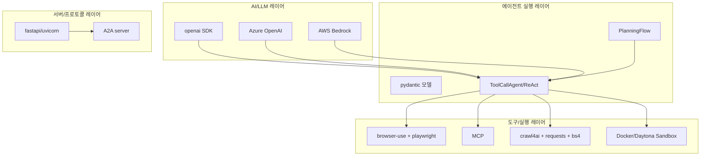
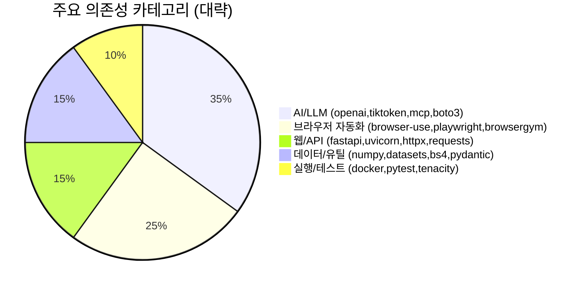

# 📦 기술 스택

## 기술 스택이 뭔가요?

이 시스템을 만들 때 사용한 언어, 라이브러리, 실행환경의 조합입니다.

## 기술 스택 구성

이 그림은 OpenManus의 기술 계층을 요약합니다.

## 의존성 비중 (핵심 패키지 분류)

## 상세 스택

| 카테고리 | 기술/라이브러리 | 용도 |
|---------|--------------|------|
| 언어/런타임 | Python 3.12 권장 | 에이전트 런타임 |
| LLM SDK | `openai` | chat/tool 호출 인터페이스 |
| 멀티 제공자 | Azure OpenAI, AWS Bedrock(`boto3`) | 배포 환경 선택지 제공 |
| 에이전트 모델링 | `pydantic` | 상태/메시지/툴스키마 모델 |
| 브라우저 자동화 | `browser-use`, `playwright` | 웹 탐색/입력/추출 |
| 검색/크롤링 | `googlesearch-python`, `duckduckgo_search`, `crawl4ai`, `bs4` | 정보 수집 |
| 샌드박스 | Docker, Daytona SDK | 격리 실행 |
| 프로토콜 | `mcp`, `a2a` | 외부 도구/에이전트 네트워크 연동 |
| 서버 | `fastapi`, `uvicorn` | MCP/A2A 서비스 노출 |
| 안정성 | `tenacity` | LLM 호출 재시도 |

## 설정 파일 관찰 포인트

- `config/config.example.toml`에서 기본 모델/브라우저/검색/MCP/runflow 설정을 관리
- 모델별 예시 파일 제공:
  - `config.example-model-anthropic.toml`
  - `config.example-model-azure.toml`
  - `config.example-model-google.toml`
  - `config.example-model-ollama.toml`
