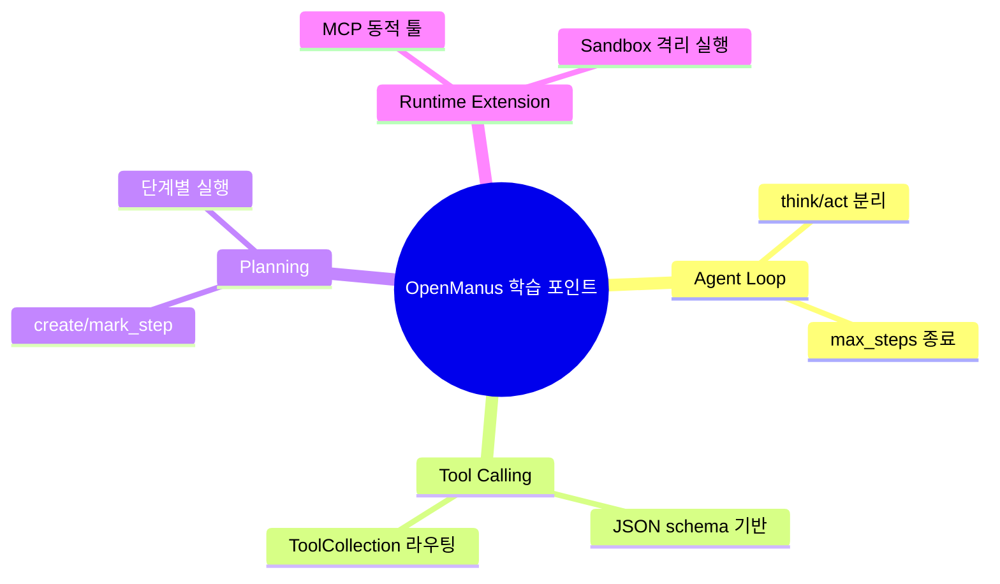

# 💡 핵심 인사이트 & 제안

## 잘 설계된 부분 👍

1. **공통 실행 엔진 재사용**: `ToolCallAgent`를 중심으로 역할별 에이전트를 확장해 중복이 적습니다.
2. **플랜 기반 확장성**: `PlanningFlow` + `PlanningTool`로 장기 작업을 단계적으로 제어합니다.
3. **기능적 라우팅 구현**: `run_flow`에서 step 태그 기반으로 executor를 선택하는 통합 라우팅(초기형)이 동작합니다.
4. **도구 동적성**: MCP 연결 시 도구가 런타임에 추가/삭제되어 확장성이 높습니다.
5. **브라우저 상태 주입**: BrowserContextHelper가 URL/탭/스크린샷을 next-step 프롬프트에 반영합니다.
6. **운영 모드 분리**: 일반/플로우/MCP/샌드박스 실행 경로가 엔트리 파일로 명확히 분리됩니다.

## 주의해야 할 부분 ⚠️

1. **LLM 설정 기본값 의존성**: 실제 `config.toml`이 없으면 예제값 기반으로 동작하며, API 키 누락 시 즉시 실패합니다.
2. **상태 저장 범위 제한**: 계획/메모리 상태는 인메모리 중심이라 장기 세션 영속화는 별도 설계가 필요합니다.
3. **라우팅 규칙 단순성**: 현재 라우팅은 step 태그 문자열 중심이라, 태그 품질이 낮으면 기본 executor fallback 비율이 올라갈 수 있습니다.
4. **도구 실패 누적 제어**: 일부 경로는 에러를 메시지로만 누적하고 강한 rollback은 없습니다.
5. **Flow 타입 단일화**: 현재 `FlowType`은 `planning` 하나라, 플로우 다양화는 향후 과제입니다.
6. **시크릿 파일 검사**: `.env` 파일은 없었지만 `config.toml`에 키를 직접 적는 구조라 운영 시 비밀관리 정책이 필요합니다.

## 초보자를 위한 학습 포인트 🎓

이 레포에서 배울 수 있는 패턴은 아래와 같습니다.

## 개선 제안 🚀

| 우선순위 | 제안 | 기대 효과 |
|---------|------|---------|
| 높음 | Plan/Memory 영속 저장소(예: SQLite/Redis) 추가 | 재시작 후에도 작업 이어서 실행 가능 |
| 높음 | Flow 타입 확장(예: review/research 전용 flow) | 작업 유형별 최적화 |
| 중간 | Tool 실패 분류/재시도 정책 표준화 | 불안정 외부 API 환경에서 복원력 향상 |
| 중간 | 프롬프트 템플릿 테스트 자동화 | 회귀 방지 |
| 낮음 | 실행 모드별 문서(일반/MCP/Flow/Sandbox) 분리 | 초보자 온보딩 속도 향상 |
