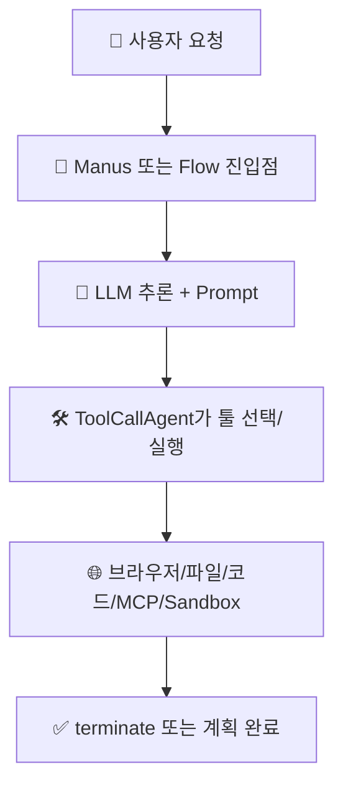

# 🔍 OpenManus 분석 보고서

> **한 줄 요약**: OpenManus는 기본은 단일 에이전트(`Manus`)로 동작하고, `run_flow.py`에서는 태그 기반으로 실행 에이전트를 고르는 통합 라우팅(초기형)을 제공하는 오픈소스 에이전트 프레임워크입니다.  
> 분석일: 2026-03-03 | 레포: https://github.com/FoundationAgents/OpenManus | 커밋: `52a13f2`

## 🔴 핵심 운영 전략 (강조)

**OpenManus는 `범용 기본 -> 필요 시 특화 확장` 전략으로 이해하면 가장 정확합니다.**

1. 먼저 `Manus` 범용 에이전트로 처리합니다.
2. 복잡한 작업이면 `run_flow.py`에서 플래닝 + 태그 기반 라우팅으로 분기합니다.
3. 그래도 요구가 높으면 `MCPAgent`/`SandboxManus`/`SWEAgent` 같은 특화 모드로 확장합니다.

## 🧭 먼저 알고 읽기

- 이 보고서에서 `통합 라우팅`은 "한 플로우가 여러 executor 중 하나를 고르는 것"을 뜻합니다.
- 따라서 `run_flow.py`의 태그 기반 executor 선택도 **라우팅으로 인정**합니다.
- 다만 적용 범위는 `run_flow` 경로 중심이며, 기본 실행(`main.py`)은 단일 에이전트입니다.

## 📚 이 보고서 읽는 순서

처음 보는 분은 이 순서대로 읽으세요:

| 순서 | 파일 | 내용 | 소요 시간 |
|------|------|------|----------|
| 1 | [00_overview](./00_overview/summary.md) | 전체 그림 파악 | 5분 |
| 2 | [01_architecture](./01_architecture/architecture.md) | 시스템 구조 | 10분 |
| 3 | [02_agents](./02_agents/agents.md) | AI 에이전트 구성 | 10분 |
| 4 | [03_prompts](./03_prompts/prompts.md) | 프롬프트 설계 | 15분 |
| 5 | [04_tools](./04_tools/tools.md) | 툴/함수 체계 | 10분 |
| 6 | [05_workflows](./05_workflows/workflows.md) | 실행 워크플로우 | 15분 |
| 7 | [06_techstack](./06_techstack/techstack.md) | 기술 스택 | 5분 |
| 8 | [07_insights](./07_insights/insights.md) | 인사이트/개선안 | 10분 |

## 🗺️ 전체 구조 한눈에 보기

아래 그림은 OpenManus의 핵심 실행 경로를 최소 구성으로 요약한 것입니다.

## 📊 주요 수치

| 항목 | 수치 |
|------|------|
| 총 파일 수 | 145개 |
| 에이전트 클래스 수 | 9개 (실행 중심 6개) |
| 프롬프트 파일 수 | 8개 |
| 이름이 정의된 툴 수 | 13개 |
| 플로우 타입 | 1개 (`planning`) |
| 사용 AI 프레임워크/핵심 라이브러리 | OpenAI SDK 기반 LLM 래퍼, `browser-use`, `mcp`, `playwright`, `crawl4ai` |

## ✅ 분석 범위

- `app/agent`, `app/flow`, `app/prompt`, `app/tool`, `app/config` 중심으로 구조/동작 분석
- `protocol/a2a`의 A2A 서버 연동 구조 포함
- 시크릿 값은 기록하지 않고 "존재 여부"만 확인
