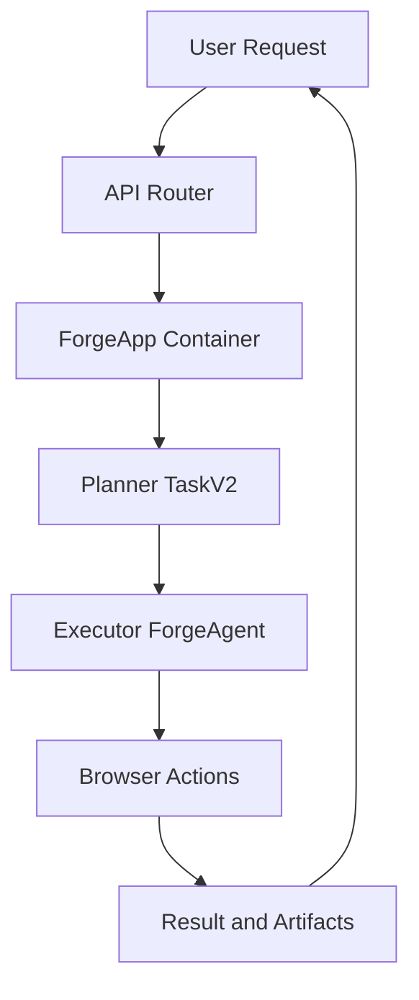

# 📖 이 시스템은 무엇인가요?

## 쉬운 설명

Skyvern은 "웹사이트에서 사람이 하는 반복 업무를 대신 수행하는 AI 팀"입니다.  
사람이 "무엇을 해달라"고 지시하면, Skyvern이 브라우저를 열고 필요한 클릭/입력/추출을 스스로 진행합니다.

## 이 시스템이 하는 일

- 입력: URL + 목표 프롬프트(예: "최신 인보이스를 찾아 다운로드")
- 처리: 계획(TaskV2) -> 액션 실행(ForgeAgent) -> 결과 검증
- 출력: 상태, 추출 데이터, 실행 아티팩트(스크린샷/로그)

## 전체 구조 다이어그램

아래 그림은 Skyvern의 전체 실행 루프를 단순화한 것입니다.



## 디렉토리 구조

```text
skyvern/
├── skyvern/forge/                  ← 오케스트레이션, LLM 핸들러, API app
├── skyvern/services/               ← task/workflow 런타임 서비스
├── skyvern/webeye/                 ← 브라우저 액션/스크래핑
├── skyvern/cli/mcp_tools/          ← MCP 툴 인터페이스
├── skyvern/forge/prompts/skyvern/  ← 프롬프트 템플릿(77개)
├── skyvern-frontend/               ← 관리 UI
├── skyvern-ts/client/              ← TypeScript SDK
└── integrations/                   ← LangChain/LlamaIndex 통합
```

## 핵심 용어 설명

| 용어 | 쉬운 설명 |
|------|----------|
| Planner | "다음에 뭘 해야 할지" 계획하는 모듈 |
| Executor | 계획된 액션을 실제 브라우저에서 수행하는 모듈 |
| Block | 워크플로우를 이루는 작업 조각(네비게이션, 추출 등) |
| TaskV2 | 계획-실행-검증 루프 기반 고도화 엔진 |
| CUA Engine | 컴퓨터 사용형 LLM 엔진(OpenAI/Anthropic/UI-TARS) |

## 용어 매핑 표 (Skyvern 내부명 ↔ 일반 개념)

| 구분 | Skyvern 내부 용어 | 일반 개념명 | 한 줄 설명 |
|------|------|------|------|
| Core Runtime | ForgeApp | App Container | 실행기가 아니라 공통 서비스 조립/주입 담당 |
| Core Runtime | TaskV2 Service | Planner | 목표를 미니 태스크로 분해하고 반복 계획 |
| Core Runtime | ForgeAgent | Executor | 브라우저 액션을 실제로 실행 |
| Core Runtime | WorkflowService | Workflow Orchestrator | 블록 워크플로우 실행/관리 |
| Core Runtime | ActionHandler | Tool Runtime | click/input/extract 같은 액션 실행기 |
| Core Runtime | RunEngine | Engine Selector | 실행 엔진(1.0/2.0/CUA) 선택 레이어 |

## 외부 연동/저작 모듈 (Extension)

| 구분 | Skyvern 내부 용어 | 핵심 역할 |
|------|------|------|
| Extension (Authoring) | Workflow Copilot | 워크플로우 YAML 생성/수정 보조 |
| Extension (External) | MCP Tool Agents | 외부 AI가 Skyvern 기능을 MCP tool-call로 사용 |
| Extension (External) | Framework Adapter Agents | LangChain/LlamaIndex 연결 |
