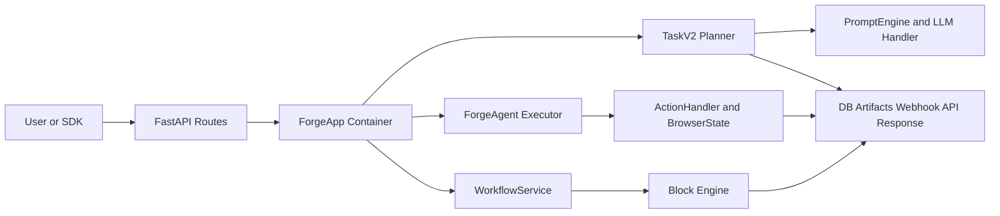
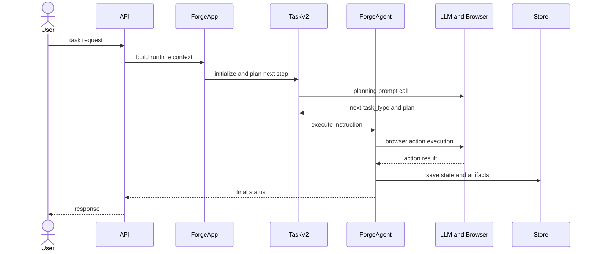

# 🏗️ 시스템 아키텍처

## 아키텍처란?

아키텍처는 "어떤 부품이 어떻게 연결되어 동작하는지"를 보여주는 설계도입니다. Skyvern은 API-컨테이너-계획-실행-저장 계층으로 분리되어 있습니다.

## 핵심 해석: 오케스트레이션 2층

Skyvern을 정확히 읽는 기준은 아래입니다.

- `ForgeApp`: 컨테이너/조립자 (공통 서비스 제공)
- `TaskV2 Service`: 계획 오케스트레이터 (Planner)
- `ForgeAgent`: 실행 오케스트레이터 (Executor)
- 즉, 단일 오케스트레이터가 아니라 "계획층 + 실행층"으로 분리된 구조

## 전체 컴포넌트 구조

## 데이터 흐름

## 계층별 설명

- 입력 레이어: FastAPI 라우터가 작업 요청을 수신
- 컨테이너 레이어: ForgeApp이 LLM/DB/스토리지 등 공통 서비스를 제공
- 계획 레이어: TaskV2가 다음 블록/태스크를 결정
- 실행 레이어: ForgeAgent가 브라우저 액션을 수행
- 출력 레이어: 실행 결과를 DB/아티팩트로 저장 후 API로 반환

## Core Runtime vs Extension 경계

- Core Runtime: 실제 작업 실행 경로 (`ForgeApp -> TaskV2 -> ForgeAgent -> ActionHandler`)
- Extension: Core Runtime을 보조/연동하는 선택 기능 (`Workflow Copilot`, `MCP Tool Agents`, `Framework Adapter Agents`)
