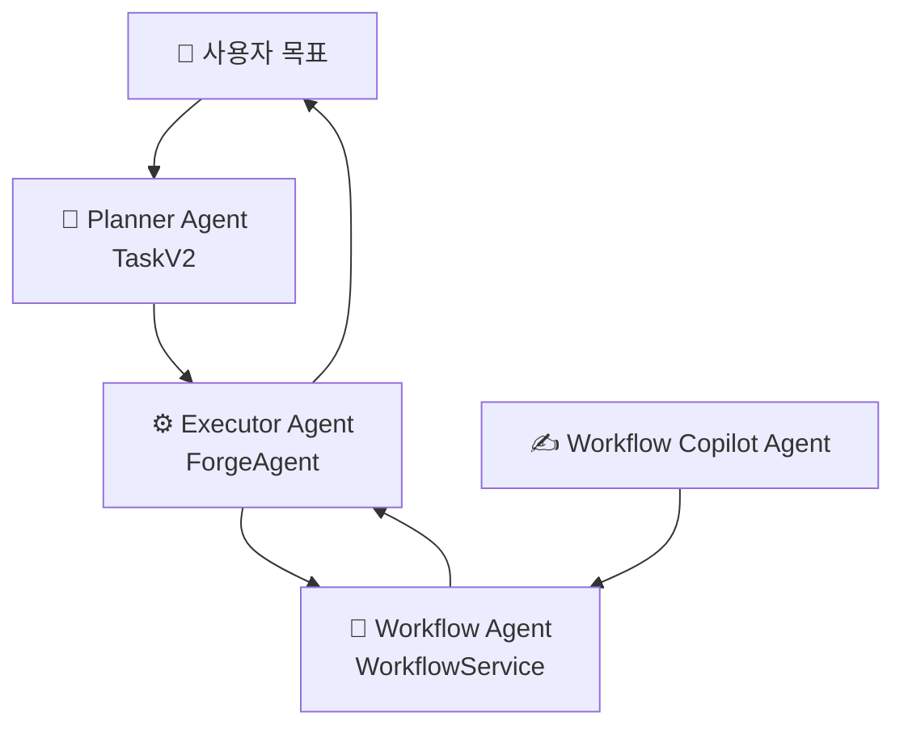

# 🤖 에이전트 구성

## 에이전트가 뭔가요?

Skyvern에서 에이전트는 "목표를 계획하고 웹 행동을 실행하는 AI 담당자"입니다.
핵심 역할은 **Planner(무엇을 할지 결정)** 와 **Executor(실제로 행동)** 로 분리됩니다.

## 에이전트 관계도

아래 그림은 Skyvern를 에이전트 책임 기준으로 정리한 것입니다.

## 에이전트별 상세 설명

### Planner Agent (TaskV2)
- **역할**: 목표를 실행 가능한 블록/스텝으로 분해
- **파일 위치**: `skyvern/services/task_v2_service.py`
- **담당 업무**:
  - 목표 분석 및 초기 계획 생성
  - 반복 루프에서 다음 블록 타입 선택
  - 완료/실패 조건 판정
- **사용 모델**: `app.LLM_API_HANDLER` 설정 모델

### Executor Agent (ForgeAgent)
- **역할**: 계획된 스텝을 실제 웹 액션으로 수행
- **파일 위치**: `skyvern/forge/agent.py`
- **담당 업무**:
  - 프롬프트 호출 및 액션 파싱
  - 브라우저 액션 실행/재시도
  - 스텝 상태 업데이트 및 결과 축적
  - 다운로드/검증/아티팩트 저장
- **사용 모델**: OpenAI/Anthropic/UI-TARS(설정 기반)

### Workflow Agent (WorkflowService)
- **역할**: 블록 실행 순서를 관리하는 워크플로우 에이전트
- **파일 위치**: `skyvern/forge/sdk/workflow/service.py`
- **담당 업무**:
  - 블록 단위 실행 오케스트레이션
  - 파라미터/버전/캐시 처리
  - 실행 이력 및 웹훅 관리
- **사용 모델**: 필요 시 Planner/Executor 경유

### Workflow Copilot Agent
- **역할**: 워크플로우 YAML 작성/수정을 돕는 저작 에이전트
- **파일 위치**: `skyvern/forge/sdk/routes/workflow_copilot.py`
- **담당 업무**:
  - 대화 기반 YAML 초안 생성
  - 검증 실패 시 수정 루프
  - 사용자의 워크플로우 설계 보조
- **사용 모델**: 설정된 Copilot용 LLM

## 에이전트 역할 분담표

| 에이전트 | 역할 한 줄 요약 | 입력 | 출력 | 책임 범위 |
|---------|----------------|------|------|----------|
| Planner Agent | 목표를 단계 계획으로 변환 | 사용자 목표/컨텍스트 | 블록/스텝 계획 | 계획 수립 |
| Executor Agent | 실제 웹 행동 실행 | 계획 + 페이지 상태 | 액션 결과/상태 업데이트 | 실행 담당 |
| Workflow Agent | 블록 흐름 관리 | 워크플로우 정의 | 실행 결과/아티팩트 | 워크플로우 운영 |
| Workflow Copilot Agent | 워크플로우 작성 보조 | 사용자 대화/YAML | 수정된 YAML | 저작 지원 |

## 참고: 비에이전트 인프라

`ForgeApp`은 중요한 구성 요소지만 에이전트라기보다 서비스 컨테이너(의존성 조립) 역할입니다.
