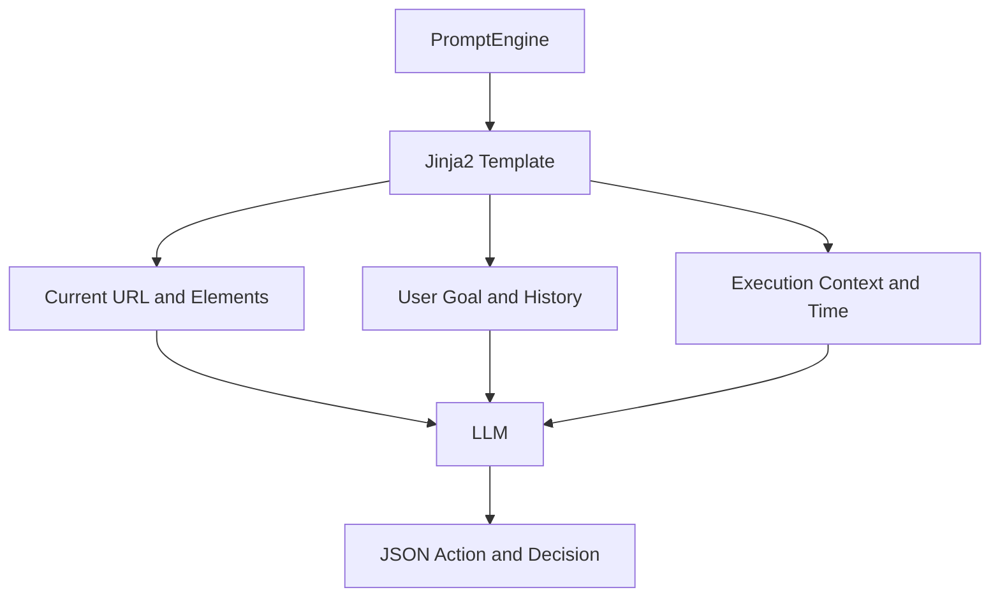
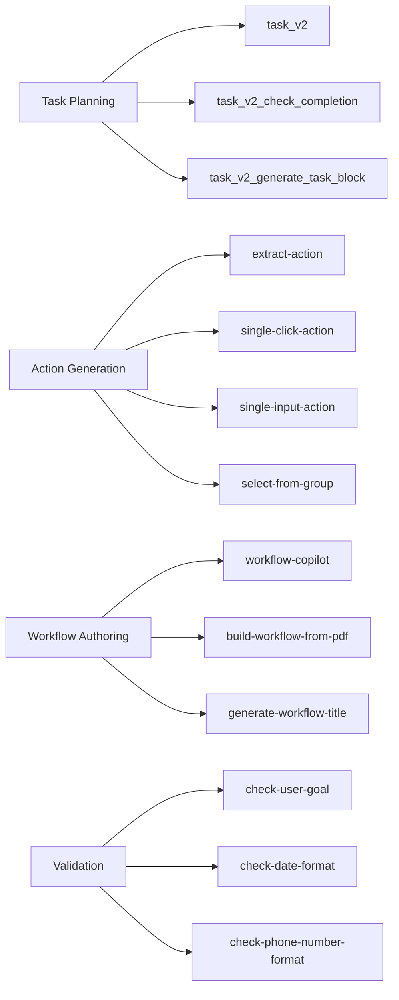
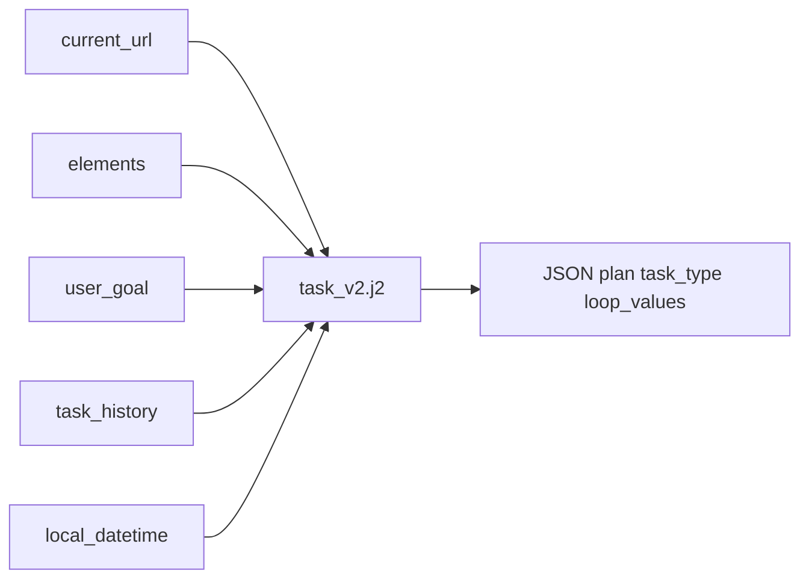

# 📝 프롬프트 분석

## 프롬프트가 뭔가요?

프롬프트는 AI에게 "어떤 판단을 어떻게 하라"고 지시하는 텍스트 템플릿입니다.  
Skyvern은 Jinja2 기반 템플릿을 대량으로 사용해 상황별 판단을 분리합니다.

## Planner/Executor 관점에서의 프롬프트 분류

- Planner 측(`TaskV2`): 다음 태스크 타입과 계획을 결정
- Executor 측(`ForgeAgent`): 클릭/입력/추출 같은 실제 액션 생성

## 프롬프트 구조 개요

아래 그림은 Skyvern 프롬프트가 조합되는 기본 구조입니다.

## 발견된 프롬프트 목록

- 코어 경로: `skyvern/forge/prompts/skyvern`
- 템플릿 수: **77개 파일 (Jinja2 75개)**
- 대표 템플릿:
  - `task_v2.j2`, `task_v2_check_completion.j2`
  - `extract-action*.j2`, `single-click-action.j2`, `single-input-action.j2`
  - `workflow-copilot.j2`, `generate-workflow-title.j2`
  - `check-user-goal-with-termination.j2`

## 프롬프트별 상세 분석

### `task_v2.j2`

> **한 줄 설명**: TaskV2 플래너가 다음 미니 태스크를 정할 때 쓰는 핵심 프롬프트

이 프롬프트는 `navigate / extract / loop` 태스크 타입 중 무엇을 선택할지 JSON으로 강제합니다.

**구조 분석**:

**템플릿 변수**:
| 변수명 | 타입 | 설명 | 예시 |
|--------|------|------|------|
| `current_url` | string | 현재 페이지 URL | `https://example.com/login` |
| `elements` | string | 클릭 가능한 DOM 요소 목록 | 버튼/입력 요소 목록 |
| `user_goal` | string | 사용자의 최종 목표 | "인보이스 다운로드" |
| `task_history` | string | 이전 단계 이력 | 성공/실패 기록 |
| `local_datetime` | string | 현재 시간 | ISO datetime |

**주요 인스트럭션 요약**:
- 반드시 유효 JSON 반환
- 필요 시 loop task 생성
- 완료 여부와 추출 필요 여부 분리
- (옵션) 명확한 불가능 증거가 있을 때만 terminate

### `workflow-copilot` 계열

- **위치**: `skyvern/forge/sdk/routes/workflow_copilot.py` + `skyvern/forge/prompts/skyvern/workflow-copilot.j2`
- **용도**: 대화형으로 workflow YAML 수정/생성
- **특징**:
  - 지식베이스(`workflow_knowledge_base.txt`)를 함께 주입
  - LLM 응답 action type(`REPLACE_WORKFLOW`, `REPLY`, `ASK_QUESTION`) 기반 분기
  - YAML 검증 실패 시 자동 교정 루프 수행

### PromptEngine 구현 특징

- **위치**: `skyvern/forge/sdk/prompting.py`
- 모델 디렉토리(여기서는 `skyvern`)를 기준으로 템플릿 로딩
- `load_prompt()`와 `load_prompt_from_string()` 제공
- `utils/prompt_engine.py`에서 토큰 초과 시 economy tree로 축소하는 보호 로직 포함
