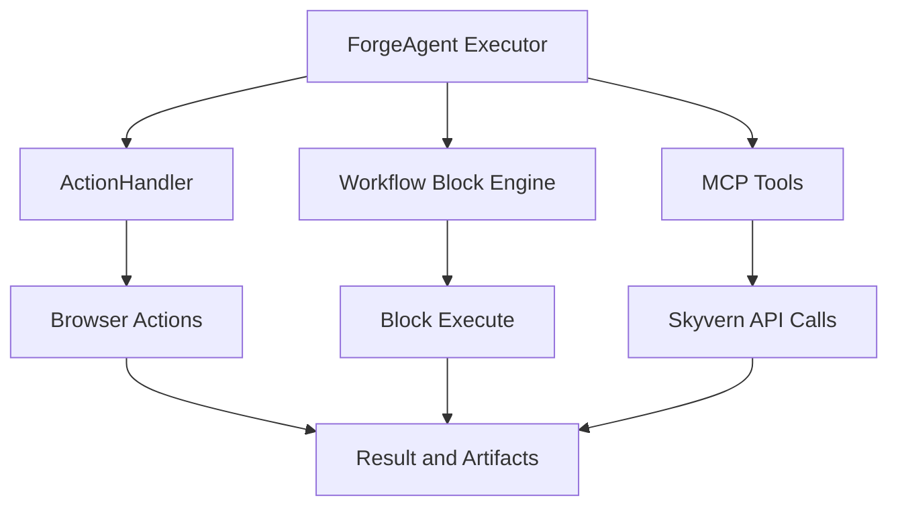
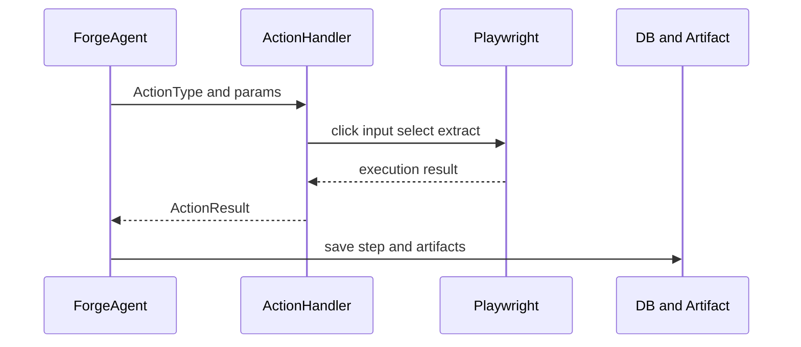

# 🛠️ 툴 & 함수

## 툴이 뭔가요?

Skyvern에서 툴은 "LLM의 판단을 실제 웹 행동으로 바꾸는 실행 장치"입니다.  
여기에는 브라우저 액션, 블록 실행기, MCP 외부 인터페이스가 포함됩니다.

## 툴 전체 맵

아래 그림은 실행 주체와 툴 계층의 관계를 보여줍니다.

## 툴 호출 흐름

## 툴 목록

| 툴/함수명 | 카테고리 | 설명 | 입력 | 출력 | 파일 위치 |
|---------|---------|------|------|------|---------|
| `ActionHandler.handle_action` | 브라우저 실행 | 액션 타입별 실제 동작 수행 | Action, page context | ActionResult[] | `skyvern/webeye/actions/handler.py` |
| `ActionType` enum (22개) | 액션 정의 | 클릭/입력/업로드/추출/종료 등 | 없음(정의) | 타입 식별자 | `skyvern/webeye/actions/action_types.py` |
| Block `execute()` 계열 (26 클래스) | 워크플로우 엔진 | 블록 단위 실행 | Block + context | BlockResult | `skyvern/forge/sdk/workflow/models/block.py` |
| `workflow_service.run_workflow` | 오케스트레이션 | 워크플로우 실행 시작 | workflow_id, request | WorkflowRun | `skyvern/services/workflow_service.py` |
| `run_blocks` endpoints | 단일 런블록 API | login/download_files 등 즉시 실행 | API request | WorkflowRunResponse | `skyvern/forge/sdk/routes/run_blocks.py` |
| `skyvern_*` MCP tools (34개) | 외부 도구 인터페이스 | 워크플로우/브라우저/MCP 제어 | MCP args | 표준 JSON result | `skyvern/cli/mcp_tools/*.py` |

## 툴별 상세 설명

### 브라우저 액션 타입 (`ActionType`)
- **한 줄 설명**: Executor가 최종적으로 선택하는 실행 명령의 종류
- **주요 타입**: `click`, `input_text`, `upload_file`, `select_option`, `wait`, `extract`, `terminate`, `goto_url`, `scroll` 등
- **특징**: 실행 후 결과를 기록하고 실패 시 재시도/종료 분기와 연결됨

### 워크플로우 블록 엔진
- **한 줄 설명**: 고수준 자동화를 블록 단위로 실행하는 런타임
- **대표 블록**:
  - Task/Navigation/Extraction/Login
  - ForLoop/Conditional/Validation/Code
  - File 관련(S3 업다운로드, 파서, 프린트)
- **특징**: 블록마다 `execute()`가 정의되어 있어 재사용/조합이 쉬움
