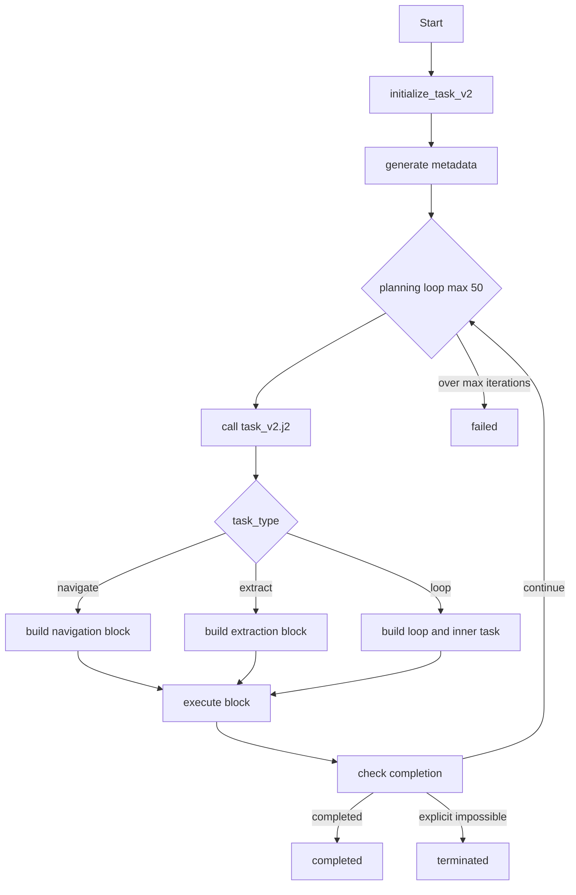
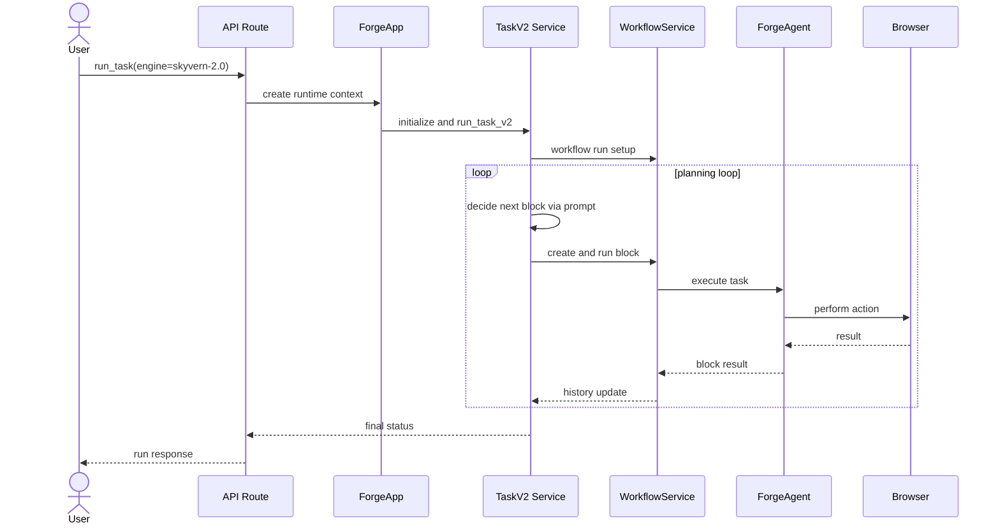
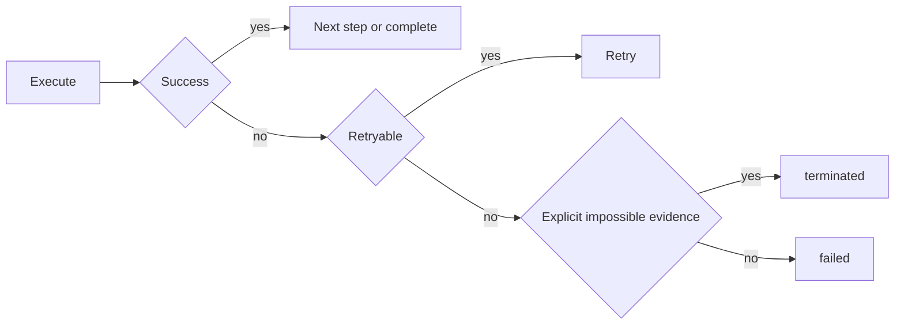

# 🔄 워크플로우

## 워크플로우가 뭔가요?

워크플로우는 "작업 순서도"입니다. Skyvern은 두 가지 큰 흐름이 있습니다.
- TaskV1/V2 기반 에이전트 실행
- 블록 기반 Workflow 실행

## 해석 기준: 계획층과 실행층

- 계획층: `TaskV2`가 다음 블록을 결정
- 실행층: `ForgeAgent`가 실제 브라우저 액션 수행
- `ForgeApp`은 두 층을 묶는 컨테이너

## 메인 워크플로우 (TaskV2 중심)

아래 다이어그램은 `task_v2_service` 기준 핵심 루프를 나타냅니다.

## 에이전트 간 상호작용 흐름

## 오류 처리 흐름

## 주요 시나리오별 흐름

1. **로그인 자동화 (`run_blocks/login`)**
- 임시 workflow 생성 -> login 블록 주입 -> run_workflow 실행

2. **파일 다운로드 (`run_blocks/download_files`)**
- 다운로드 목표 프롬프트 기반 navigation/task 실행 -> 파일 추적/저장

3. **워크플로우 코파일럿**
- 사용자 메시지 -> workflow-copilot 프롬프트 -> YAML 생성/교정 -> 반영
