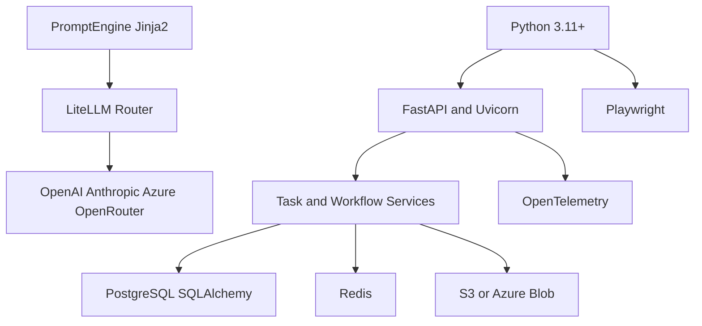
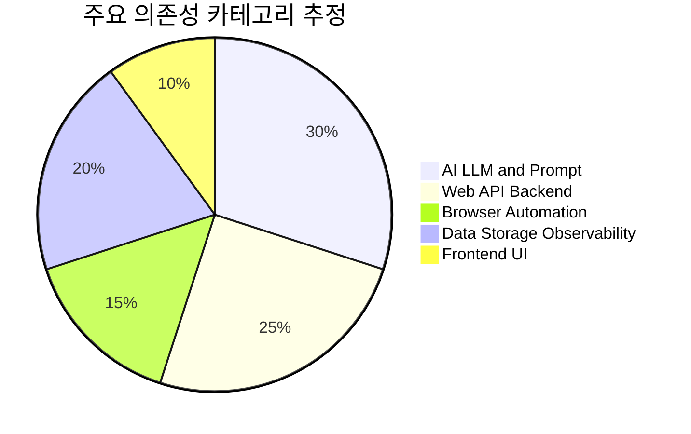

# 📦 기술 스택

## 기술 스택이 뭔가요?

이 시스템을 만들고 운영하는 데 사용되는 언어/라이브러리/인프라의 조합입니다.

## 기술 스택 구성

아래 그림은 Skyvern의 계층별 스택을 단순화한 것입니다.

## 아키텍처 용어와 스택 매핑

| 아키텍처 용어 | 주 사용 스택 | 설명 |
|------|------|------|
| ForgeApp (Container) | FastAPI, Python, DI 구성 | 공통 런타임 조립 |
| TaskV2 (Planner) | LiteLLM, PromptEngine, Jinja2 | 다음 태스크/블록 계획 |
| ForgeAgent (Executor) | Playwright, ActionHandler | 브라우저 액션 실행 |
| WorkflowService | Block Models, DB/Storage | 블록 실행/상태 관리 |

## 의존성 비중 (핵심 카테고리 기준)

아래 수치는 pyproject + frontend package를 기준으로 분류한 대략 비중입니다.

## 상세 스택

| 카테고리 | 기술/라이브러리 | 버전(관측) | 용도 |
|---------|--------------|------|------|
| 언어/런타임 | Python | 3.11+ | 백엔드 실행 |
| 웹 프레임워크 | FastAPI, Uvicorn | `fastapi>=0.121.0`, `uvicorn>=0.35.0` | API 서버 |
| 브라우저 자동화 | Playwright | `1.46+` | 웹 액션 실행 |
| AI 라우팅 | LiteLLM | `>=1.80.10` | 멀티 LLM 핸들링 |
| LLM SDK | OpenAI, Anthropic | `openai>=1.68.2`, `anthropic>=0.50.0` | 모델 호출 |
| 템플릿 | Jinja2 | `>=3.1.2` | 프롬프트 템플릿 |
| 데이터 계층 | SQLAlchemy, Alembic | `2.x`, `1.12+` | ORM/마이그레이션 |
| 캐시/메시징 | Redis | `>=5.0.3` | 캐시/일부 레지스트리 |
| 스토리지 | aioboto3 / Azure Blob | `>=14.3.0` | 아티팩트 저장 |
| 관측 | OpenTelemetry stack | `1.39.x / 0.60b1` | 트레이싱/메트릭 |
| 프론트엔드 | React + Vite + TS | React 18, Vite 5 | UI 콘솔 |
| TS SDK | `@skyvern/client` | `1.0.23` | TypeScript 클라이언트 |
