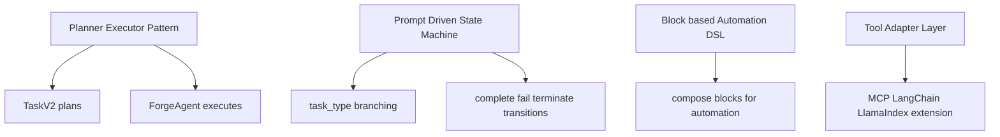

# 💡 핵심 인사이트 & 제안

## 잘 설계된 부분

1. **오케스트레이션 분리 전략이 명확함**
- 컨테이너(`ForgeApp`)와 계획(`TaskV2`), 실행(`ForgeAgent`)이 역할 분리되어 있음.

2. **프롬프트와 실행 로직 분리가 잘 되어 있음**
- `PromptEngine` + 템플릿 디렉토리 구조로 프롬프트 변경이 코드 변경과 분리됨.

3. **워크플로우 모델링이 강력함**
- `block.py`에 다양한 블록 타입(26 클래스)이 있어 복잡한 자동화를 조합형으로 표현 가능.

4. **외부 생태계 연동이 넓음**
- MCP, LangChain, LlamaIndex, TS SDK까지 제공해 제품 확장성이 높음.

5. **운영 관점 기능 포함**
- 아티팩트/웹훅/OTEL/재시도/종료 로직이 들어 있어 실서비스 지향 구조.

## 주의해야 할 부분

1. **핵심 파일 비대화**
- `skyvern/forge/agent.py`가 매우 큰 단일 파일(수천 라인)로 복잡도가 높고 변경 리스크가 큼.

2. **프롬프트 자산 수 증가**
- 코어 템플릿이 77개로 늘어나 일관성/회귀 테스트 체계가 없으면 품질 편차 가능.

3. **설정 복잡성**
- `.env.example` 기준 LLM/클라우드 설정 항목이 매우 많아 초기 온보딩이 어려울 수 있음.

4. **기능 플래그 의존성**
- TaskV2 종료/선택 파싱 등 일부 로직이 실험 플래그에 의존해 환경별 동작 편차 가능.

## 초보자를 위한 학습 포인트

이 레포에서 배울 수 있는 에이전틱 패턴:

## 개선 제안

| 우선순위 | 제안 | 기대 효과 |
|---------|------|---------|
| 높음 | `forge/agent.py`를 도메인별 모듈로 분리(계획/실행/아티팩트/오류처리) | 유지보수성/테스트성 향상 |
| 높음 | 프롬프트 템플릿 자동 회귀 테스트(골든 JSON + 스냅샷) 도입 | 프롬프트 변경 안정성 확보 |
| 중간 | `.env` 프리셋(로컬 최소 설정/클라우드 설정) 분리 제공 | 초기 셋업 난이도 감소 |
| 중간 | 블록/액션 실패 원인 분류 표준화(에러 코드 taxonomy) | 디버깅 속도 향상 |
| 낮음 | 코파일럿 응답 품질 지표와 피드백 루프 강화 | YAML 생성 성공률 향상 |
