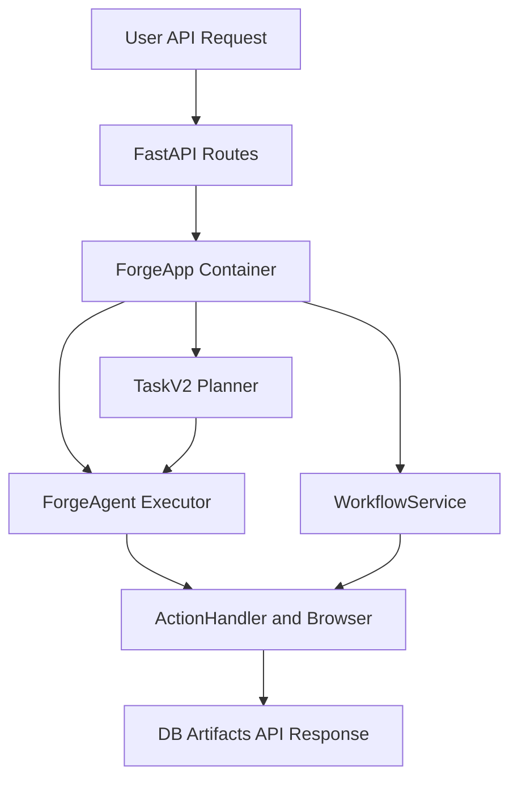

# 🔍 skyvern 분석 보고서

> **한 줄 요약**: Skyvern은 "웹 반복 업무를 자동화하는 Planner-Executor 시스템"입니다.  
> 분석일: 2026-03-03 | 레포: https://github.com/Skyvern-AI/skyvern

## 🔴 핵심 해석 기준 (필독)

이 보고서는 아래 기준으로 읽으면 헷갈리지 않습니다.

- `ForgeApp`: 실행기가 아니라 **앱 컨테이너/조립자**
- `TaskV2 Service`: **Planner 오케스트레이터**
- `ForgeAgent`: **Executor 오케스트레이터**
- 따라서 오케스트레이션은 단일 1개가 아니라 **2층(계획층 + 실행층)** 구조

## 구분 기준: Core와 Extension

- **Core Runtime(실행 필수)**: `ForgeApp`, `TaskV2 Service`, `ForgeAgent`, `WorkflowService`
- **Extension(선택 기능)**: `Workflow Copilot`, `MCP Tool Agents`, `Framework Adapter Agents`
- 외부 연동 모듈은 코어 루프를 대체하는 것이 아니라, 코어 기능을 다른 채널에서 쓰게 해주는 확장 레이어

## 📚 이 보고서 읽는 순서

처음 보는 분은 이 순서대로 읽으세요:

| 순서 | 파일 | 내용 | 소요 시간 |
|------|------|------|----------|
| 1 | [00_overview](./00_overview/summary.md) | 전체 그림 파악 | 5분 |
| 2 | [01_architecture](./01_architecture/architecture.md) | 시스템 구조 | 10분 |
| 3 | [02_agents](./02_agents/agents.md) | 에이전트 역할 분리 | 10분 |
| 4 | [03_prompts](./03_prompts/prompts.md) | 프롬프트 설계 | 15분 |
| 5 | [04_tools](./04_tools/tools.md) | 사용 가능한 도구들 | 10분 |
| 6 | [05_workflows](./05_workflows/workflows.md) | 실제 동작 흐름 | 15분 |
| 7 | [06_techstack](./06_techstack/techstack.md) | 기술 스택 | 5분 |
| 8 | [07_insights](./07_insights/insights.md) | 인사이트 & 제안 | 10분 |

## 🗺️ 전체 구조 한눈에 보기

아래 그림은 Skyvern의 핵심 실행 흐름(요청 -> 계획 -> 실행 -> 저장)을 단순화한 것입니다.

## 📊 주요 수치

| 항목 | 수치 |
|------|------|
| 총 파일 수 | 약 2,439개 |
| 핵심 에이전트/오케스트레이터 모듈 수 | 6개 |
| 코어 프롬프트 템플릿 수 (`skyvern/forge/prompts/skyvern`) | 77개 (Jinja2 75개) |
| 웹 액션 타입 수 (`ActionType`) | 22개 |
| MCP 툴 함수 수 (`skyvern/cli/mcp_tools`) | 34개 |
| 사용 AI 프레임워크/핵심 계층 | LiteLLM, OpenAI, Anthropic, PromptEngine(Jinja2), Playwright |

## 📁 생성된 보고서 경로

- 로컬 저장 경로: `/Users/mingukjang/Documents/Obsidian Vault/mgjang_claw/[260303]skyvern_report`
