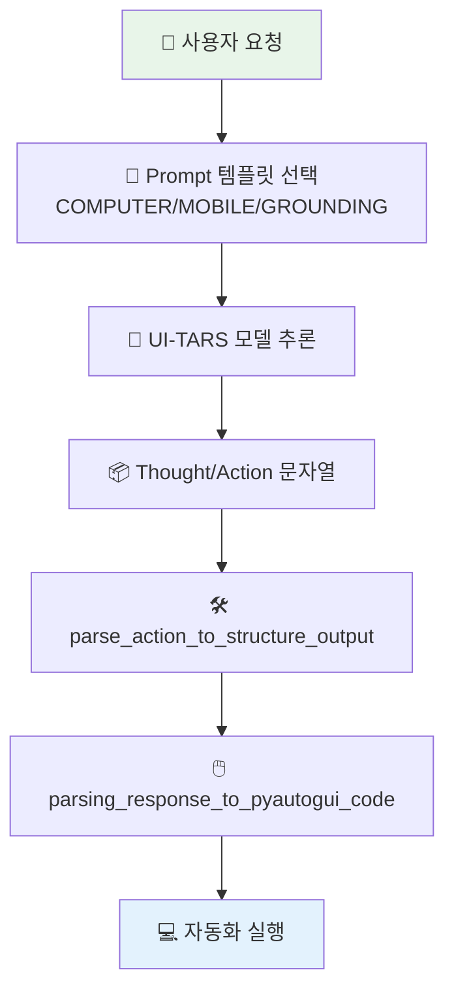

# 📖 이 시스템은 무엇인가요?

## 쉬운 설명

이 시스템은 "화면을 보면서 마우스/키보드로 다음 행동을 말해주는 AI 기사"에 가깝습니다.
AI가 "여기를 클릭해", "텍스트 입력해", "스크롤 내려"처럼 액션을 내면, 레포의 파서가 그 텍스트를 실제 자동화 코드로 바꿉니다.

## 이 시스템이 하는 일

- 입력: 사용자 목표(예: "이미지를 팔레트 모드로 바꿔줘") + 현재 화면 스크린샷
- 처리: UI-TARS 모델이 `Thought`/`Action` 생성
- 후처리: `action_parser.py`가 좌표 정규화 + 구조화 + `pyautogui` 코드 생성
- 출력: 실행 가능한 GUI 자동화 코드 또는 구조화된 액션 딕셔너리

## 전체 구조 다이어그램

아래 그림은 모델 출력이 실행 코드로 바뀌는 큰 흐름입니다. 화살표 방향으로 읽으면 됩니다.



## 디렉토리 구조

각 폴더 역할은 아래처럼 단순합니다.

```text
UI-TARS/
├── README*.md                 ← 모델 소개, 배포, 좌표 처리 가이드
├── codes/
│   ├── ui_tars/
│   │   ├── prompt.py          ← 프롬프트 템플릿 3종
│   │   └── action_parser.py   ← 액션 파싱/좌표 변환/코드 생성 핵심
│   ├── tests/                 ← 유닛 테스트
│   └── pyproject.toml         ← 패키지 메타/테스트 설정
├── data/                      ← 메시지/좌표 처리 예시 데이터
└── .github/workflows/test.yml ← CI 테스트 파이프라인
```

## 핵심 용어 설명

| 용어 | 쉬운 설명 |
|------|----------|
| 에이전트 (Agent) | 화면 보고 다음 행동을 판단하는 AI 주체 |
| 프롬프트 (Prompt) | AI에게 주는 행동 규칙 문서 |
| 액션 (Action) | `click`, `type`, `scroll` 같은 실제 행동 단위 |
| 그라운딩 (Grounding) | 화면 상 정확한 위치를 찾아 행동하는 능력 |
| 스마트 리사이즈 (smart_resize) | 좌표계 일관성을 위해 해상도를 규칙대로 보정하는 처리 |
| 워크플로우 (Workflow) | 입력부터 실행 코드 생성까지의 처리 순서 |
