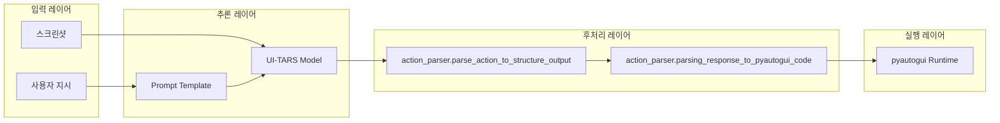
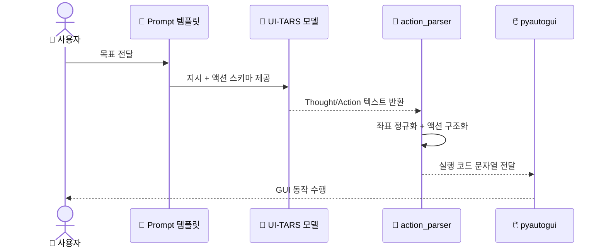

# 🏗️ 시스템 아키텍처

## 아키텍처란?

아키텍처는 "어떤 부품이 어떤 순서로 일하는지"를 보여주는 설계도입니다.
UI-TARS 레포는 대규모 오케스트레이터보다 "모델 출력 후처리 레이어"가 핵심입니다.

## 전체 컴포넌트 구조

이 그림은 입력-추론-후처리-실행의 4계층 구조를 보여줍니다.

## 데이터 흐름

아래 시퀀스는 실제 시간 순서대로 "요청 -> 액션 문자열 -> 실행 코드"가 만들어지는 과정을 보여줍니다.

## 계층별 설명

- 입력 레이어: 사용자 목표와 스크린샷을 준비
- 추론 레이어: `COMPUTER_USE_DOUBAO`/`MOBILE_USE_DOUBAO`/`GROUNDING_DOUBAO` 중 하나로 모델 행동 포맷 고정
- 후처리 레이어: 문자열 파싱, 좌표 변환, 액션 타입 분기 처리
- 실행 레이어: 생성된 `pyautogui` 코드로 실제 마우스/키보드 이벤트 수행
