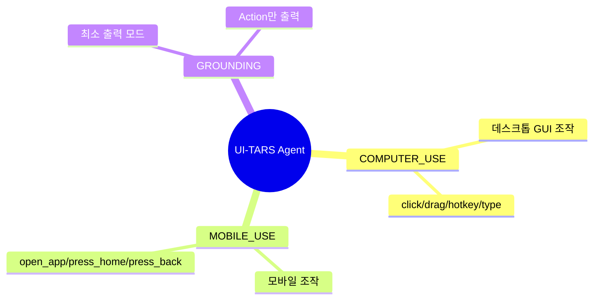
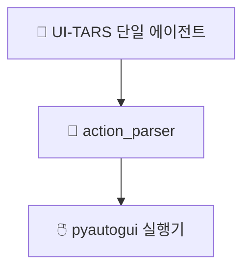

# 🤖 에이전트 구성

## 에이전트가 뭔가요?

에이전트는 "화면 상태를 보고 다음 행동을 결정하는 AI"입니다.
이 레포는 멀티 에이전트 협업 구조가 아니라, **단일 GUI 에이전트 + 모드별 프롬프트 프로파일** 구조입니다.

## 에이전트 관계도

이 그림은 하나의 모델이 3가지 동작 모드(데스크톱/모바일/그라운딩)로 작동하는 관계를 보여줍니다.

또한 실행 관점에서는 아래처럼 단일 에이전트와 파서가 연결됩니다.

## 에이전트별 상세 설명

### UI-TARS GUI Agent
- **역할**: 스크린샷과 지시를 보고 다음 GUI 행동을 생성
- **파일 위치**: 레포 내 모델 구현 코드는 직접 포함되지 않고 프롬프트/후처리 코드 중심
- **담당 업무**:
- 다음 액션 선택 (`click`, `type`, `scroll` 등)
- 필요 시 `Thought`로 계획 설명
- 지정 포맷으로 행동 출력 (`Action: ...`)
- **사용하는 모델**: UI-TARS 계열 모델 (문서상 1.5/2 계열)
- **사용하는 툴**: `action_parser.py` 후처리 함수, `pyautogui` 실행 코드 경로
- **다른 에이전트와의 관계**: 코드상 Supervisor/Planner/Reviewer 같은 별도 에이전트 없음

## 에이전트 역할 분담표

| 에이전트 | 역할 한 줄 요약 | 입력 | 출력 | 사용 모델 |
|---------|--------------|------|------|---------|
| UI-TARS Agent | 다음 GUI 행동 결정 | 지시 + 스크린샷 + 히스토리 | Thought/Action 문자열 | UI-TARS |
