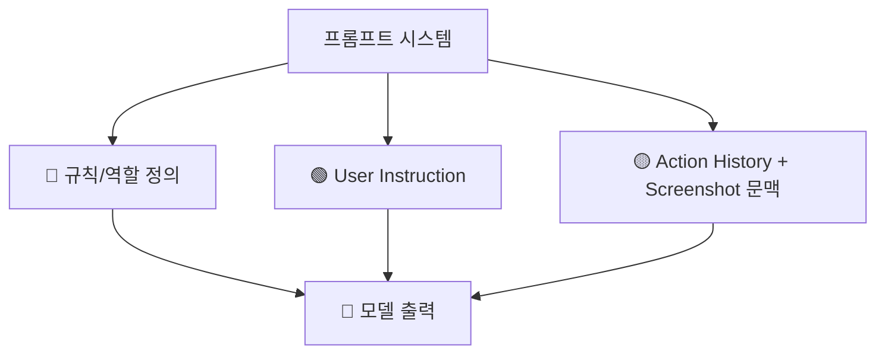
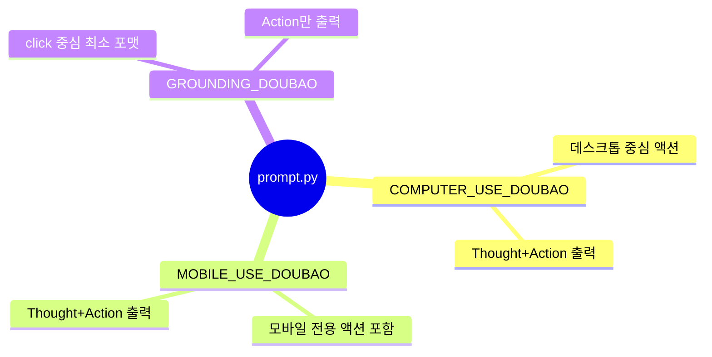

# 📝 프롬프트 분석

## 프롬프트가 뭔가요?

프롬프트는 AI의 "행동 규칙서"입니다.
이 레포는 `codes/ui_tars/prompt.py` 한 파일에 3개 템플릿을 넣어 디바이스 환경별 행동 공간을 분리합니다.

## 프롬프트 구조 개요

아래 구조에서 핵심은 System 성격의 규칙 블록이 액션 포맷을 강하게 고정한다는 점입니다.



## 발견된 프롬프트 목록

이 그림은 실제 템플릿 3개를 그대로 분류한 것입니다.



## 프롬프트별 상세 분석

### COMPUTER_USE_DOUBAO (`codes/ui_tars/prompt.py`)

> **한 줄 설명**: 데스크톱 환경에서 가장 범용적으로 쓰는 기본 템플릿

이 템플릿은 행동 타입을 풍부하게 제공하고, `Thought`에 계획을 짧게 쓰도록 강제합니다.

```mermaid
graph LR
    V1[{language}] --> F[최종 프롬프트]
    V2[{instruction}] --> F
    R[Action Space + Note] --> F
    F --> LLM[🤖 LLM]
```

**템플릿 변수**:

| 변수명 | 타입 | 설명 | 예시 |
|--------|------|------|------|
| `{language}` | string | Thought 작성 언어 | `Chinese`, `Korean` |
| `{instruction}` | string | 사용자 작업 지시 | `Open settings` |

**주요 인스트럭션 요약**:

- 출력 포맷 고정: `Thought:` + `Action:`
- 액션 타입 제공: click/drag/hotkey/type/scroll/wait/finished 등
- `Thought`에 "작은 계획 + 다음 행동 요약" 요구

### MOBILE_USE_DOUBAO (`codes/ui_tars/prompt.py`)

> **한 줄 설명**: 모바일/에뮬레이터 환경에 맞춘 템플릿

```mermaid
graph LR
    D[모바일 전용 액션
open_app/press_home/press_back] --> F[최종 프롬프트]
    I[{instruction}] --> F
    F --> LLM[🤖 LLM]
```

**템플릿 변수**:

| 변수명 | 타입 | 설명 | 예시 |
|--------|------|------|------|
| `{language}` | string | Thought 언어 | `Chinese` |
| `{instruction}` | string | 모바일 작업 지시 | `Open calculator app` |

### GROUNDING_DOUBAO (`codes/ui_tars/prompt.py`)

> **한 줄 설명**: 학습/평가용 최소 액션 출력 템플릿

```mermaid
graph LR
    I[{instruction}] --> F[최종 프롬프트]
    F --> O[Action만 출력]
```

**템플릿 변수**:

| 변수명 | 타입 | 설명 | 예시 |
|--------|------|------|------|
| `{instruction}` | string | 위치 지정 중심 지시 | `Click the save icon` |
