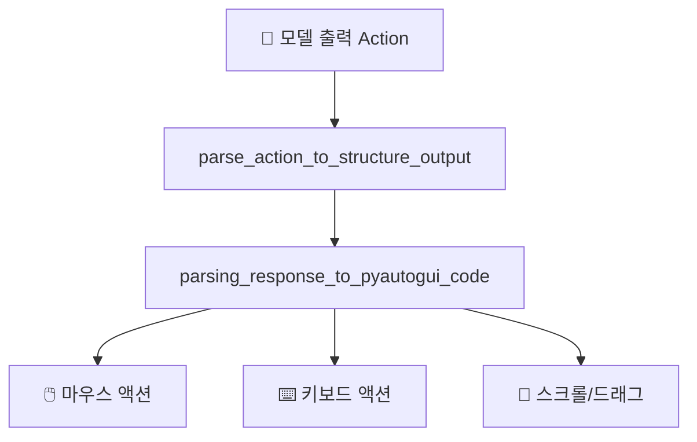
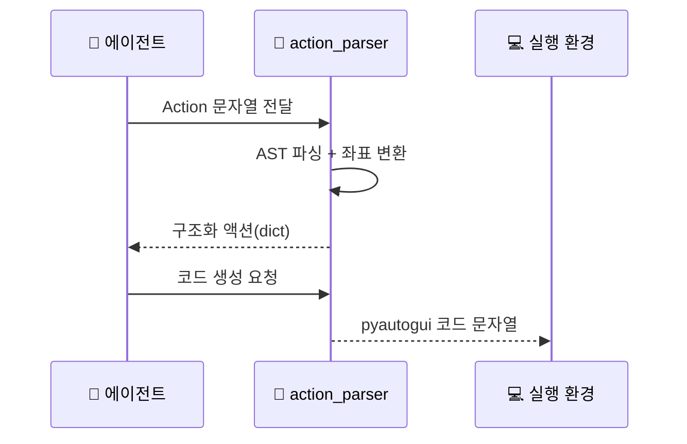

# 🛠️ 툴 & 함수

## 툴이 뭔가요?

이 레포에서 툴은 "모델이 낸 액션 텍스트를 실행 가능한 형태로 바꿔주는 함수/액션 타입"입니다.
즉, 외부 검색 툴보다 **GUI 조작 액션 실행기** 성격이 강합니다.

## 툴 전체 맵

아래 그림은 모델 출력이 파서를 거쳐 실제 OS 조작으로 이어지는 구조입니다.

## 툴 호출 흐름

이 시퀀스는 한 번의 액션이 실제 코드로 바뀌는 과정을 보여줍니다.

## 툴 목록

| 툴 이름 | 카테고리 | 설명 | 입력 | 출력 | 파일 위치 |
|---------|---------|------|------|------|---------|
| `parse_action_to_structure_output` | 파싱 | Thought/Action 텍스트를 구조화 | 원문 텍스트, 해상도 정보 | 액션 dict 리스트 | `codes/ui_tars/action_parser.py` |
| `parsing_response_to_pyautogui_code` | 코드 생성 | 액션 dict를 자동화 코드로 변환 | 액션 dict, 이미지 크기 | Python 코드 문자열 | `codes/ui_tars/action_parser.py` |
| `add_box_token` | 후처리 | 좌표 토큰 포맷 보정 | 액션 텍스트 | 토큰 삽입된 텍스트 | `codes/ui_tars/action_parser.py` |

## 지원 액션 타입 (15개)

아래 액션들은 파서의 `action_type` 분기에서 직접 처리됩니다.

- `click`, `left_single`, `left_double`, `right_single`, `hover`
- `drag`, `select`, `scroll`
- `type`, `hotkey`, `press`, `keydown`, `release`, `keyup`
- `finished`

## 툴별 상세 설명

### `parse_action_to_structure_output`
- **한 줄 설명**: 모델 출력 문자열을 실행 가능한 중간 표현으로 정규화
- **언제 사용**: 모델 응답 직후
- **파라미터**: `text`, `factor`, 원본 해상도, `model_type`
- **반환값**: `action_type`, `action_inputs`, `thought` 등이 담긴 dict 리스트

### `parsing_response_to_pyautogui_code`
- **한 줄 설명**: 구조화 액션을 실제 GUI 자동화 코드로 변환
- **언제 사용**: 파싱 성공 후 실행 직전
- **파라미터**: `responses`, `image_height`, `image_width`, `input_swap`
- **반환값**: `pyautogui` Python 코드 문자열 (`finished` 시 `DONE`)
