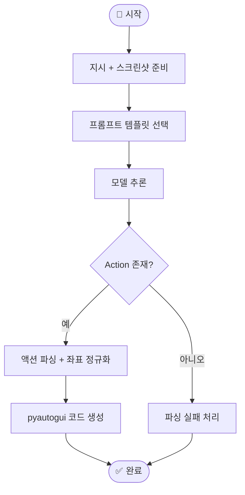
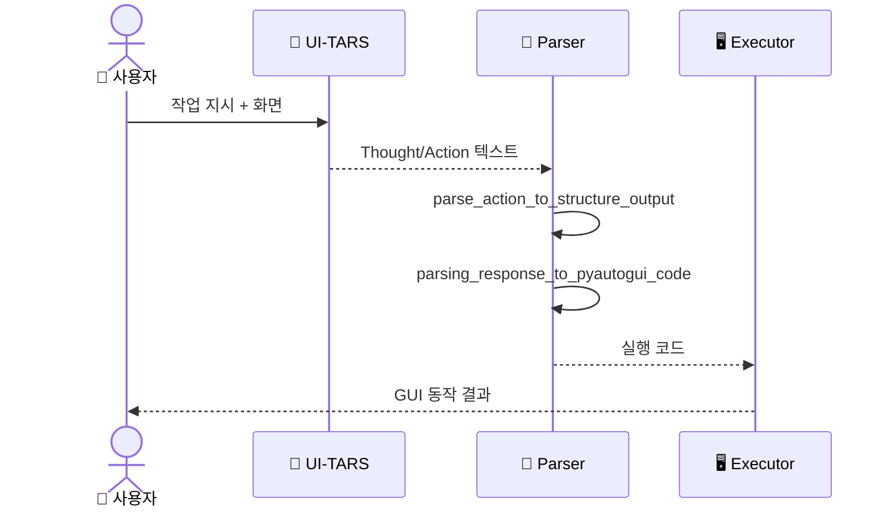
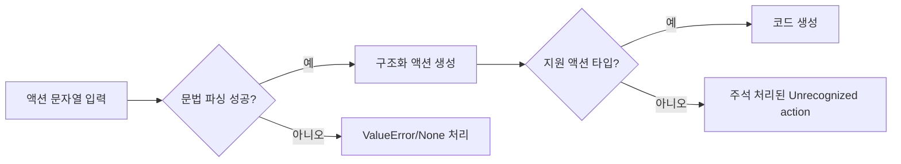

# 🔄 워크플로우

## 워크플로우가 뭔가요?

워크플로우는 "어떤 순서로 일을 처리하는지"를 보여주는 실행 절차입니다.
UI-TARS 레포의 메인 워크플로우는 모델 추론 자체보다 **응답 후처리 파이프라인**이 중심입니다.

## 메인 워크플로우

아래는 이 저장소 기준 핵심 흐름입니다.

## 컴포넌트 간 상호작용 흐름

이 시퀀스는 사용자 요청이 실제 클릭/타이핑 동작으로 변환되는 시간 흐름입니다.

## 오류 처리 흐름

파서 코드에서 확인되는 실패/예외 경로를 단순화하면 아래와 같습니다.

## 주요 시나리오별 흐름

- 데스크톱 시나리오: `COMPUTER_USE_DOUBAO` -> click/type/hotkey 위주
- 모바일 시나리오: `MOBILE_USE_DOUBAO` -> open_app/press_home/press_back 포함
- 평가 시나리오: `GROUNDING_DOUBAO` -> Action-only 출력으로 단순 평가
