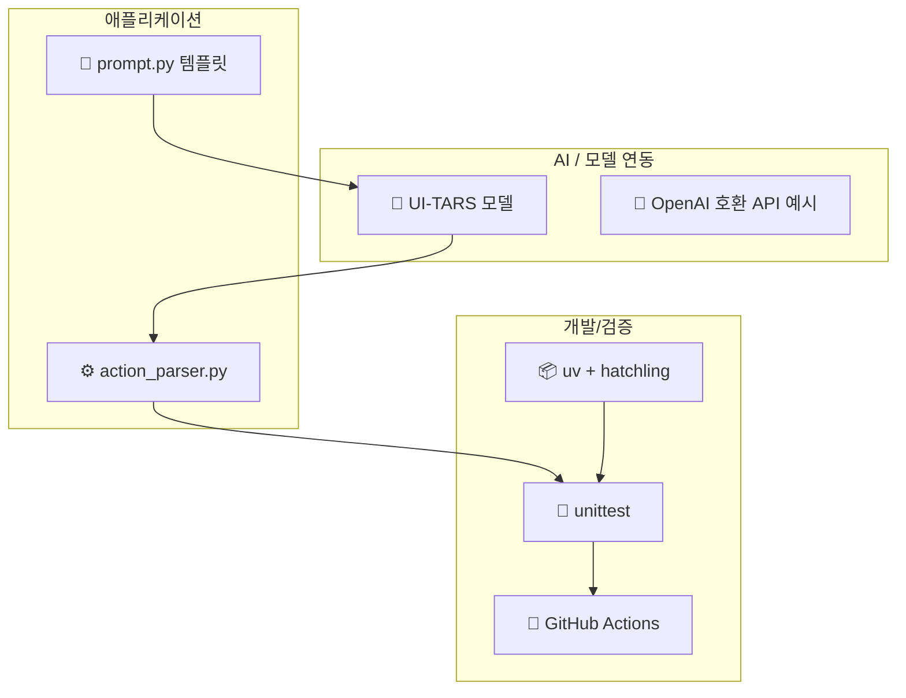
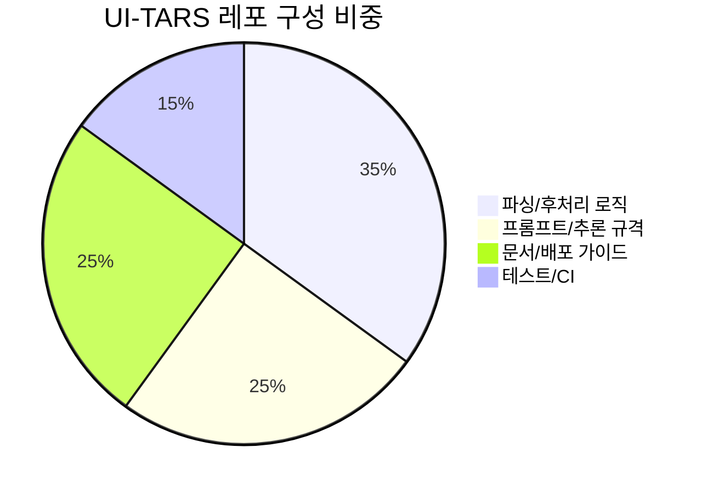

# 📦 기술 스택

## 기술 스택이 뭔가요?

기술 스택은 "이 시스템을 만들고 테스트하는 데 쓰인 언어/도구 목록"입니다.
이 레포는 Python 패키지 배포 + 문서/실험 가이드 중심 구조입니다.

## 기술 스택 구성

아래 그림은 실제 코드 기준 레이어를 단순화한 것입니다.

## 구성 비중 (저장소 목적 기준)

아래 비율은 의존성 개수보다 "레포 목적"(문서/파서/실행가이드) 관점의 비중입니다.

## 상세 스택

| 카테고리 | 기술/라이브러리 | 버전 | 용도 |
|---------|--------------|------|------|
| 언어/런타임 | Python | `>=3.10,<4.0` | 패키지/파서 구현 |
| 빌드 | hatchling | pyproject 기준 | 패키지 빌드 |
| 패키지 관리 | uv | lock/sync | 개발 의존성 관리 |
| 테스트 | unittest | 표준 라이브러리 | 파서 기능 검증 |
| CI | GitHub Actions | `actions/setup-python@v5` | PR/메인 브랜치 테스트 |
| 시각/실험(개발) | matplotlib, pillow | dev-dependencies | 좌표 시각화 예시 |
| 실행 자동화(코드 생성 대상) | pyautogui, pyperclip | 코드 내 사용 | GUI 동작 스크립트 생성 타깃 |

## 인프라/DB 관찰 사항

- 데이터베이스, 메시지 큐, 서버 오케스트레이터는 레포에 직접 포함되지 않음
- 주 대상은 "모델 출력 후처리 라이브러리 + 사용 문서"
