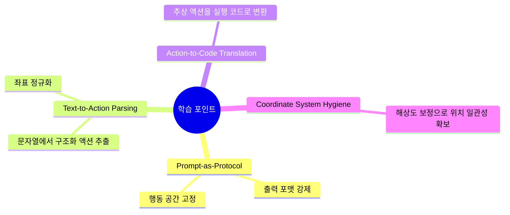

# 💡 핵심 인사이트 & 제안

## 잘 설계된 부분 👍

- 프롬프트 프로파일 분리: `prompt.py`에서 데스크톱/모바일/그라운딩을 명확히 분리해 목적이 분명함
- 파서 책임이 명확함: `parse_action_to_structure_output`(구조화)와 `parsing_response_to_pyautogui_code`(실행코드 변환)가 분리됨
- 좌표 처리 가이드 제공: `README_coordinates.md`와 테스트 코드로 좌표 스케일링 원리를 재현 가능하게 설명
- CI 최소 루프 존재: `.github/workflows/test.yml`에서 PR/푸시 시 자동 테스트 실행

## 주의해야 할 부분 ⚠️

- `eval` 사용 리스크: `action_parser.py`에서 좌표 문자열 처리 시 `eval`이 사용되어 입력 신뢰성 검증이 매우 중요
- 예외 복원력 제한: 파싱 실패 시 `ValueError` 중심이라 생산 환경에서 재시도/폴백 정책이 약함
- 실행 보안 경계 부재: 생성된 `pyautogui` 코드는 실제 OS 입력을 발생시키므로 샌드박스/권한 통제가 필요
- 의존성 선언 미니멀: `pyproject.toml` `dependencies`가 비어 있어 실제 런타임 패키지 관리 정책을 별도로 정해야 함

## 초보자를 위한 학습 포인트 🎓

이 레포에서 배울 수 있는 패턴은 아래와 같습니다.

## 개선 제안 🚀

| 우선순위 | 제안 | 기대 효과 |
|---------|------|---------|
| 높음 | `eval` 제거 후 안전 파서(`ast.literal_eval` + 엄격 검증)로 전환 | 코드 실행 취약점 완화 |
| 높음 | 파싱 실패 시 재시도/폴백 규칙(예: 액션 재생성 요청) 추가 | 실사용 안정성 향상 |
| 중간 | 액션 스키마를 JSON Schema로 공식화 | 모델/파서 간 계약 안정화 |
| 중간 | 액션별 단위 테스트 확대(경계 좌표, 잘못된 인코딩) | 회귀 버그 감소 |
| 낮음 | 실제 실행기(샌드박스) 레퍼런스 추가 | 안전한 데모/교육 환경 제공 |
