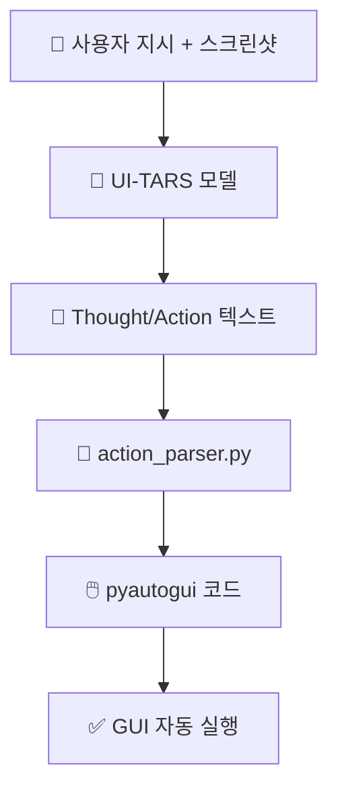

# 🔍 UI-TARS 분석 보고서

> **한 줄 요약**: UI-TARS는 화면을 보고 다음 행동을 텍스트 액션으로 내놓는 단일 GUI 에이전트 모델이며, 이 레포는 그 출력을 실행 가능한 코드로 바꿔주는 파서 패키지 중심 저장소입니다.
> 분석일: 2026-03-03 | 레포: https://github.com/bytedance/UI-TARS | 커밋: `582f3a7`

## 📚 이 보고서 읽는 순서

처음 보는 분은 이 순서대로 읽으세요:

| 순서 | 파일 | 내용 | 소요 시간 |
|------|------|------|----------|
| 1 | [00_overview](./00_overview/summary.md) | 전체 그림 파악 | 5분 |
| 2 | [01_architecture](./01_architecture/architecture.md) | 시스템 구조 | 10분 |
| 3 | [02_agents](./02_agents/agents.md) | AI 에이전트 구성 | 10분 |
| 4 | [03_prompts](./03_prompts/prompts.md) | 프롬프트 설계 | 15분 |
| 5 | [04_tools](./04_tools/tools.md) | 툴/액션 체계 | 10분 |
| 6 | [05_workflows](./05_workflows/workflows.md) | 실행 워크플로우 | 15분 |
| 7 | [06_techstack](./06_techstack/techstack.md) | 기술 스택 | 5분 |
| 8 | [07_insights](./07_insights/insights.md) | 인사이트/개선안 | 10분 |

## 🗺️ 전체 구조 한눈에 보기

아래 그림은 이 레포의 핵심 흐름(프롬프트 -> 모델 응답 -> 파싱 -> 자동화 코드)을 요약한 것입니다.

## 📊 주요 수치

| 항목 | 수치 |
|------|------|
| 총 파일 수 | 28개 (`.git` 제외) |
| 에이전트 수 | 1개 (단일 GUI 에이전트 모델, 코드상 에이전트 클래스는 0개) |
| 프롬프트 파일 수 | 1개 (`codes/ui_tars/prompt.py`, 템플릿 3개) |
| 정의된 액션/툴 타입 수 | 15개 (`action_parser.py` 기준) |
| 사용 AI 프레임워크 | 전용 파서 패키지 중심 (LangChain/LangGraph 미사용) |

## ✅ 분석 범위

- 핵심 코드: `codes/ui_tars/prompt.py`, `codes/ui_tars/action_parser.py`
- 실행/검증: `codes/tests/*.py`, `.github/workflows/test.yml`
- 문서/배포: `README.md`, `README_deploy.md`, `README_coordinates.md`
- 시크릿: `.env` 파일이나 API 키 원문은 레포에 포함되어 있지 않음 (예시 키는 문서 내 마스킹 형태)
