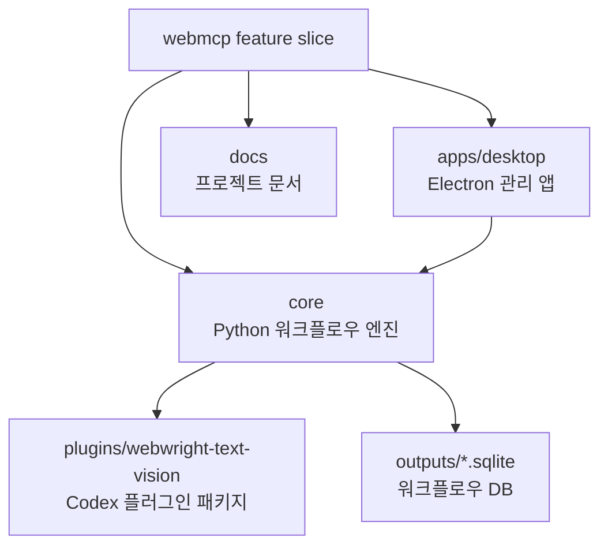
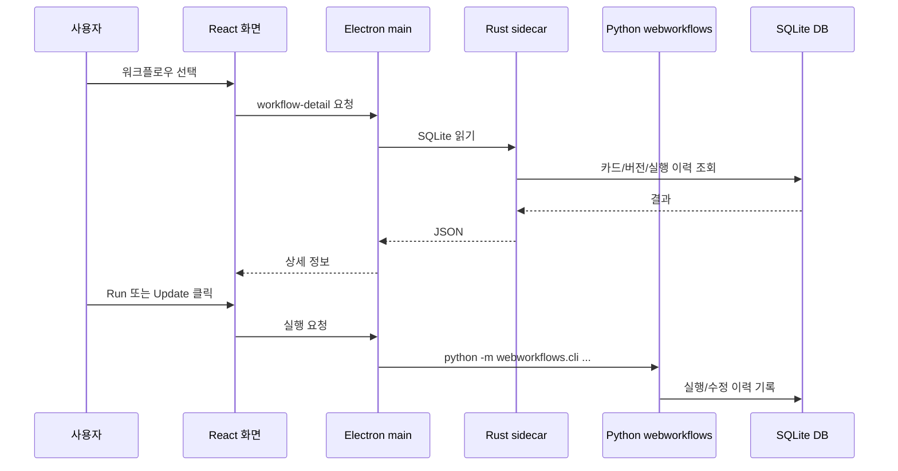
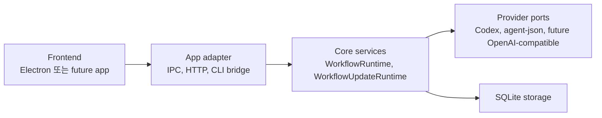

# WebMCP

WebMCP는 Webwright 기반 브라우저 작업을 반복 가능한 워크플로우로 저장하고,
각 버전의 실행 결과와 수정 이력을 관리하는 기능 묶음입니다. 이 디렉터리는
제품 관점의 단일 feature slice이며, 기술 스택보다 기능 경계를 먼저 드러내는
구조를 사용합니다.

```text
webmcp/
  core/          Python 워크플로우 엔진, Webwright 통합, 플러그인 패키지
  apps/desktop/ Electron + React 관리 앱, Rust SQLite sidecar
  docs/          아키텍처, 개발, 앱, 워크플로우 문서
```

## 전체 구조



## 실행 흐름

Desktop 앱은 워크플로우를 직접 구현하지 않습니다. 화면은 사용자가 선택한
워크플로우를 보여주고, 읽기 작업은 Rust sidecar에 맡기며, 실행과 수정처럼
DB를 바꾸는 작업은 Python CLI에 위임합니다. 이 위임 경계는 service와 adapter로
분리되어 있어 Claude Code, OpenAI-compatible API, 다른 frontend app으로 옮길 때
교체 지점이 분명합니다.



## 이식성 경계



- Core 실행 contract는 `core/webworkflows/services/`에서 확인합니다.
- 모델 provider 선택은 `core/webworkflows/providers/synthesis_provider.py`에
  모읍니다.
- Desktop의 process/IPC adapter는 `apps/desktop/electron/webmcp-core-client.cjs`와
  `apps/desktop/electron/ipc-handlers.cjs`에 있습니다.
- 새 frontend를 붙일 때는 Core 내부 SQL을 복제하지 말고, CLI JSON contract 또는
  service facade와 같은 shape를 사용합니다.

## 빠른 시작

처음 온보딩하는 사람은 먼저 [Runbook](docs/RUNBOOK.md)을 따라가면 됩니다. 이
README는 제품과 폴더 지도를 제공하고, Runbook은 실제 실행, DB 확인, 장애 대응,
검증 매트릭스를 한 번에 제공합니다.

Core 테스트:

```bash
cd webmcp/core
python3 -m unittest tests/test_repo_structure.py tests/test_workflow_runtime_service.py tests/test_workflow_update_runtime_service.py tests/test_synthesis_provider_port.py tests/test_workflow_tools.py tests/test_js_tool_conversion.py tests/test_text_default_vision_fallback.py
```

고정된 ablation study suite 실행:

```bash
cd webmcp
python3 core/scripts/run_ablation_studies.py --suite all
```

시간이 부족하면 harder browser task와 memory ablation만 다시 돌립니다.

```bash
python3 core/scripts/run_ablation_studies.py --suite fast
```

이 스크립트는 persistent DB를 쓰지 않고 `core/outputs/ablation_*` 아래 격리 DB,
로컬 demo site, browser artifact를 생성합니다. 통합 요약은
`core/outputs/ablation_latest/consolidated_summary.md`와
`core/outputs/ablation_latest/consolidated_results.json`에 남습니다.

DB에 저장된 workflow tool을 JavaScript tool로 변환:

```bash
cd webmcp/core
python3 -m webworkflows.cli export-js-tool \
  --db ~/.webmcp-studio/db/workflows.sqlite \
  --workflow-name naver_stock_report \
  --version 1 \
  --output-dir outputs/js_tools

python3 -m webworkflows.cli run-js-tool \
  --tool-dir outputs/js_tools/naver-stock-report-v1 \
  --arguments-file outputs/js_tools/naver_stock_args.json

python3 -m webworkflows.cli eval-js-tool \
  --tool-dir outputs/js_tools/naver-stock-report-v1 \
  --arguments-file outputs/js_tools/naver_stock_args.json \
  --required-output company_name \
  --required-output ticker \
  --required-output current_price \
  --required-output report_text
```

Canonical workflow metadata table 이름은 `workflow_tools`와 `workflow_tool_*`입니다.
기존 `workflow_skills` DB는 Core 초기화 시 자동으로 새 table 이름으로 migrate됩니다.

Desktop 실행:

```bash
cd webmcp/apps/desktop
npm install
npm run dev
```

Desktop 기본 DB:

```text
~/.webmcp-studio/db/workflows.sqlite
```

다른 위치가 필요하면 `WEBMCP_STUDIO_DB_PATH`를 지정합니다.

Reviewed workflow memory fixture를 persistent DB에 동기화:

```bash
npm run db:sync-memory
```

이 명령은 `core/fixtures/workflow-memory/*.jsonl`의 `workflow_example`,
`page_analysis`, `knowledge` 레코드를 `~/.webmcp-studio/db/workflows.sqlite`에
idempotent upsert합니다. `WEBMCP_STUDIO_DB_PATH`를 지정하면 같은 명령이 해당 DB를
사용합니다.

```bash
npm run db:sync-memory:dry
npm run db:sync-examples
npm run db:sync-naver
```

## 문서 지도

- [Runbook](docs/RUNBOOK.md): 처음 실행, DB 확인, 실제 workflow 실행, 장애 대응.
- [아키텍처](docs/ARCHITECTURE.md): 경계, 의존성, 데이터 흐름.
- [개발 가이드](docs/DEVELOPMENT.md): 설치, 실행, 검증 명령.
- [Desktop 앱](docs/DESKTOP_APP.md): UI, IPC, sidecar, 실행/수정 동작.
- [워크플로우](docs/WORKFLOWS.md): DB 구조, step, handler, cold init.
- [Ablation baseline](docs/ablation-study-2026-06-10.md): 저장 workflow, JS export, dynamic action 기본 비교.
- [Ablation harder](docs/ablation-study-harder-2026-06-10.md): multi-variant browser task 비교.
- [Ablation memory](docs/ablation-study-memory-2026-06-10.md): page analysis/knowledge memory with/without 비교.
- [계획 문서](docs/plans/): 설계와 구현 계획의 이력.

## 소스 규칙

- 실행 엔진과 workflow handler는 `core/webworkflows`에 둡니다.
- workflow 실행/수정 use case는 `core/webworkflows/services`에 둡니다.
- Codex/OpenAI-compatible/agent-json 같은 생성 provider 선택은
  `core/webworkflows/providers`에 둡니다.
- Desktop 전용 UI와 IPC는 `apps/desktop`에 둡니다.
- 공유 동작은 Desktop에 복제하지 말고 Core CLI나 DB 조회 계층을 통해
  호출합니다.
- generated output은 `core/outputs`에 두고, fixture나 문서로 승격할 때만
  Git에 포함합니다.
