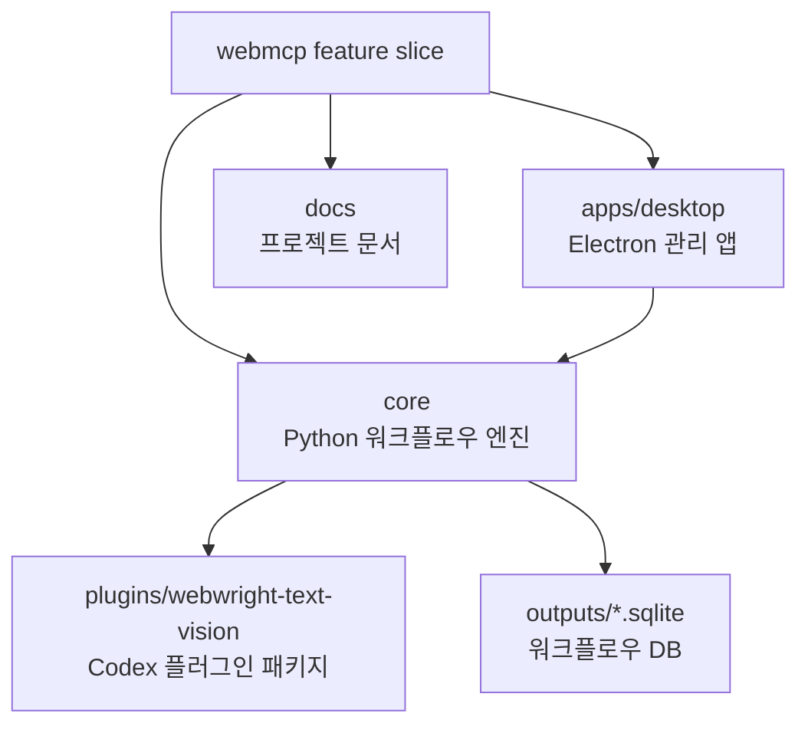
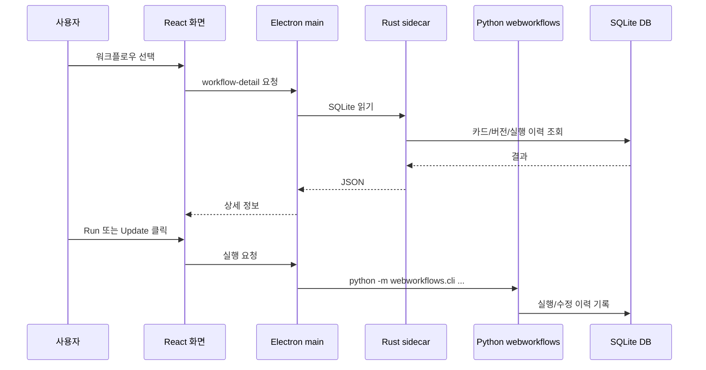

# WebMCP

WebMCP는 Webwright 기반 브라우저 작업을 반복 가능한 워크플로우로 저장하고,
각 버전의 실행 결과와 수정 이력을 관리하는 기능 묶음입니다. 이 디렉터리는
제품 관점의 단일 feature slice이며, 기술 스택보다 기능 경계를 먼저 드러내는
구조를 사용합니다.

```text
webmcp/
  core/          Python 워크플로우 엔진, Webwright 통합, 플러그인 패키지
  apps/desktop/ Electron + React 관리 앱, Rust SQLite sidecar
  docs/          아키텍처, 개발, 앱, 워크플로우 문서
```

## 전체 구조



## 실행 흐름

Desktop 앱은 워크플로우를 직접 구현하지 않습니다. 화면은 사용자가 선택한
워크플로우를 보여주고, 읽기 작업은 Rust sidecar에 맡기며, 실행과 수정처럼
DB를 바꾸는 작업은 Python CLI에 위임합니다.



## 빠른 시작

Core 테스트:

```bash
cd webmcp/core
python3 -m unittest tests/test_repo_structure.py tests/test_workflow_skills.py tests/test_text_default_vision_fallback.py
```

Desktop 실행:

```bash
cd webmcp/apps/desktop
npm install
npm run dev
```

Desktop 기본 DB:

```text
webmcp/core/outputs/webmcp_plugin_cold_iter_check/workflows.sqlite
```

## 문서 지도

- [아키텍처](docs/ARCHITECTURE.md): 경계, 의존성, 데이터 흐름.
- [개발 가이드](docs/DEVELOPMENT.md): 설치, 실행, 검증 명령.
- [Desktop 앱](docs/DESKTOP_APP.md): UI, IPC, sidecar, 실행/수정 동작.
- [워크플로우](docs/WORKFLOWS.md): DB 구조, step, handler, cold init.
- [계획 문서](docs/plans/): 설계와 구현 계획의 이력.

## 소스 규칙

- 실행 엔진과 workflow handler는 `core/webworkflows`에 둡니다.
- Desktop 전용 UI와 IPC는 `apps/desktop`에 둡니다.
- 공유 동작은 Desktop에 복제하지 말고 Core CLI나 DB 조회 계층을 통해
  호출합니다.
- generated output은 `core/outputs`에 두고, fixture나 문서로 승격할 때만
  Git에 포함합니다.
