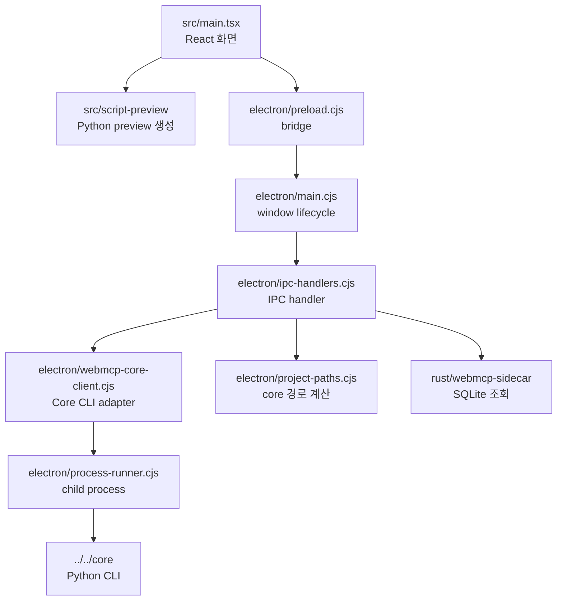
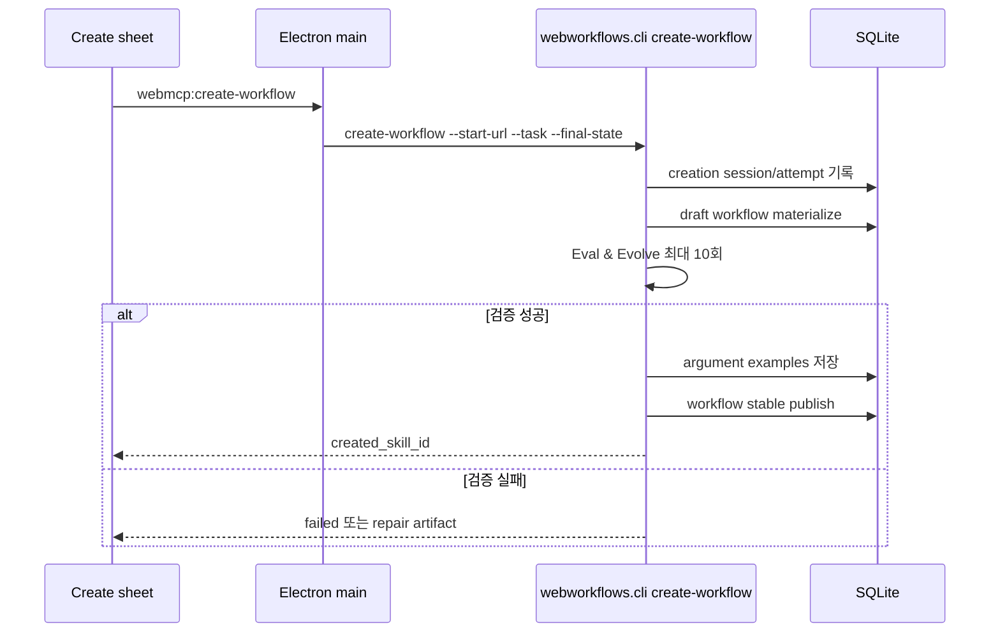
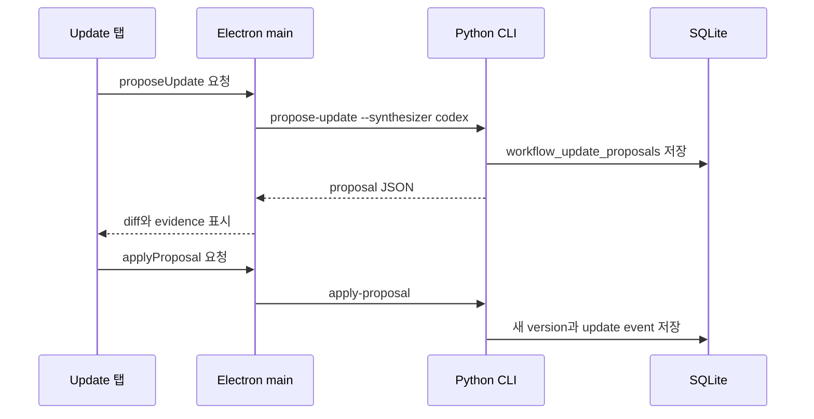
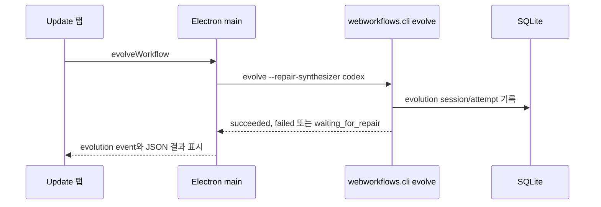

# WebMCP Desktop

이 디렉터리는 WebMCP workflow를 확인하고 관리하는 Electron + React 앱입니다.
전체 프로젝트 지도는 [../../README.md](../../README.md)를 확인합니다. Desktop은
workflow engine이 아니라 UI와 process orchestration을 담당합니다.

## 실행

```bash
cd webmcp/apps/desktop
npm install
npm run dev
```

`npm run dev`는 Rust sidecar를 빌드하고, Vite dev server를 띄운 뒤 Electron
창을 엽니다. 운영 빌드에 가까운 로컬 실행은 다음 명령을 사용합니다.

```bash
npm run app
```

## Desktop 구조



## App adapter 파일

- `electron/ipc-handlers.cjs`: 기존 IPC channel 이름을 등록하고 queue lock을 관리합니다.
- `electron/webmcp-core-client.cjs`: `create-workflow`, `run-version`, `evolve`,
  `propose-update`, `apply-proposal` Python CLI 호출과 stdout JSON parsing을
  담당합니다.
- `electron/process-runner.cjs`: `child_process.spawn`을 감싼 adapter입니다. 실행 중인
  job은 macOS/Linux에서 process group `SIGSTOP`/`SIGCONT`로 일시정지/재개할 수
  있습니다.
- `electron/main.cjs`: Electron app lifecycle과 BrowserWindow 생성만 담당합니다.

다른 frontend app으로 옮길 때는 이 adapter shape를 참고해 HTTP, Tauri, native app
bridge로 바꾸면 됩니다. Core 내부 SQL이나 workflow executor를 UI 쪽으로 복제하지
않습니다.

## 기본 경로

Desktop의 기본 DB는 다음 위치입니다.

```text
~/.webmcp-studio/db/workflows.sqlite
```

다른 위치를 쓰려면 `WEBMCP_STUDIO_DB_PATH`로 override합니다.

기본 Python runtime은 Webwright virtualenv가 있으면 다음 경로를 사용합니다.

```text
webmcp/core/reference/webwright/.venv/bin/python
```

없으면 `python3`로 fallback합니다.

## 실행 패널

실행 패널은 선택된 workflow version 하나만 실행합니다. 여러 version을 동시에
headless로 실행하면 사용자가 실제 동작을 관찰하기 어렵고, 현재 선택된 version과
결과의 관계가 불명확해집니다.

주요 명령은 macOS toolbar처럼 icon-only control로 표시합니다. 각 control은
`title`과 `aria-label`을 함께 가지고 있어 hover하면 정확한 기능을 볼 수 있고,
키보드 사용자도 같은 이름을 얻습니다.

- `Play` icon: 선택 version을 headless로 실행합니다.
- `Eye` icon: 선택 version을 headed로 실행합니다.
- `Refresh` icon: workflow 목록과 상세 정보를 다시 불러옵니다.

Naver workflow는 stale fixture를 쓰지 않도록 항상 다음 CLI 형태로 live page
text를 수집합니다.

```bash
<configured-python> -m webworkflows.cli run-version --live-page-text ...
```

Eval and evolve loop를 payload로 켜면 같은 `run-version` 명령에
`--eval-and-evolve --vlm-evaluator codex`가 추가됩니다. Desktop은 evaluator 선택을
노출하지 않습니다. step 평가는 항상 Codex VLM evaluator가 수행하며, 기본 경로는
`codex exec` subprocess가 아니라 Codex app-server 기반 OAuth 재사용입니다. 기본
모델 `gpt-5.5`로 screenshot, page text, URL, title, output, assertion을 함께 보고
수행합니다.

## Create workflow

Tool List 상단의 `Plus` icon은 새 workflow 생성 sheet를 엽니다. 생성 시점에는 어떤
tool을 만들지 아직 모르므로 `company`, `ticker`, `news_limit` 같은 domain-specific
argument를 받지 않습니다. 사용자가 입력하는 값은 다음 네 가지입니다.

- 시작 URL
- 수행할 작업
- 완료되었을 때의 브라우저 상태
- 실행 화면과 Codex 모델



자동 수정/재검증 반복 수는 내부적으로 최대 10회로 고정합니다. 이 값은 사용자가
매번 결정할 설정이 아니므로 UI에 노출하지 않습니다. 생성 중에는 `Pause` icon으로
현재 Python/Codex/Playwright process group을 일시정지하고, `Play` icon으로 재개할
수 있습니다.

검증을 통과한 workflow는 실행에 사용한 argument set을 metadata로 저장합니다.
Desktop의 Argument Examples 패널은 `workflow_skill_examples`와 argument별
`examples_json`을 읽어, 다음 QA나 재실행 때 바로 적용할 수 있는 예시 버튼을
구성합니다. 예시 안의 일반 argument는 실행과 Eval & Evolve payload에 보존되고,
Electron adapter가 Core CLI의 `--argument name=value` 옵션으로 전달합니다.

사람이 검토한 예시와 page/knowledge memory는 repo root에서 다음 명령으로 persistent
DB에 동기화할 수 있습니다.

```bash
npm run db:sync-memory
```

fixture는 `core/fixtures/workflow-memory/*.jsonl`에 있으며 반복 실행해도 같은 예시
버튼이나 knowledge entry를 중복 생성하지 않습니다. Naver 관련 예시만 갱신하려면
`npm run db:sync-naver`, 쓰기 전 확인은 `npm run db:sync-memory:dry`를 사용합니다.

## Implementation 탭

Workflow step은 JavaScript snippet이 아닙니다. DB에는 declarative action과
handler reference가 저장되고, 실제 handler는 Python source에 있습니다.
Implementation 탭은 이 구조를 숨기지 않기 위해 다음 정보를 함께 보여줍니다.

- Python + Playwright single-file preview
- step type과 action JSON
- handler module/function
- handler source text
- resource template
- run output과 step evidence

## Update 탭



Desktop은 사용자에게 `fake-copy`를 노출하지 않습니다. 사용자가 보는 수정 방식은
`코드만 보고 수정`과 `브라우저를 조작하며 수정` 두 가지입니다.

Repair loop는 별도 icon action입니다. 이 경로는 `webworkflows.cli evolve`를
호출합니다. 실패하면 `repair_request.json`을 남기고, Codex repair synthesizer가
다음 workflow JSON을 생성해 다음 version을 재실행합니다.

Update 탭의 `Eval & Evolve` 패널은 원클릭 흐름입니다.

- `실행 화면`: `브라우저 보기`를 고르면 Playwright 브라우저가 실제로 떠서 실행 과정을
  육안으로 볼 수 있습니다. `브라우저 숨김`은 백그라운드 검증입니다.
- `최대 시도`: eval 실패 후 자동 repair와 재실행을 몇 번까지 반복할지 정합니다.
- 실행 버튼을 누르면 선택 version을 실행하고, 각 step을 Codex VLM으로 평가합니다.
  실패하면 Codex repair synthesizer가 수정안을 만들고 적용한 뒤 다음 version을 다시
  실행합니다.
- 실행 후 `최근 검사 결과` 영역에서 `성공`, `수정 대기`, 시도 수, 실패 step,
  소요 시간, repair artifact, report artifact를 바로 열 수 있습니다.
- 각 attempt 아래에는 step timeline이 표시됩니다. 각 step은 상태, step type,
  step 실행 시간, Codex VLM 요약, 기대 상태, 관찰 결과, 문제 목록, 수정 초점,
  수정 방향, screenshot/evidence artifact를 JSON 없이 보여줍니다.



## 검증

```bash
npm run test:unit
npm run sidecar:test
npm run typecheck
npm run build
npm run sidecar:build
WEBMCP_DEV_SMOKE=1 npm run dev
```
