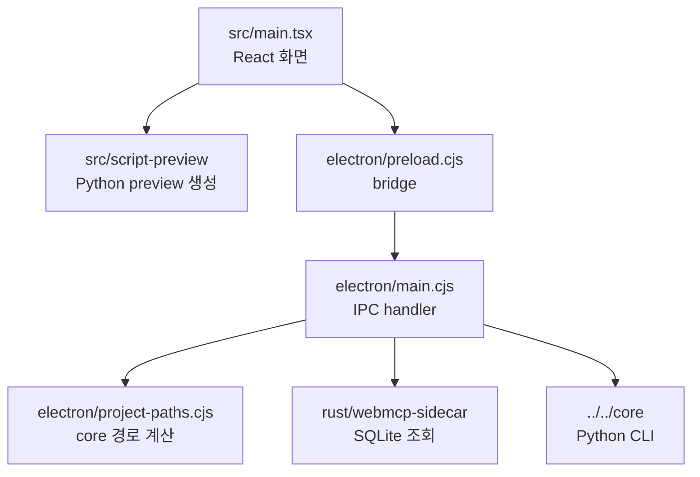
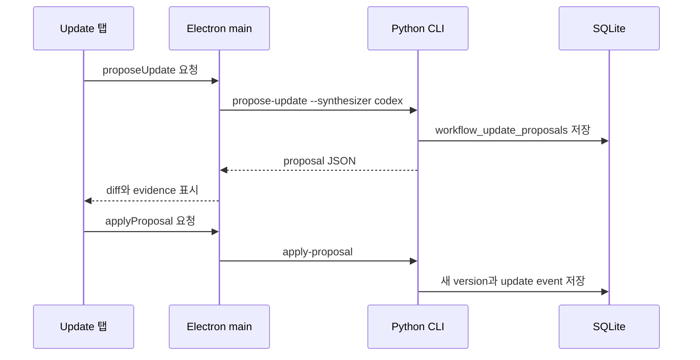

# WebMCP Desktop

이 디렉터리는 WebMCP workflow를 확인하고 관리하는 Electron + React 앱입니다.
전체 프로젝트 지도는 [../../README.md](../../README.md)를 확인합니다. Desktop은
workflow engine이 아니라 UI와 process orchestration을 담당합니다.

## 실행

```bash
cd webmcp/apps/desktop
npm install
npm run dev
```

`npm run dev`는 Rust sidecar를 빌드하고, Vite dev server를 띄운 뒤 Electron
창을 엽니다. 운영 빌드에 가까운 로컬 실행은 다음 명령을 사용합니다.

```bash
npm run app
```

## Desktop 구조



## 기본 경로

Desktop의 기본 DB는 다음 위치입니다.

```text
webmcp/core/outputs/webmcp_plugin_cold_iter_check/workflows.sqlite
```

기본 Python runtime은 Webwright virtualenv가 있으면 다음 경로를 사용합니다.

```text
webmcp/core/reference/webwright/.venv/bin/python
```

없으면 `python3`로 fallback합니다.

## 실행 패널

실행 패널은 선택된 workflow version 하나만 실행합니다. 여러 version을 동시에
headless로 실행하면 사용자가 실제 동작을 관찰하기 어렵고, 현재 선택된 version과
결과의 관계가 불명확해집니다.

- `Run selected headless`: `WEBWRIGHT_HEADLESS=1`로 실행합니다.
- `Run selected headed`: `WEBWRIGHT_HEADLESS=0`로 실행합니다.

Naver workflow는 stale fixture를 쓰지 않도록 항상 다음 CLI 형태로 live page
text를 수집합니다.

```bash
<configured-python> -m webworkflows.cli run-version --live-page-text ...
```

## Implementation 탭

Workflow step은 JavaScript snippet이 아닙니다. DB에는 declarative action과
handler reference가 저장되고, 실제 handler는 Python source에 있습니다.
Implementation 탭은 이 구조를 숨기지 않기 위해 다음 정보를 함께 보여줍니다.

- Python + Playwright single-file preview
- step type과 action JSON
- handler module/function
- handler source text
- resource template
- run output과 step evidence

## Update 탭



Desktop은 사용자에게 `fake-copy`를 노출하지 않습니다. 사용자가 보는 수정 방식은
`코드만 보고 수정`과 `브라우저를 조작하며 수정` 두 가지입니다.

## 검증

```bash
npm run test:unit
npm run sidecar:test
npm run typecheck
npm run build
npm run sidecar:build
WEBMCP_DEV_SMOKE=1 npm run dev
```
