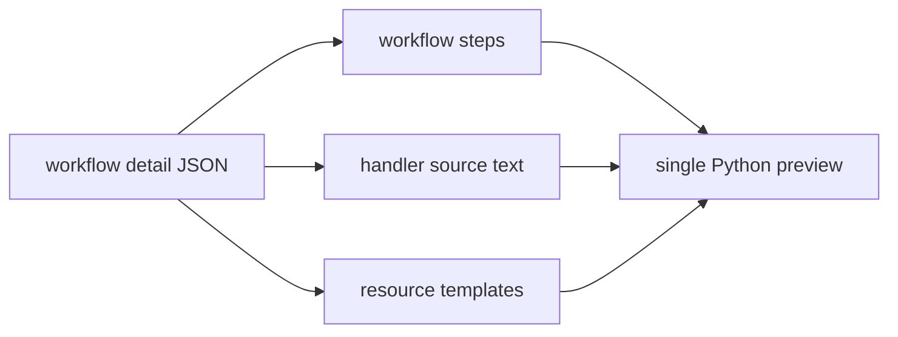

# Script Preview 규칙

이 폴더는 WebMCP Desktop의 Implementation 탭에서 보여주는 script preview를
생성합니다. preview는 실행 source of truth가 아니라 사용자가 workflow를
검사할 수 있도록 만든 단일 Python + Playwright 파일입니다.

## Preview 생성 흐름

## 규칙

1. Preview는 JavaScript가 아니라 Python + Playwright 파일입니다.
2. `run_handler` step을 import 한 줄 뒤에 숨기지 않습니다.
3. 참조된 handler module은 실제 Python 함수 코드로 inline합니다.
4. handler source를 읽지 못하면 조용히 생략하지 않고 `RuntimeError`를 던지는
   stub 함수를 생성합니다.
5. resource template과 step JSON은 preview 근처에 함께 보여줍니다.

Electron main process는 sidecar가 반환한 handler metadata에 `sourcePath`와
`sourceText`를 붙입니다. Renderer는 이 정보를 받아 `generatePlaywrightScriptPreview`
를 호출합니다.
