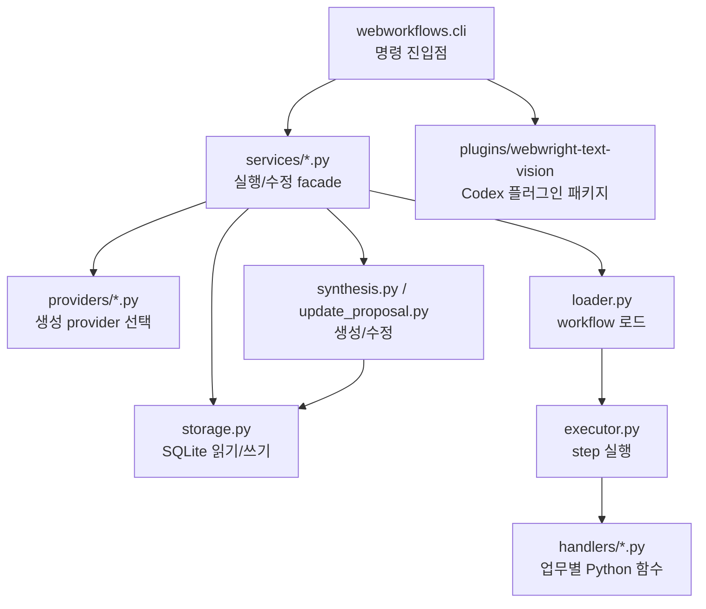
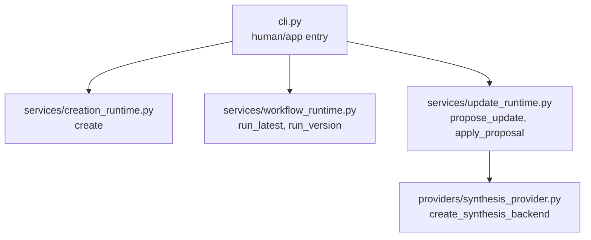
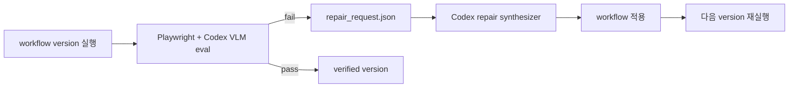

# WebMCP Core

이 디렉터리는 WebMCP의 Python core입니다. workflow 저장소, 실행기, cold init,
update proposal, Naver stock handler, Webwright text/vision 플러그인 패키지가
여기에 있습니다. 전체 프로젝트 지도는 [../README.md](../README.md)를 먼저
확인합니다.

## Core 책임



Core는 Desktop 앱 없이도 실행되어야 합니다. Codex plugin, CLI smoke test,
Desktop IPC가 모두 같은 `webworkflows` 모듈을 호출합니다.

## 이식 가능한 API 경계



Claude Code, OpenAI-compatible API, 다른 frontend로 옮길 때 우선 확인할 파일은
다음 세 곳입니다.

- `services/workflow_runtime.py`: workflow 실행 payload를 CLI와 같은 JSON shape로
  반환합니다.
- `services/creation_runtime.py`: start URL, 사용자 작업, 완료 브라우저 상태를 받아
  새 workflow 생성 session을 실행하고 검증 통과 시 stable workflow로 publish합니다.
- `services/update_runtime.py`: update proposal 생성과 적용 payload를 반환합니다.
- `providers/synthesis_provider.py`: `codex`, `agent-json`, `fake-copy` provider 이름을
  backend instance로 매핑합니다.

## 테스트

```bash
cd webmcp/core
python3 -m unittest discover -s tests
```

`test_repo_structure.py`는 단순 파일 존재 여부뿐 아니라 현재 문서가 한글
중심인지, 주요 문서에 Mermaid 다이어그램이 충분히 있는지도 확인합니다.

## Workflow CLI

fixture 기반 deterministic 실행:

```bash
python3 -m webworkflows.cli run \
  --db outputs/webmcp_workflows.sqlite \
  --output-dir outputs/workflow_runs \
  --request "네이버에서 삼성전자 주가 리포트" \
  --company-name 삼성전자 \
  --ticker 005930 \
  --page-text-file tests/fixtures/naver_stock_text.txt
```

Desktop 앱과 동일한 live 실행:

```bash
reference/webwright/.venv/bin/python -m webworkflows.cli run-version \
  --db outputs/webmcp_plugin_cold_iter_check/workflows.sqlite \
  --output-dir outputs/desktop_runs \
  --workflow-name naver_stock_report \
  --version 7 \
  --request "네이버에서 삼성전자 주가 리포트" \
  --company-name 삼성전자 \
  --ticker 005930 \
  --news-limit 1 \
	  --live-page-text
```

Eval and evolve loop를 켜면 Playwright가 workflow step을 실제 브라우저에서
다시 밟고, 각 step과 final 상태의 screenshot/text/output evidence를 남깁니다.
평가는 항상 Codex VLM evaluator가 수행합니다. 기본 `--vlm-evaluator codex` 경로는
`codex exec` subprocess를 반복 실행하지 않고 Codex app-server를 통해 저장된 Codex
OAuth 로그인을 재사용합니다. 기본 모델 `gpt-5.5`로 step screenshot과 page text, URL,
title, handler output, assertion을 함께 보고 JSON 결과를 반환합니다. 모델 없는 로컬
판정이나 수동 VLM JSON 파일 경로는 사용하지 않습니다. 기존 Codex CLI subprocess
경로가 꼭 필요하면 명시적으로 `--vlm-evaluator codex-cli`를, Platform API key 기반
Responses API 경로가 필요하면 `--vlm-evaluator openai-responses`를 사용합니다.

```bash
python3 -m webworkflows.cli run-version \
  --db outputs/webmcp_plugin_cold_iter_check/workflows.sqlite \
  --output-dir outputs/desktop_runs \
  --workflow-name naver_stock_report \
  --version 7 \
  --request "네이버에서 삼성전자 주가 리포트" \
  --company-name 삼성전자 \
  --ticker 005930 \
  --eval-and-evolve \
  --vlm-evaluator codex
```

### Repair loop 실행

`evolve` 명령은 Webwright식 `실행 -> 평가 -> 실패 evidence -> repair request ->
새 version -> 재실행` 흐름을 하나의 session으로 기록합니다. 평가 단계는 항상
Codex VLM evaluator가 담당하고, 실패하면 Codex repair synthesizer가 다음 workflow
JSON을 생성해 다음 attempt를 실행합니다.



repair JSON이 아직 없으면 `waiting_for_repair` 상태로 멈추고
`outputs/.../evolution/session_<id>/attempt_<n>/repair_request.json`을 남깁니다.

```bash
python3 -m webworkflows.cli evolve \
  --db outputs/webmcp_workflows.sqlite \
  --output-dir outputs/evolution_runs \
  --workflow-name naver_stock_report \
  --base-version 1 \
  --request "네이버에서 삼성전자 주가 리포트" \
  --company-name 삼성전자 \
  --ticker 005930 \
  --max-attempts 3 \
  --vlm-evaluator codex
```

Desktop 기본 경로는 repair synthesizer도 Codex로 고정합니다.

```bash
python3 -m webworkflows.cli evolve \
  --db outputs/webmcp_workflows.sqlite \
  --output-dir outputs/evolution_runs \
  --workflow-name naver_stock_report \
  --base-version 1 \
  --request "네이버에서 삼성전자 주가 리포트" \
  --company-name 삼성전자 \
  --ticker 005930 \
  --repair-synthesizer codex \
  --vlm-evaluator codex
```

## Workflow 생성

새 tool 생성은 `create-workflow` 명령을 사용합니다. 생성 시점에는 workflow schema를
아직 모르므로 `company_name`, `ticker` 같은 domain-specific argument를 요구하지
않습니다. 입력은 start URL, 수행 작업, 완료 브라우저 상태가 전부입니다.

```bash
python3 -m webworkflows.cli create-workflow \
  --db outputs/webmcp_workflows.sqlite \
  --output-dir outputs/desktop_runs \
  --start-url "https://www.google.com/flights" \
  --task "Search for flights from SEA to JFK on 2026-08-15 to 2026-08-20" \
  --final-state "SEA to JFK flight results are visible" \
  --eval-and-evolve \
  --vlm-evaluator codex
```

생성 workflow는 먼저 draft로 materialize되고, Eval & Evolve를 통과한 뒤에만 stable
상태로 publish됩니다. Desktop adapter는 생성 과정의 자동 수정/재검증 한도를 내부
max 10회로 고정하고 UI에 노출하지 않습니다.

검증을 통과한 argument set은 workflow metadata에도 저장됩니다. Core는 성공한
Eval & Evolve loop 안에서 `workflow_skill_examples`에 `user_request`,
`normalized_arguments_json`, 기대 출력 요약을 기록하고, 각 argument의
`examples_json`도 성공 입력값으로 보강합니다. Desktop의 Argument Examples 패널은
이 metadata를 읽어 다음 테스트 입력으로 재사용합니다. `company_name`/`ticker`처럼
기존 stock 전용 flag가 없는 workflow argument는 `run-version`과 `evolve`에서
`--argument name=value` 형식으로 전달합니다.

## Reviewed memory fixtures

실제 QA 중 확인한 예시와 노하우는 `core/fixtures/workflow-memory/*.jsonl`에 사람이
리뷰 가능한 형태로 저장합니다. 이 fixture는 실행 성공으로 자동 축적되는 metadata와
별개로, 새 환경이나 persistent DB를 다시 구성할 때 기준 memory를 재현하기 위한
seed입니다.

```bash
cd webmcp
npm run db:sync-memory
```

동기화 스크립트는 기본적으로 `WEBMCP_STUDIO_DB_PATH`를 따르고, 없으면
`~/.webmcp-studio/db/workflows.sqlite`를 사용합니다. 반복 실행해도 같은 예시나
노하우 row를 중복으로 늘리지 않습니다.

```bash
npm run db:sync-memory:dry  # fixture row 쓰기 없이 insert/update/skip 요약
npm run db:sync-examples    # workflow_skill_examples만 동기화
npm run db:sync-naver       # tags/category/workflow/url이 naver와 맞는 record만 동기화
```

Fixture record는 세 종류를 지원합니다.

```jsonl
{"type":"workflow_example","workflow_name":"naver_map_transit_route","user_request":"네이버 지도에서 양재역에서 사당역까지 지하철 소요 시간을 확인한다.","normalized_arguments":{"start_station":"양재역","end_station":"사당역","start_url":"https://www.naver.com"},"expected_output_summary":"네이버 지도 대중교통 길찾기 결과에 지하철 소요 시간이 표시된다.","tags":["naver","map"]}
{"type":"page_analysis","original_url":"https://map.naver.com/p/directions/-/-/-/transit?c=15.00,0,0,0,dh","title":"네이버 지도 길찾기","framework_hints":["naver_map","client_rendered"],"frame_hints":["hydrated_map_surface"],"locator_hints":["prefer_accessible_input_names"],"analysis":{"page_type":"naver_map_transit_directions","stable_markers":["대중교통","출발","도착"]},"evidence":{"page_text_excerpt":"대중교통 자동차 도보 출발 도착"},"source":"manual_fixture","tags":["naver","map"]}
{"type":"knowledge","category":"script_generation","summary":"Treat Naver Map transit routes as hydrated browser tasks, not static text tasks.","content":{"actionable_tips":["Headed Naver Map runs must enter eval-and-evolve/browser evaluation."]},"source":"manual_fixture","confidence":0.92,"tags":["naver","map","headed"]}
```

`page_analysis`의 `original_url`은 저장 시 Core의 URL normalization을 사용합니다.
query string과 fragment를 제거하고 host/path를 kebab-case로 변환하므로, 저장과
조회가 같은 key를 공유합니다. `workflow_example`은 workflow가 아직 DB에 없으면
skip으로 보고하고, workflow가 있으면 `workflow_skill_examples`와 argument별
`examples_json`을 함께 보강합니다.

## Webwright Text + Vision 플러그인

`plugins/webwright-text-vision`은 `reference/webwright` 기반의 local Codex
plugin variant입니다. 기본 작업은 text/DOM/ARIA evidence를 우선 사용하고,
시각 판단이 반드시 필요할 때만 vision model로 넘기는 구조입니다.

Codex 세션 안에서는 nested `codex exec`를 피해야 합니다. 브라우저 작업은
`@webwright`를 사용하고, 반복 가능한 workflow 생성은 active Codex 모델이
`workflow.json`을 직접 작성한 뒤 `--synthesizer agent-json`으로 materialize하는
경로를 사용합니다.

## Reference patch

`reference/webwright`는 ignored local clone입니다. standalone harness 테스트가
필요할 때만 다음 patch를 적용합니다.

```bash
patches/webwright-codex-oauth-text-vision.patch
```
