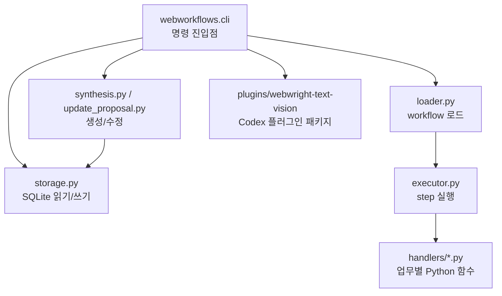

# WebMCP Core

이 디렉터리는 WebMCP의 Python core입니다. workflow 저장소, 실행기, cold init,
update proposal, Naver stock handler, Webwright text/vision 플러그인 패키지가
여기에 있습니다. 전체 프로젝트 지도는 [../README.md](../README.md)를 먼저
확인합니다.

## Core 책임



Core는 Desktop 앱 없이도 실행되어야 합니다. Codex plugin, CLI smoke test,
Desktop IPC가 모두 같은 `webworkflows` 모듈을 호출합니다.

## 테스트

```bash
cd webmcp/core
python3 -m unittest tests/test_repo_structure.py tests/test_workflow_skills.py tests/test_text_default_vision_fallback.py
```

`test_repo_structure.py`는 단순 파일 존재 여부뿐 아니라 현재 문서가 한글
중심인지, 주요 문서에 Mermaid 다이어그램이 충분히 있는지도 확인합니다.

## Workflow CLI

fixture 기반 deterministic 실행:

```bash
python3 -m webworkflows.cli run \
  --db outputs/webmcp_workflows.sqlite \
  --output-dir outputs/workflow_runs \
  --request "네이버에서 삼성전자 주가 리포트" \
  --company-name 삼성전자 \
  --ticker 005930 \
  --page-text-file tests/fixtures/naver_stock_text.txt
```

Desktop 앱과 동일한 live 실행:

```bash
reference/webwright/.venv/bin/python -m webworkflows.cli run-version \
  --db outputs/webmcp_plugin_cold_iter_check/workflows.sqlite \
  --output-dir outputs/desktop_runs \
  --workflow-name naver_stock_report \
  --version 7 \
  --request "네이버에서 삼성전자 주가 리포트" \
  --company-name 삼성전자 \
  --ticker 005930 \
  --news-limit 1 \
  --live-page-text
```

## Webwright Text + Vision 플러그인

`plugins/webwright-text-vision`은 `reference/webwright` 기반의 local Codex
plugin variant입니다. 기본 작업은 text/DOM/ARIA evidence를 우선 사용하고,
시각 판단이 반드시 필요할 때만 vision model로 넘기는 구조입니다.

Codex 세션 안에서는 nested `codex exec`를 피해야 합니다. 브라우저 작업은
`@webwright`를 사용하고, 반복 가능한 workflow 생성은 active Codex 모델이
`workflow.json`을 직접 작성한 뒤 `--synthesizer agent-json`으로 materialize하는
경로를 사용합니다.

## Reference patch

`reference/webwright`는 ignored local clone입니다. standalone harness 테스트가
필요할 때만 다음 patch를 적용합니다.

```bash
patches/webwright-codex-oauth-text-vision.patch
```
