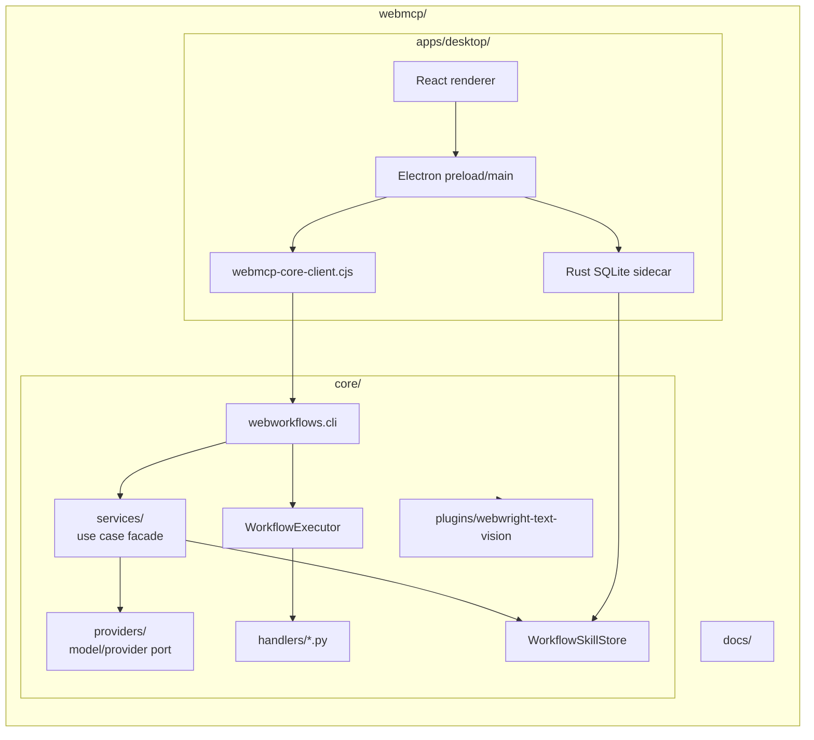
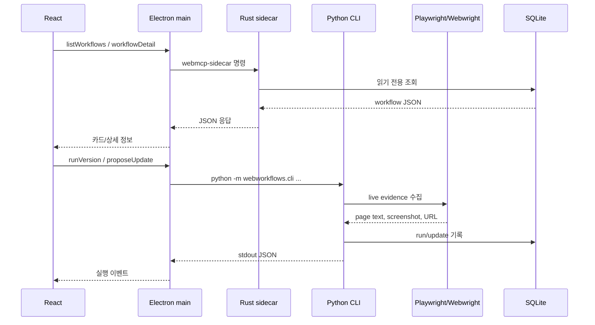
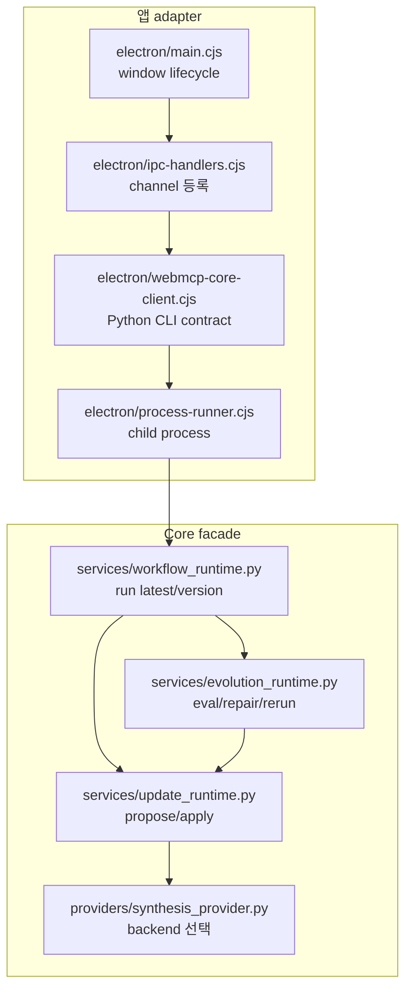
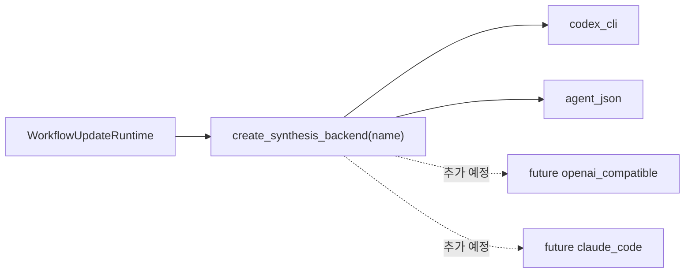
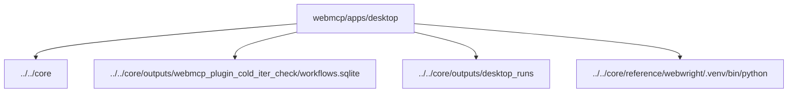
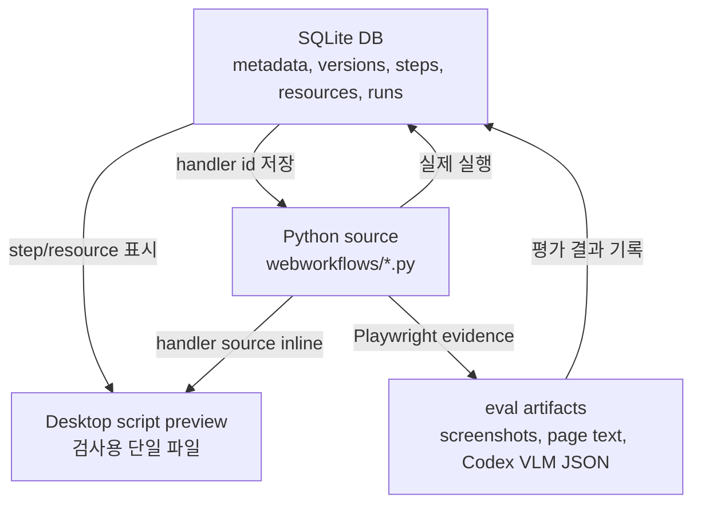
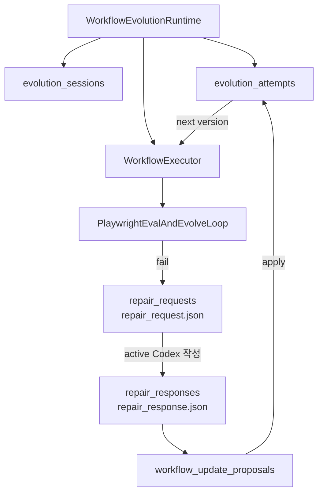

# WebMCP 아키텍처

이 문서는 `webmcp/` feature slice의 책임 경계와 런타임 흐름을 설명합니다.
핵심 원칙은 간단합니다. Core는 워크플로우를 실행하고 저장하며, Desktop은
그 워크플로우를 확인하고 조작하는 앱입니다.
처음 실행, DB 확인, 장애 대응 절차는 [RUNBOOK.md](RUNBOOK.md)를 먼저 봅니다.

## 책임 경계

`apps/desktop`는 `core`에 의존합니다. 반대로 `core`는 Desktop을 몰라야
합니다. 이 방향을 지키면 CLI, Codex 플러그인, Desktop 앱이 같은 workflow
engine을 공유하면서도 서로를 불필요하게 끌어안지 않습니다.

## 런타임 데이터 흐름

## Port/Adapter 구조

`main.cjs`는 더 이상 Python 인자, stdout JSON parsing, queue event shape를 직접
알지 않습니다. Desktop에서는 `webmcp-core-client.cjs`가 Core CLI adapter이고,
Core에서는 `services/*.py`가 CLI와 future API server가 공유할 use case입니다.

## Provider 교체 지점

현재 provider는 `codex`, `agent-json`, `fake-copy` 이름을 유지합니다. OpenAI-
compatible API나 Claude Code를 붙일 때는 CLI와 Desktop IPC를 고치기보다
`providers/synthesis_provider.py`에 backend를 추가하고 문서화합니다.

## 기본 경로

Desktop의 기본 경로는 `webmcp/apps/desktop` 기준으로 계산합니다. 이 로직은
테스트 가능한 `electron/project-paths.cjs`에 있습니다.

## Source of Truth

워크플로우 정의는 DB에 저장되지만, 실행 가능한 Python 함수는 source file에
남습니다. Desktop의 Implementation preview는 감사와 이해를 위한 생성물이며,
실제 실행의 source of truth가 아닙니다.

Eval and evolve loop도 같은 원칙을 따릅니다. Core는 Playwright로 evidence를
수집하고 SQLite에 기록한 뒤, Codex VLM evaluator가 기본 모델 `gpt-5.5`로 각 step의
화면과 텍스트 증거를 평가합니다. 평가 결과는 `summary`, `expected_state`,
`observed_state`, `problems`, `repair_focus`를 포함한 JSON으로 DB와 Desktop UI에
전달됩니다.

VLM evaluator의 현재 기본 경로와 교체 절차는 [VLM_EVALUATION.md](VLM_EVALUATION.md)
에 정리되어 있습니다. 기본 `--vlm-evaluator codex`는 `codex exec` 반복 호출이 아니라
Codex app-server와 저장된 Codex OAuth 로그인을 사용합니다.

## Evolution Runtime

Evolution runtime은 Core 내부에서 모델을 호출하는 backend가 아닙니다. Core의
역할은 실행, 평가 artifact 저장, repair request 작성, agent-json workflow 적용,
재실행입니다. Codex harness는 이 바깥에서 artifact를 읽고 다음 workflow JSON을
작성합니다. 이 경계를 유지해야 OpenAI-compatible API, Claude Code, 다른 Desktop
frontend로 옮길 때 실행 엔진과 agent 판단을 분리할 수 있습니다.
