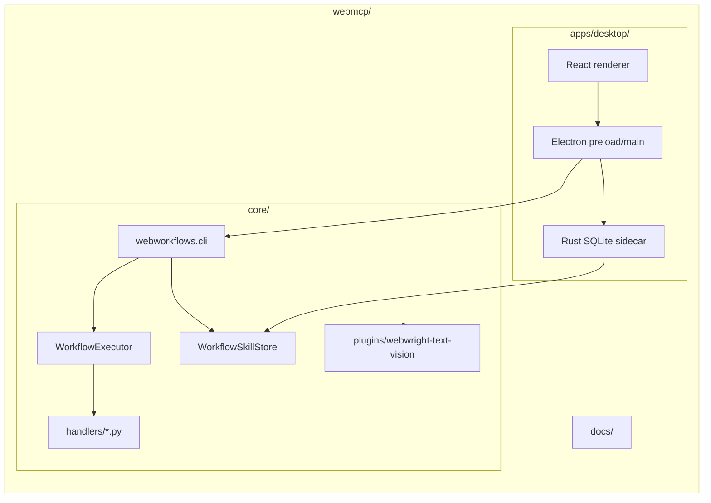
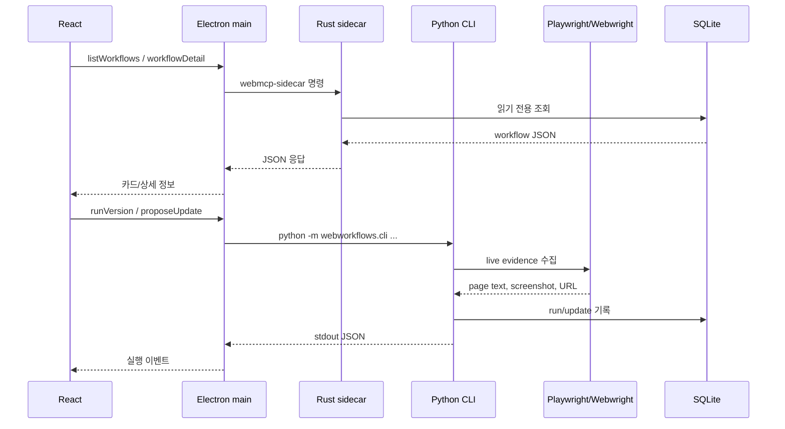
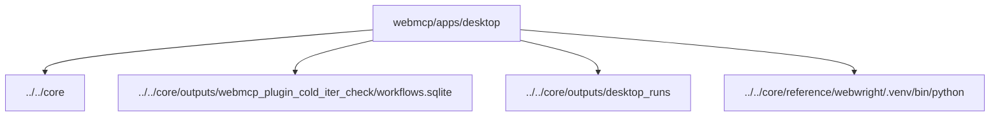
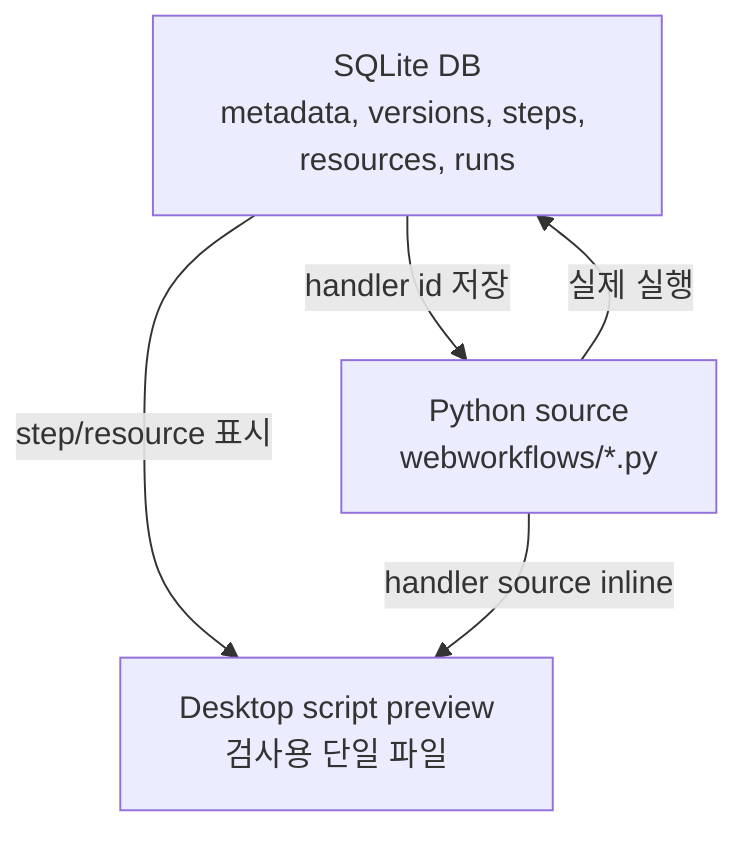

# WebMCP 아키텍처

이 문서는 `webmcp/` feature slice의 책임 경계와 런타임 흐름을 설명합니다.
핵심 원칙은 간단합니다. Core는 워크플로우를 실행하고 저장하며, Desktop은
그 워크플로우를 확인하고 조작하는 앱입니다.

## 책임 경계

`apps/desktop`는 `core`에 의존합니다. 반대로 `core`는 Desktop을 몰라야
합니다. 이 방향을 지키면 CLI, Codex 플러그인, Desktop 앱이 같은 workflow
engine을 공유하면서도 서로를 불필요하게 끌어안지 않습니다.

## 런타임 데이터 흐름

## 기본 경로

Desktop의 기본 경로는 `webmcp/apps/desktop` 기준으로 계산합니다. 이 로직은
테스트 가능한 `electron/project-paths.cjs`에 있습니다.

## Source of Truth

워크플로우 정의는 DB에 저장되지만, 실행 가능한 Python 함수는 source file에
남습니다. Desktop의 Implementation preview는 감사와 이해를 위한 생성물이며,
실제 실행의 source of truth가 아닙니다.
