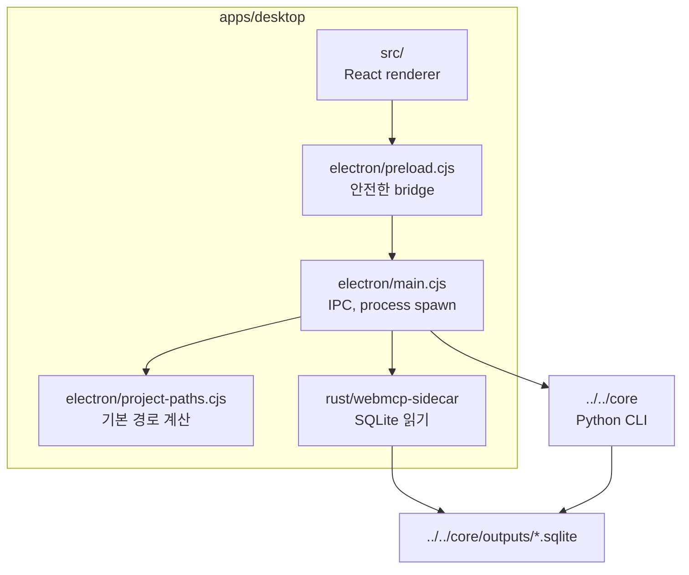
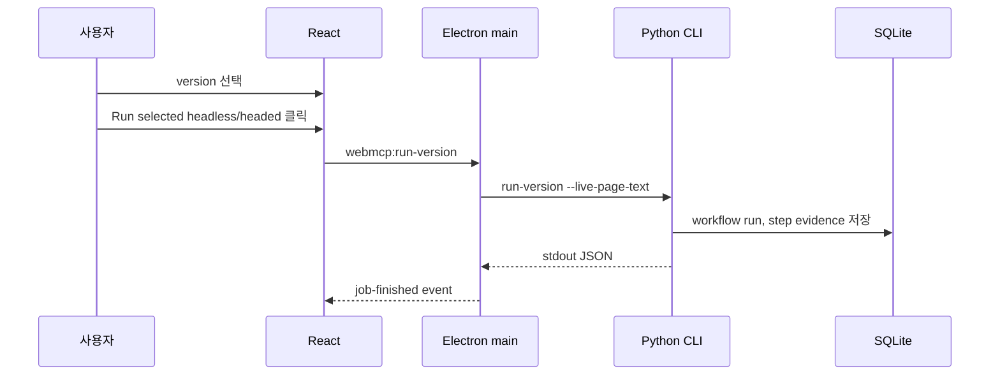
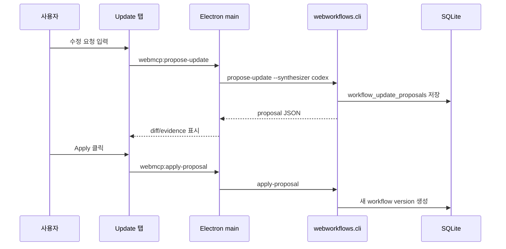

# WebMCP Desktop 앱

`webmcp/apps/desktop`는 WebMCP workflow를 확인하고 관리하는 Electron 앱입니다.
이 앱은 workflow engine이 아니라 관리 화면입니다. 실행과 수정은 Python Core가
담당하고, DB 읽기는 Rust sidecar가 담당합니다.

## 구성 요소

## 화면 책임

- entry page에서 workflow card 목록을 보여줍니다.
- workflow detail에서 step, version, run history, update proposal을 보여줍니다.
- Implementation 탭에서 Python + Playwright preview와 handler source를
  확인할 수 있게 합니다.
- 선택된 version 하나를 headless 또는 headed로 실행합니다.
- 사용자 수정 요청을 받아 Codex 기반 proposal을 생성하고 적용합니다.

## 실행 흐름

Desktop 실행은 항상 선택된 version 하나만 대상으로 합니다. 모든 version을
동시에 headless로 돌리면 관찰도 어렵고 사용자가 선택한 수정 지점도 흐려지기
때문입니다.

## 수정 흐름

Update 모드는 사용자에게 직관적으로 보이도록 두 가지로 표현합니다.

- `코드만 보고 수정`: 저장된 workflow JSON, step, resource, handler 정보를
  기반으로 proposal을 만듭니다.
- `브라우저를 조작하며 수정`: Webwright가 브라우저를 열어 evidence를 수집한
  뒤 proposal에 반영합니다.

## 결과 표시

실행 후 UI는 단순히 성공 여부만 보여주지 않습니다. Latest Run Result와 Runs
영역에 structured output, report path, stdout JSON, step evidence를 함께
보여줍니다. 이 구조 덕분에 “정말 live 결과를 읽었는지”를 사용자가 확인할 수
있습니다.
