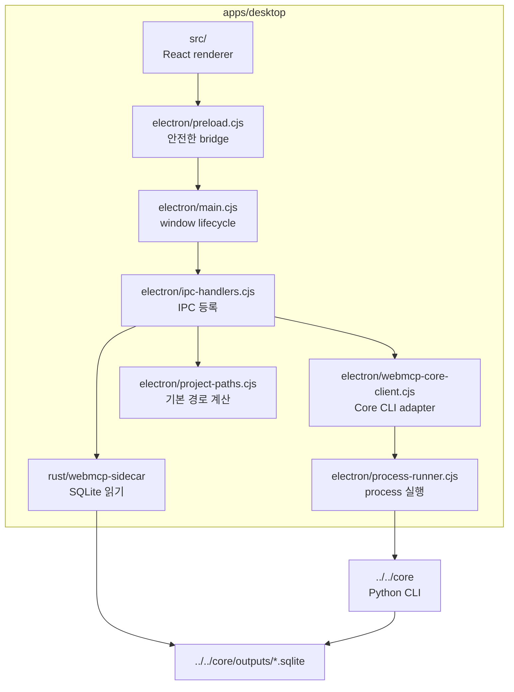
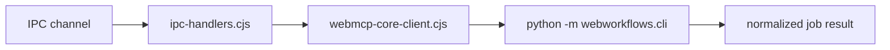
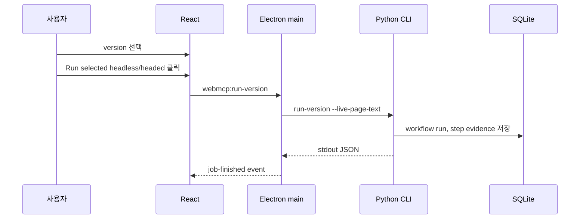
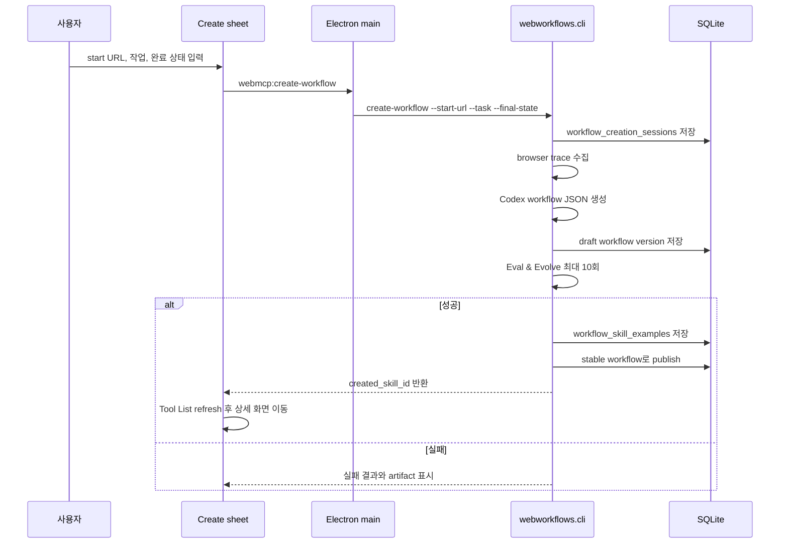
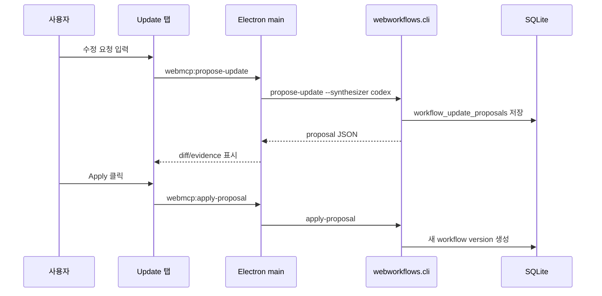
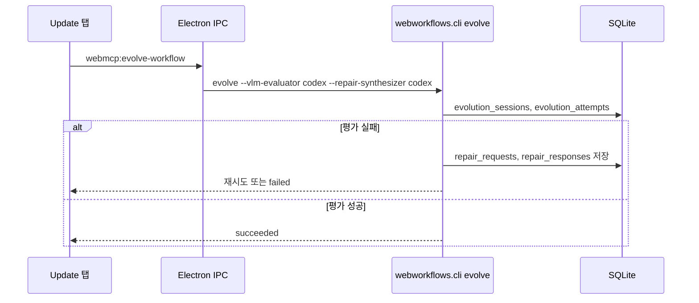

# WebMCP Desktop 앱

`webmcp/apps/desktop`는 WebMCP workflow를 확인하고 관리하는 Electron 앱입니다.
이 앱은 workflow engine이 아니라 관리 화면입니다. 실행과 수정은 Python Core가
담당하고, DB 읽기는 Rust sidecar가 담당합니다.

## 구성 요소

## 화면 책임

- entry page에서 workflow card 목록을 보여줍니다.
- workflow detail에서 step, version, run history, update proposal을 보여줍니다.
- Implementation 탭에서 Python + Playwright preview와 handler source를
  확인할 수 있게 합니다.
- Tool List에서 start URL, 수행 작업, 완료 브라우저 상태를 입력해 새 workflow를
  생성할 수 있게 합니다.
- 선택된 version 하나를 headless 또는 headed로 실행합니다.
- 사용자 수정 요청을 받아 Codex 기반 proposal을 생성하고 적용합니다.

## Electron 경계

새 frontend app을 만들 때는 Electron IPC를 그대로 복제할 필요가 없습니다. 대신
`webmcp-core-client.cjs`가 만드는 CLI 인자와 JSON result shape를 같은 adapter로
구현하면 됩니다. `main.cjs`는 app lifecycle만 담당하므로 기능 변경은 대부분
`ipc-handlers.cjs`나 Core service에서 처리합니다.

## 실행 흐름

Desktop 실행은 항상 선택된 version 하나만 대상으로 합니다. 모든 version을
동시에 headless로 돌리면 관찰도 어렵고 사용자가 선택한 수정 지점도 흐려지기
때문입니다.

화면의 주요 명령은 Apple식 toolbar에 가깝게 icon-only control로 구성합니다.
사용자에게 보이는 긴 버튼 문구를 줄이고, 각 icon에는 정확한 `title`과
`aria-label`을 붙입니다. hover tooltip은 기능명을 그대로 보여주고, keyboard
focus ring은 macOS의 파란 focus 느낌을 유지합니다.

## 생성 흐름

생성 sheet는 domain-specific argument를 받지 않습니다. 생성 전에는 tool의 schema를
모르기 때문입니다. `company`, `ticker`, `news_limit` 같은 값은 생성된 workflow의
argument schema가 정해진 뒤 실행 화면에서 다룹니다.

생성된 workflow가 검증을 통과하면 Core는 성공한 실행 argument를 workflow example
metadata로 저장합니다. Desktop은 이 값을 Argument Examples 패널에 표시하고, 사용자가
나중에 같은 입력으로 QA를 다시 돌릴 수 있게 합니다. 예시를 적용하면 stock 전용 입력
외의 generic argument도 보존되어 실행/evolve payload에 포함되고, Core CLI에는
`--argument name=value`로 전달됩니다.

생성 과정의 자동 수정/재검증은 내부 max 10회입니다. 이 값은 운영 안전장치이며
사용자 설정이 아니므로 화면에 노출하지 않습니다. 사용자가 제어해야 하는 것은
현재 실행 중인 생성 job의 일시정지/재개입니다. Desktop은 `webmcp:pause-current-job`,
`webmcp:resume-current-job` IPC를 통해 macOS/Linux에서 process group에
`SIGSTOP`/`SIGCONT`를 보냅니다.

## 수정 흐름

Update 모드는 사용자에게 직관적으로 보이도록 두 가지로 표현합니다.

- `코드만 보고 수정`: 저장된 workflow JSON, step, resource, handler 정보를
  기반으로 proposal을 만듭니다.
- `브라우저를 조작하며 수정`: Webwright가 브라우저를 열어 evidence를 수집한
  뒤 proposal에 반영합니다.

Repair loop는 proposal 생성과 별개입니다. 사용자가 `Route` icon을 누르면
Desktop은 `webmcp:evolve-workflow` IPC channel로 `webworkflows.cli evolve`를
실행합니다. 이 명령은 선택 version을 실제로 실행하고, 평가 실패 시
`repair_request.json`을 남겨 active Codex harness가 다음 version을 만들 수 있게
합니다.

현재 UI에서는 Update 탭 안의 `Eval & Evolve` 패널이 이 흐름을 담당합니다.
사용자는 수동 JSON 파일을 넣지 않고 버튼으로 전체 loop를 시작합니다.

- `실행 화면`: `브라우저 숨김` 또는 `브라우저 보기`. `브라우저 보기`는 Playwright 브라우저를 화면에
  띄워 실제 조작 과정을 육안으로 확인합니다.
- `최대 시도`: eval 실패 후 repair loop를 반복할 최대 횟수입니다.
- 실행 버튼: 선택 version을 실행하고, 실패하면 Codex repair synthesizer가 수정안을
  생성해 적용한 뒤 다음 version을 다시 실행합니다.

실행 결과는 같은 패널의 `최근 검사 결과` 영역에 남습니다. 여기에는 session,
기준/현재/최종 version, 시도 수, 실패 step, 소요 시간, final run id,
`repair_request.json`, `repair_response.json`, report path가 표시됩니다. 경로
버튼을 누르면 Finder 또는 외부 URL로 열 수 있습니다.

각 attempt는 step timeline을 함께 렌더링합니다. 평가는 항상 Codex VLM evaluator가
수행합니다. Desktop은 `evolution` stdout의 `evaluation.step_evaluations`와 Core가
payload에 추가한 `step_runs`를 합쳐 step 이름, step type, 상태, step 실행 시간,
Codex VLM 요약, 기대 상태, 관찰 결과, 문제 목록, 수정 초점, 수정 방향,
evidence artifact를 보여줍니다. 원본 JSON은 감사용으로 접힌 영역에만 남깁니다.

## 결과 표시

실행 후 UI는 단순히 성공 여부만 보여주지 않습니다. Latest Run Result와 Runs
영역에 structured output, report path, stdout JSON, step evidence를 함께
보여줍니다. 이 구조 덕분에 “정말 live 결과를 읽었는지”를 사용자가 확인할 수
있습니다.
