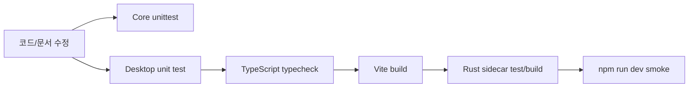
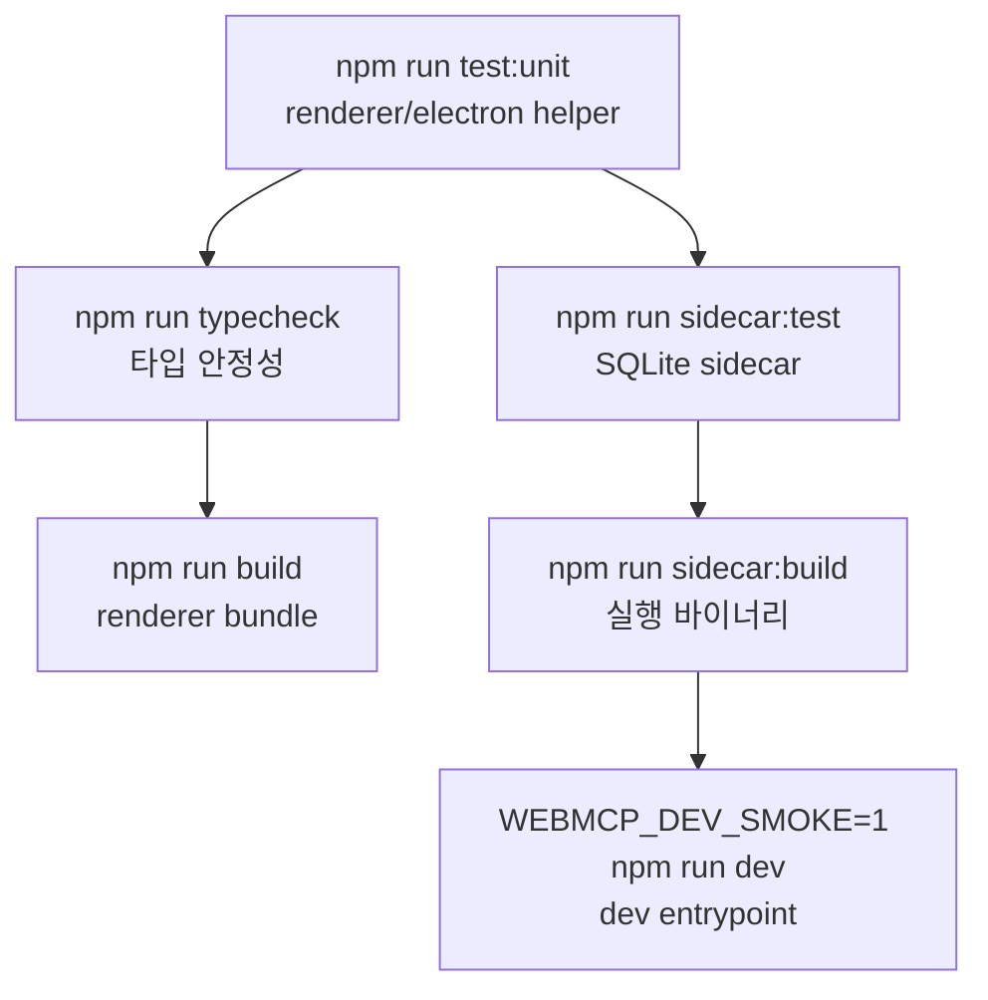
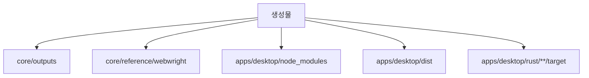

# WebMCP 개발 가이드

이 문서는 새 구조에서 어디서 어떤 명령을 실행해야 하는지 정리합니다. Python
명령은 `webmcp/core`에서, Desktop 명령은 `webmcp/apps/desktop`에서 실행합니다.

## 개발 루프



## Core 검증

```bash
cd webmcp/core
python3 -m unittest tests/test_repo_structure.py tests/test_workflow_runtime_service.py tests/test_workflow_update_runtime_service.py tests/test_synthesis_provider_port.py tests/test_workflow_skills.py tests/test_text_default_vision_fallback.py
```

`tests/test_repo_structure.py`는 feature slice 구조, 문서 entry point, 한글
문서화, Mermaid 다이어그램 개수를 함께 확인합니다. 구조를 바꾸면 이 테스트를
먼저 갱신해야 합니다.

`tests/test_workflow_runtime_service.py`와
`tests/test_workflow_update_runtime_service.py`는 CLI와 다른 app adapter가 공유할
Core service payload를 고정합니다. `tests/test_synthesis_provider_port.py`는 모델
provider 이름이 흔들리지 않도록 확인합니다.

## Desktop 검증

```bash
cd webmcp/apps/desktop
npm run test:unit
npm run typecheck
npm run build
npm run sidecar:test
npm run sidecar:build
WEBMCP_DEV_SMOKE=1 npm run dev
```



## Live workflow smoke

Naver 주가 workflow를 Desktop과 같은 방식으로 live page text를 수집해
실행하려면 다음 명령을 사용합니다.

```bash
cd webmcp/core
reference/webwright/.venv/bin/python -m webworkflows.cli run-version \
  --db outputs/webmcp_plugin_cold_iter_check/workflows.sqlite \
  --output-dir outputs/desktop_runs \
  --workflow-name naver_stock_report \
  --version 7 \
  --request "네이버에서 삼성전자 주가 리포트" \
  --company-name 삼성전자 \
  --ticker 005930 \
  --news-limit 1 \
  --live-page-text
```

## Ignore 기준



생성물은 fixture나 문서 증거로 승격할 때만 Git에 포함합니다. 일반 실행 산출물과
build output은 작업 디렉터리에 남기되 commit 대상에서 제외합니다.
