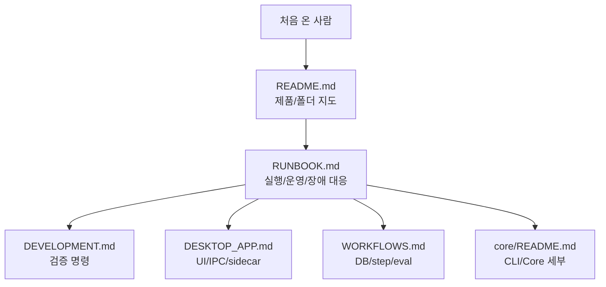
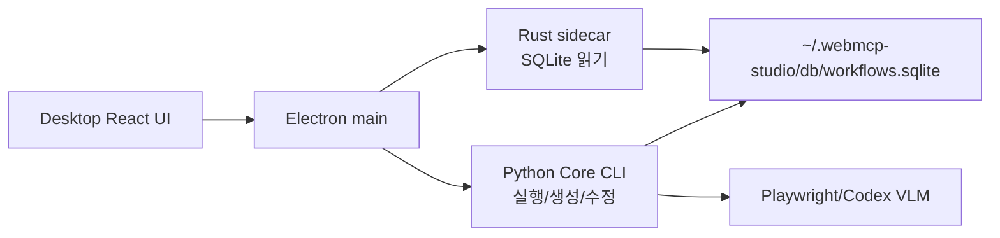
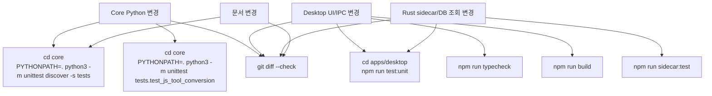

# WebMCP Runbook

이 문서는 WebMCP를 처음 맡은 사람이 하루 안에 개발 환경을 띄우고, DB 상태를
확인하고, 실제 workflow tool을 실행하며, 흔한 장애를 복구할 수 있게 만든 운영
runbook입니다. 더 깊은 설계 배경은 [ARCHITECTURE.md](ARCHITECTURE.md), workflow
세부 모델은 [WORKFLOWS.md](WORKFLOWS.md), Desktop 내부 구조는
[DESKTOP_APP.md](DESKTOP_APP.md)를 봅니다.

## 빠른 지도



처음에는 이 순서로 보면 됩니다.

1. `README.md`에서 WebMCP가 무엇이고 어디에 코드가 있는지 확인합니다.
2. 이 문서의 “처음 실행”을 그대로 수행합니다.
3. Tool list가 보이면 “첫 workflow 실행”을 돌립니다.
4. 기능을 바꾸기 전 “검증 매트릭스”에서 필요한 테스트 범위를 고릅니다.
5. 문제가 생기면 “장애 대응”에서 증상별로 확인합니다.

## 핵심 개념

WebMCP는 Codex skill이 아니라 SQLite에 저장되는 browser workflow tool을 관리합니다.
Tool은 `workflow_tools`와 `workflow_tool_*` table에 저장되고, version, argument,
step, resource, handler, run history, update proposal을 갖습니다.



역할은 명확히 나뉩니다.

- Desktop UI: 목록, 상세, 실행 버튼, 결과 표시.
- Rust sidecar: SQLite 읽기 전용 조회. Tool list, detail, memory overview를 빠르게 읽습니다.
- Python Core: DB를 바꾸는 작업. run, create, evolve, proposal, memory sync, JS export를 담당합니다.
- SQLite DB: 기본 persistent DB는 `~/.webmcp-studio/db/workflows.sqlite`입니다.

## 처음 실행

루트에서 dependency와 DB fixture를 준비합니다.

```bash
cd /Users/mingukjang/git/spica_at_home/webmcp
npm run db:sync-memory
```

Desktop 앱을 띄웁니다.

```bash
cd apps/desktop
npm install
npm run dev
```

정상 상태는 다음과 같습니다.

- dev server URL이 `http://127.0.0.1:5178/`로 출력됩니다.
- Electron 창이 열립니다.
- Tool list에 stable workflow tool이 보입니다.
- `naver_stock_report`, `naver_map_transit_route` 같은 seed/fixture tool이 보이면 DB 연결은 정상입니다.

## DB 확인

Desktop과 Core의 기본 DB는 같습니다.

```text
~/.webmcp-studio/db/workflows.sqlite
```

다른 DB를 쓰려면 shell에서 `WEBMCP_STUDIO_DB_PATH`를 지정합니다. Desktop과 Core CLI를
같은 shell에서 실행해야 같은 override를 봅니다.

```bash
export WEBMCP_STUDIO_DB_PATH=/tmp/webmcp-dev/workflows.sqlite
npm run db:sync-memory
cd apps/desktop
npm run dev
```

현재 DB의 schema와 tool 수를 확인합니다.

```bash
python3 - <<'PY'
import sqlite3
from pathlib import Path
path = Path.home() / ".webmcp-studio/db/workflows.sqlite"
conn = sqlite3.connect(path)
for table in ["workflow_tools", "workflow_tool_versions", "workflow_runs"]:
    exists = conn.execute(
        "select 1 from sqlite_master where type='table' and name=?",
        (table,),
    ).fetchone() is not None
    print(table, exists, conn.execute(f"select count(*) from {table}").fetchone()[0] if exists else "")
for row in conn.execute("select status, count(*) from workflow_tools group by status order by status"):
    print(row[0], row[1])
conn.close()
PY
```

Desktop Tool list는 기본적으로 `stable` tool만 보여줍니다. DB에 row가 있는데 화면에
안 보이면 먼저 status를 확인합니다.

## 첫 workflow 실행

Core fixture로 deterministic 실행을 확인합니다.

```bash
cd /Users/mingukjang/git/spica_at_home/webmcp/core
python3 -m webworkflows.cli run-version \
  --db ~/.webmcp-studio/db/workflows.sqlite \
  --output-dir outputs/desktop_runs \
  --workflow-name naver_stock_report \
  --version 1 \
  --request "네이버에서 삼성전자 주가 리포트" \
  --company-name 삼성전자 \
  --ticker 005930 \
  --page-text-file tests/fixtures/naver_stock_text.txt
```

브라우저와 Codex VLM 평가까지 포함하려면 `--eval-and-evolve --vlm-evaluator codex`를
사용합니다. 이 경로는 시간이 더 걸리고 Playwright runtime이 필요합니다.

```bash
python3 -m webworkflows.cli run-version \
  --db ~/.webmcp-studio/db/workflows.sqlite \
  --output-dir outputs/desktop_runs \
  --workflow-name naver_stock_report \
  --version 1 \
  --request "네이버에서 삼성전자 주가 리포트" \
  --company-name 삼성전자 \
  --ticker 005930 \
  --eval-and-evolve \
  --vlm-evaluator codex
```

## Tool 생성

새 tool 생성은 start URL, 작업 설명, 완료 상태만 입력합니다. 생성 전에는 schema를
모르므로 `ticker`, `company_name` 같은 domain-specific 입력을 UI에 만들지 않습니다.
탐색 순서를 사람이 알고 있거나 작업이 큰 경우에는 Create sheet의 `Step guide`에
rough step을 추가합니다. CLI에서는 같은 값을 `--step-guide-json`으로 넘깁니다.
Core는 이 guide를 `workflow_creation_sessions.input_json`의 `step_guide`에 저장하고,
생성 prompt의 `Human-authored step guide JSON` 섹션으로 전달합니다.
한 줄씩 만들기 번거로우면 Create sheet에서 `Suggest Draft`를 먼저 누릅니다. 이 버튼은
Core `suggest-step-guide`를 호출해 LLM 기반 rough steps를 만들고, 실패하면 heuristic
초안을 반환합니다. 기본 Codex 추천은 `codex exec` subprocess가 아니라 Codex app-server
JSON-RPC 경로를 사용합니다. 초안은 drag/drop, 위/아래 이동, 복제, 삭제로 편집합니다.

```bash
python3 -m webworkflows.cli suggest-step-guide \
  --db ~/.webmcp-studio/db/workflows.sqlite \
  --start-url "https://the-internet.herokuapp.com/login" \
  --task "Log in with the documented test credentials and summarize the secure area" \
  --final-state "The secure area success message is visible" \
  --suggester codex
```

```bash
cd /Users/mingukjang/git/spica_at_home/webmcp/core
python3 -m webworkflows.cli create-workflow \
  --db ~/.webmcp-studio/db/workflows.sqlite \
  --output-dir outputs/desktop_runs \
  --start-url "https://the-internet.herokuapp.com/login" \
  --task "Log in with the documented test credentials and summarize the secure area" \
  --final-state "The secure area success message is visible" \
  --step-guide-json '[{"name":"open_login","description":"Open the login page.","step_type":"goto"},{"name":"submit_credentials","description":"Fill the documented username and password, then submit.","step_type":"fill"},{"name":"wait_secure_area","description":"Wait for the secure area success message.","step_type":"wait_for_text"}]' \
  --eval-and-evolve \
  --vlm-evaluator codex
```

생성된 tool은 검증을 통과하면 `stable`로 publish됩니다. 실패하거나 검증 전이면
`draft`로 남을 수 있고, 이 경우 Tool list에는 안 보일 수 있습니다.

## JavaScript Tool Export

DB에 저장된 workflow tool을 Node.js에서 실행 가능한 JavaScript tool로 변환할 수
있습니다. 이 기능은 browser VLM eval을 대체하지 않고, deterministic step과 output
contract parity를 확인하는 용도입니다.

```bash
cd /Users/mingukjang/git/spica_at_home/webmcp/core
python3 -m webworkflows.cli export-js-tool \
  --db ~/.webmcp-studio/db/workflows.sqlite \
  --workflow-name naver_stock_report \
  --version 1 \
  --output-dir outputs/js_tools
```

실행과 eval 예시입니다.

```bash
cat > outputs/js_tools/naver_stock_args.json <<'JSON'
{
  "company_name": "삼성전자",
  "ticker": "005930",
  "news_limit": 3,
  "page_text": "삼성전자 주가 검색 결과\n증권정보\n삼성전자\n005930 KOSPI\n현재가\n295,500원\nKRX 06.08. 16:10 장마감\n관련 뉴스\n삼성전자와 SK하이닉스가 반도체 업황 변동으로 하락했다."
}
JSON

python3 -m webworkflows.cli run-js-tool \
  --tool-dir outputs/js_tools/naver-stock-report-v1 \
  --arguments-file outputs/js_tools/naver_stock_args.json

python3 -m webworkflows.cli eval-js-tool \
  --tool-dir outputs/js_tools/naver-stock-report-v1 \
  --arguments-file outputs/js_tools/naver_stock_args.json \
  --required-output company_name \
  --required-output ticker \
  --required-output current_price \
  --required-output report_text
```

## Memory Fixture 운영

Page analysis와 script-generation knowledge는 persistent DB에 축적됩니다. 사람이
검토한 기준 memory는 `core/fixtures/workflow-memory/*.jsonl`에 저장하고 다음 명령으로
동기화합니다.

```bash
cd /Users/mingukjang/git/spica_at_home/webmcp
npm run db:sync-memory:dry
npm run db:sync-memory
npm run db:sync-naver
```

저장 품질 기준은 다음과 같습니다.

- Page analysis는 URL key, stable marker, selector strategy, extraction strategy, risk note, evidence excerpt를 포함해야 합니다.
- Knowledge는 “다음 script 생성자가 바로 써먹을 수 있는 팁”이어야 합니다.
- URL key는 query/fragment를 제거하고 host/path를 kebab-case로 만든 값입니다.

## 검증 매트릭스

변경 범위별로 필요한 검증을 선택합니다.



자주 쓰는 전체 smoke입니다.

```bash
cd /Users/mingukjang/git/spica_at_home/webmcp/core
PYTHONPATH=. python3 -m unittest discover -s tests

cd ../apps/desktop
npm run typecheck
npm run test:unit
npm run sidecar:test
npm run build
```

## Ablation study 재실행

workflow 생성/실행 로직을 바꾸거나 page analysis, knowledge, `llm_browser_action`,
JS export 성능을 확인해야 하면 고정된 ablation suite를 돌립니다.

```bash
cd /Users/mingukjang/git/spica_at_home/webmcp
python3 core/scripts/run_ablation_studies.py --suite all
```

빠른 확인은 harder browser task와 memory ablation만 실행합니다.

```bash
python3 core/scripts/run_ablation_studies.py --suite fast
```

기존 raw 결과만 다시 모아 하나의 summary를 만들려면 실행을 건너뜁니다.

```bash
python3 core/scripts/run_ablation_studies.py --suite all --skip-run
```

산출물은 모두 ignored `core/outputs/**` 아래에 남습니다.

- 통합 요약: `core/outputs/ablation_latest/consolidated_summary.md`
- 통합 JSON: `core/outputs/ablation_latest/consolidated_results.json`
- baseline raw: `core/outputs/ablation_study_20260610/results.json`
- harder raw: `core/outputs/ablation_harder_20260610/results.json`
- memory raw: `core/outputs/ablation_memory_20260610/results.json`

Suite는 persistent 제품 DB인 `~/.webmcp-studio/db/workflows.sqlite`를 사용하지 않습니다.
각 suite가 자체 throwaway SQLite DB와 local demo site를 만들기 때문에 운영 DB를
오염시키지 않습니다.

## 장애 대응

### Tool list가 비어 있음

1. Desktop이 보는 DB 경로를 확인합니다.

```bash
python3 - <<'PY'
from pathlib import Path
print(Path.home() / ".webmcp-studio/db/workflows.sqlite")
print((Path.home() / ".webmcp-studio/db/workflows.sqlite").exists())
PY
```

2. DB table과 stable tool 수를 확인합니다.

```bash
python3 - <<'PY'
import sqlite3
from pathlib import Path
path = Path.home() / ".webmcp-studio/db/workflows.sqlite"
conn = sqlite3.connect(path)
for table in ["workflow_tools", "workflow_skills"]:
    exists = conn.execute("select 1 from sqlite_master where type='table' and name=?", (table,)).fetchone() is not None
    print(table, exists)
    if exists:
        print(conn.execute(f"select count(*) from {table}").fetchone()[0])
if conn.execute("select 1 from sqlite_master where type='table' and name='workflow_tools'").fetchone():
    print(list(conn.execute("select status, count(*) from workflow_tools group by status")))
conn.close()
PY
```

3. Sidecar가 직접 list를 반환하는지 확인합니다.

```bash
cd /Users/mingukjang/git/spica_at_home/webmcp/apps/desktop
npm run sidecar:build
rust/webmcp-sidecar/target/debug/webmcp-sidecar \
  list-workflows \
  --db ~/.webmcp-studio/db/workflows.sqlite
```

`workflow_skills`는 있고 `workflow_tools`가 없다면 legacy schema입니다. 최신 sidecar와
Python Core는 DB를 열 때 자동으로 `workflow_tools`로 migrate합니다. 그래도 앱에 안
보이면 `npm run dev`를 재시작합니다.

### npm run dev가 두 개 떠 있음

포트가 밀려 `5179` 등으로 뜨면 기존 dev process가 남아 있을 수 있습니다.

```bash
ps -axo pid,ppid,pgid,command | rg 'npm run dev|vite --host 127.0.0.1|electron .'
```

같은 앱의 dev process group이 여러 개면 오래된 group을 종료합니다.

```bash
kill -TERM -<PGID>
```

다시 실행합니다.

```bash
cd /Users/mingukjang/git/spica_at_home/webmcp/apps/desktop
npm run dev
```

### Browser eval이 Playwright import 문제로 실패

`--eval-and-evolve`, `--live-page-text`, browser discovery는 Playwright runtime이
필요합니다. Core CLI는 가능한 경우 `core/reference/webwright/.venv/bin/python`으로
re-exec합니다. venv가 없으면 reference harness를 준비합니다.

```bash
cd /Users/mingukjang/git/spica_at_home/webmcp/core
mkdir -p reference
test -d reference/webwright || git clone https://github.com/microsoft/Webwright.git reference/webwright
cd reference/webwright
uv venv --python 3.12 .venv
. .venv/bin/activate
uv pip install -e . pytest playwright
python -m playwright install chromium
```

### JS tool은 되는데 browser workflow는 실패

JS tool은 deterministic step과 output contract를 확인합니다. 실제 화면 조작,
iframe, popup, `llm_browser_action`, VLM 평가는 Python `run-version --eval-and-evolve`
경로에서 확인해야 합니다.

### Memory가 안 쌓임

생성/실행 중 page text evidence가 없으면 page analysis가 저장되지 않을 수 있습니다.
다음 세 가지를 확인합니다.

- `--live-page-text` 또는 `--eval-and-evolve`로 실제 page text가 수집됐는가.
- `page_analyses` row가 URL key 기준으로 생겼는가.
- `workflow_knowledge_entries`에 `script_generation` category row가 생겼는가.
- 최근 `page_analyses.analysis_json`에 `wait_markers`, `verified_selectors`,
  `dynamic_action_hints`, `verified_workflow_shape`가 들어갔는가.
- 최근 `workflow_knowledge_entries.content_json`에 `url_shape`, `wait_markers`,
  `verified_selectors`, `failure_modes`가 들어갔는가.

```bash
sqlite3 ~/.webmcp-studio/db/workflows.sqlite \
  "select url_key, source, observation_count from page_analyses order by id desc limit 5;"
sqlite3 ~/.webmcp-studio/db/workflows.sqlite \
  "select category, summary, source from workflow_knowledge_entries order by id desc limit 5;"
sqlite3 ~/.webmcp-studio/db/workflows.sqlite \
  "select json_extract(analysis_json, '$.wait_markers'), json_extract(analysis_json, '$.verified_selectors') from page_analyses order by id desc limit 1;"
```

## 운영 원칙

- Persistent product DB는 `~/.webmcp-studio/db/workflows.sqlite`입니다.
- `core/outputs/**` DB는 smoke와 임시 artifact용입니다.
- DB schema 변경은 Python Core와 Rust sidecar 양쪽 migration을 같이 맞춥니다.
- Tool list가 비면 DB path, schema, sidecar 직접 조회 순서로 확인합니다.
- 새 workflow 생성은 start URL, task, final state만 입력받고, domain-specific
  argument는 생성된 schema 이후에 다룹니다.
- Browser eval과 JS eval은 목적이 다릅니다. JS eval은 변환 산출물 검증, browser
  eval은 실제 화면 검증입니다.
