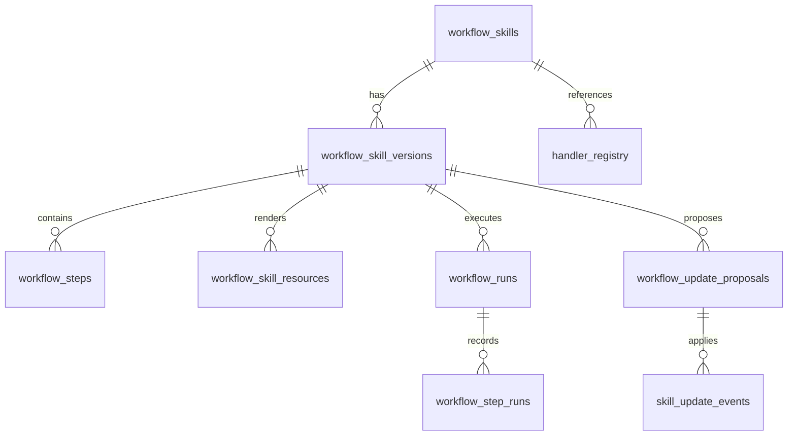
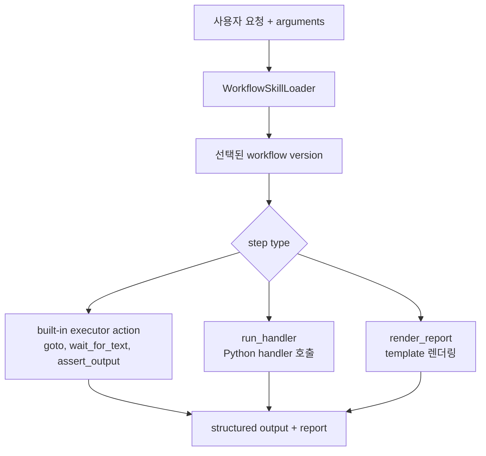
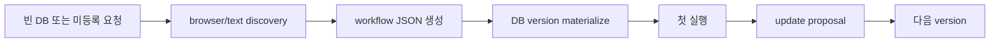

# WebMCP 워크플로우

WebMCP workflow는 Codex `SKILL.md`가 아닙니다. SQLite에 저장되는 versioned
browser-task recipe입니다. 이름, 설명, argument schema, step, resource,
handler reference, run history, update event를 저장하고 필요할 때 로드합니다.

## 데이터 모델 개요



## Step 실행 구조



대표 step은 다음과 같습니다.

- `goto`: 브라우저 이동 의도를 기록합니다.
- `wait_for_text`: 페이지 텍스트 evidence를 기다리거나 검증합니다.
- `run_handler`: 등록된 Python 함수를 호출합니다.
- `assert_output`: 구조화된 결과를 검증합니다.
- `render_report`: resource template로 Markdown report를 생성합니다.

## Naver 주가 workflow

테스트 fixture 기반 deterministic 실행:

```bash
cd webmcp/core
python3 -m webworkflows.cli run \
  --db outputs/webmcp_workflows.sqlite \
  --output-dir outputs/workflow_runs \
  --request "네이버에서 삼성전자 주가 리포트" \
  --company-name 삼성전자 \
  --ticker 005930 \
  --page-text-file tests/fixtures/naver_stock_text.txt
```

Desktop과 같은 live 실행:

```bash
cd webmcp/core
reference/webwright/.venv/bin/python -m webworkflows.cli run-version \
  --db outputs/webmcp_plugin_cold_iter_check/workflows.sqlite \
  --output-dir outputs/desktop_runs \
  --workflow-name naver_stock_report \
  --version 7 \
  --request "네이버에서 삼성전자 주가 리포트" \
  --company-name 삼성전자 \
  --ticker 005930 \
  --news-limit 1 \
  --live-page-text
```

## Cold init과 update



Codex 세션 안에서는 `--synthesizer agent-json` 경로를 우선합니다. 이 방식은
활성 Codex 모델이 직접 `workflow.json`을 작성하고, local materializer가 그것을
DB에 반영합니다. `--synthesizer codex`는 nested `codex exec`를 실행하므로
명시적인 standalone fallback 테스트에만 사용합니다.
