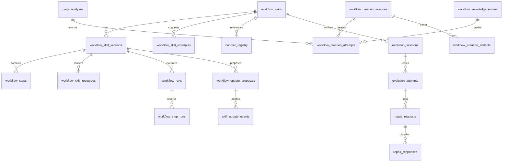
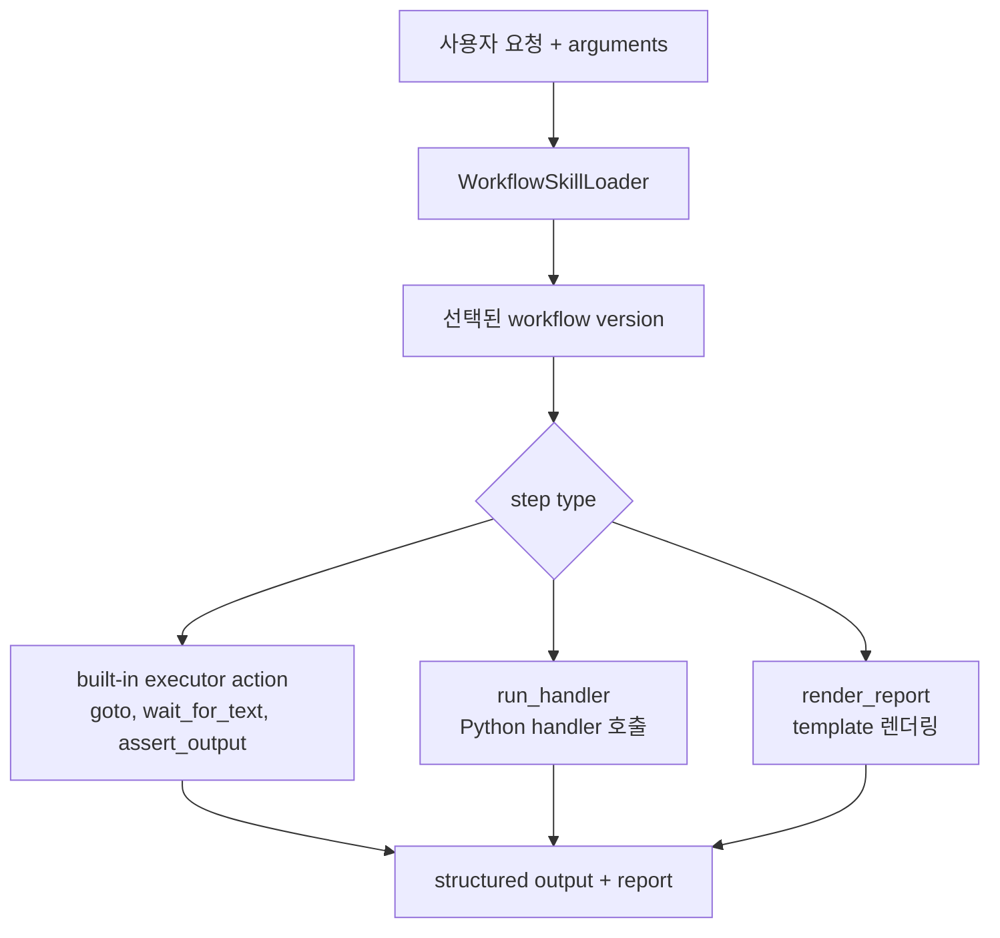
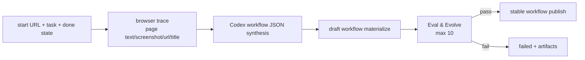
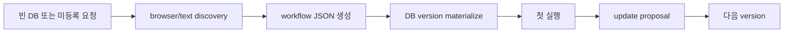
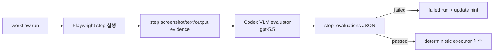
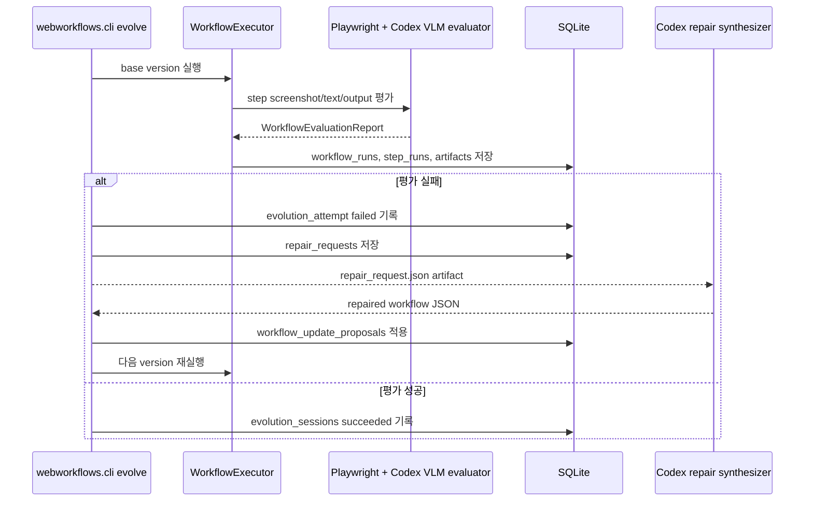

# WebMCP 워크플로우

WebMCP workflow는 Codex `SKILL.md`가 아닙니다. SQLite에 저장되는 versioned
browser-task recipe입니다. 이름, 설명, argument schema, step, resource,
handler reference, run history, update event를 저장하고 필요할 때 로드합니다.

## 데이터 모델 개요



## Step 실행 구조



대표 step은 다음과 같습니다.

- `goto`: 브라우저 이동 의도를 기록합니다.
- `wait_for_text`: 페이지 텍스트 evidence를 기다리거나 검증합니다.
- `run_handler`: 등록된 Python 함수를 호출합니다.
- `assert_output`: 구조화된 결과를 검증합니다.
- `render_report`: resource template로 Markdown report를 생성합니다.

## Naver 주가 workflow

테스트 fixture 기반 deterministic 실행:

```bash
cd webmcp/core
python3 -m webworkflows.cli run \
  --db outputs/webmcp_workflows.sqlite \
  --output-dir outputs/workflow_runs \
  --request "네이버에서 삼성전자 주가 리포트" \
  --company-name 삼성전자 \
  --ticker 005930 \
  --page-text-file tests/fixtures/naver_stock_text.txt
```

Desktop과 같은 live 실행:

```bash
cd webmcp/core
reference/webwright/.venv/bin/python -m webworkflows.cli run-version \
  --db outputs/webmcp_plugin_cold_iter_check/workflows.sqlite \
  --output-dir outputs/desktop_runs \
  --workflow-name naver_stock_report \
  --version 7 \
  --request "네이버에서 삼성전자 주가 리포트" \
  --company-name 삼성전자 \
  --ticker 005930 \
  --news-limit 1 \
  --live-page-text
```

## Workflow 생성

Desktop의 Create sheet나 CLI `create-workflow`는 start URL, 사용자 작업, 완료
브라우저 상태를 받아 새 workflow를 만듭니다. 생성 전에는 어떤 argument가 필요한지
모르므로 company/ticker 같은 domain-specific 입력을 받지 않습니다.



생성 세션은 `workflow_creation_sessions`, 개별 시도는
`workflow_creation_attempts`, screenshot 등 증거는 `workflow_creation_artifacts`에
저장됩니다. 검증을 통과하기 전 workflow는 draft 상태이고, 통과한 뒤에만
`workflow_skills.status = stable`로 publish되어 Tool List에 나타납니다.
성공한 loop는 같은 시점에 실제 실행 argument를 `workflow_skill_examples`와
`workflow_skill_arguments.examples_json`에 저장합니다. 이 값은 Desktop의 Argument
Examples 패널과 후속 QA smoke 입력으로 재사용됩니다.

생성 trace를 수집하면 Core는 같은 SQLite DB의 `page_analyses`를 URL key 기준으로
업데이트합니다. URL key는 query string과 fragment를 제거한 뒤 host/path를
kebab-case로 만든 값입니다. 예를 들어
`https://example.com/search/results?query=a`와
`https://example.com/search/results?query=b`는 모두
`example-com-search-results`로 조회됩니다. 저장된 page analysis에는 framework,
iframe, locator 힌트와 짧은 evidence가 들어가며, 다음 synthesis prompt의
`Reusable page analysis context JSON` 블록으로 전달됩니다.

URL에 종속되지 않는 생성 노하우는 `workflow_knowledge_entries`에 append-only
형태로 쌓습니다. 생성 성공/실패 결과도 `script_generation` category의 노하우로
저장되며, 이후 `create-workflow`와 page analysis 단계에서 최근 entry를 꺼내
`Reusable script generation knowledge JSON`으로 전달합니다.

Reviewed fixture 기반 memory도 같은 DB 구조를 사용합니다. `core/fixtures/workflow-memory`
아래 JSONL 파일을 수정한 뒤 repo root에서 다음 명령을 실행합니다.

```bash
npm run db:sync-memory
```

동기화 스크립트는 `workflow_example`, `page_analysis`, `knowledge` record를 읽습니다.
`workflow_example`은 `workflow_name`으로 skill을 찾고
`normalized_arguments_json`의 canonical JSON 값으로 중복을 판단합니다. 같은 argument
set이 있으면 request와 기대 요약을 update하고, 없으면 insert합니다. 동시에 해당
workflow 최신 version의 `workflow_skill_arguments.examples_json`에도 실제 입력값을
추가합니다.

`page_analysis`는 `normalize_url_key()`와 동일한 로직으로 query string과 fragment를
제거한 URL key를 만들고 `page_analyses.url_key`에 upsert합니다. `knowledge`는
`category + summary`로 upsert하므로, 사람이 다듬은 노하우를 여러 번 sync해도 중복
entry가 늘지 않습니다.

```bash
npm run db:sync-memory:dry  # fixture row 쓰기 없는 요약
npm run db:sync-examples    # workflow examples만
npm run db:sync-naver       # naver tag/category/workflow/url record만
```

```bash
python3 -m webworkflows.cli create-workflow \
  --db outputs/webmcp_workflows/workflows.sqlite \
  --output-dir outputs/desktop_runs \
  --start-url "https://www.google.com/flights" \
  --task "Search for flights from SEA to JFK on 2026-08-15 to 2026-08-20" \
  --final-state "SEA to JFK flight results are visible" \
  --eval-and-evolve \
  --vlm-evaluator codex
```

`create-workflow`의 자동 repair/eval 반복 한도는 Desktop에서 내부 max 10회로
전달합니다. UI에는 이 값을 노출하지 않고, 사용자는 실행 중인 process를 pause/resume
할 수 있습니다.

## Cold init과 update



Codex 세션 안에서는 `--synthesizer agent-json` 경로를 우선합니다. 이 방식은
활성 Codex 모델이 직접 `workflow.json`을 작성하고, local materializer가 그것을
DB에 반영합니다. `--synthesizer codex`는 nested `codex exec`를 실행하므로
명시적인 standalone fallback 테스트에만 사용합니다.

## Eval and evolve loop



이 loop의 목적은 실제 브라우저 화면을 step별로 확인하고, 문제가 보이면
`WorkflowEvaluationError`로 실행을 멈춘 뒤 `workflow_runs`, `step_runs`,
`artifacts`에 실패 evidence를 남기는 것입니다. first run과 일반 `run-version`
모두 같은 executor hook을 사용합니다.

loop가 통과하면 Core는 실행에 사용한 argument set을 정규화해
`workflow_skill_examples`에 저장합니다. `page_text`, `final_state` 같은 내부 전달값은
제외하고, workflow schema에 있는 사용자 입력 argument만 남깁니다. 같은 값이 이미
있으면 중복 저장하지 않고, argument별 `examples_json`은 최근 성공값을 앞에 둔 최대
3개 예시로 유지합니다. Desktop에서 이 예시를 적용하면 stock 전용
`company_name`/`ticker` 필드는 기존 flag로, 그 외 일반 argument는 Core CLI의
`--argument name=value` 옵션으로 `run-version`과 `evolve`에 전달됩니다.

평가는 모델 없는 로컬 판정이나 수동 파일을 사용하지 않습니다. Codex VLM evaluator가
step screenshot, page text, URL, title, output, assertion을 입력으로 받고 다음
형태의 JSON을 반환합니다.

```json
{
  "status": "passed",
  "summary": "네이버 검색 결과 화면에 삼성전자 증권정보 카드와 현재가가 보입니다.",
  "problems": [],
  "suggested_update": "",
  "failure_kind": "",
  "expected_state": "삼성전자 주가 검색 결과와 현재가 카드가 보여야 합니다.",
  "observed_state": "검색 결과 본문에 삼성전자, 현재가, 310,500원이 표시됩니다.",
  "repair_focus": "",
  "evidence_artifacts": ["outputs/.../step_02_wait_stock_card.png"]
}
```

Desktop은 evaluator 옵션을 사용자에게 노출하지 않고 항상 Codex VLM으로 평가합니다.
기본 `--vlm-evaluator codex`는 Codex app-server와 저장된 Codex OAuth 로그인을
사용합니다. evaluator별 상세 동작과 교체 절차는 [VLM_EVALUATION.md](VLM_EVALUATION.md)
를 참고합니다.

## Repair 가능한 evolve session

`eval and evolve`가 단일 실행의 pass/fail을 판단한다면, `evolve` 명령은 실패한
실행을 새 version으로 고치고 다시 실행하는 session을 기록합니다. 평가 실패 시
Codex VLM 결과가 repair request에 들어가고, Codex repair synthesizer가 다음
workflow JSON을 생성합니다.



session artifact는 다음처럼 저장됩니다.

```text
outputs/evolution_runs/evolution/session_0001/
  attempt_01/
    repair_request.json
    repair_response.json
```

`repair_request.json`은 다음 정보를 포함합니다.

- base workflow JSON
- user request와 arguments
- 실패 run id, duration, output
- failed step의 `failure_kind`, `expected_state`, `observed_state`
- screenshot/text evidence 경로
- active Codex가 작성해야 할 response contract

자동 repair JSON이 준비되지 않은 경우에는 `waiting_for_repair`로 멈춥니다. 이
상태는 실패가 아니라, Codex harness가 artifact를 읽고 다음 workflow JSON을
작성해야 한다는 명시적인 handoff입니다.
