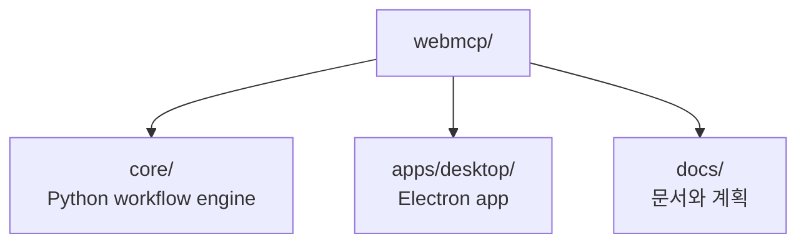

# WebMCP Feature Slice 재구조화 설계

## 배경

이 변경 전에는 WebMCP core와 Desktop 앱이 같은 Git repo 안에 있었지만 서로
형제 디렉터리로 분리되어 있었습니다. 기능적으로는 하나의 WebMCP 제품인데,
폴더 이름만 보면 어느 쪽이 core이고 어느 쪽이 app인지 코드 밖의 맥락을 알아야
했습니다.

새 구조는 `webmcp/`를 제품 단위 feature slice로 만들고, 그 안에서 실행 엔진과
앱을 분리합니다. 이렇게 하면 “기능 경계가 먼저, 기술 스택은 그 다음”이라는
개발 원칙이 코드 구조에 반영됩니다.

## 목표 구조



```text
webmcp/
  README.md
  docs/
    ARCHITECTURE.md
    DEVELOPMENT.md
    DESKTOP_APP.md
    WORKFLOWS.md
    plans/
  core/
    webworkflows/
    tests/
    plugins/
    patches/
    reference/
    outputs/
  apps/
    desktop/
      electron/
      src/
      rust/
      tests/
      package.json
```

## 경계 원칙

`core`는 workflow storage, execution, synthesis, update proposal, handler,
Codex plugin packaging을 담당합니다. `apps/desktop`은 workflow를 보여주고
사용자가 실행/수정할 수 있게 하는 관리 앱입니다. Desktop은 core를 호출하지만,
core는 Desktop을 몰라야 합니다.

## 기본 경로 설계

Desktop 기본 경로는 `apps/desktop` 기준으로 계산합니다. hard-coded sibling
path를 쓰지 않도록 `electron/project-paths.cjs`에서 계산하고 테스트합니다.

```text
repo/core root: ../../core
database:       ../../core/outputs/webmcp_plugin_cold_iter_check/workflows.sqlite
python:         ../../core/reference/webwright/.venv/bin/python
outputs:        ../../core/outputs/desktop_runs
```

## 문서화 원칙

`webmcp/README.md`는 전체 entry point입니다. 세부 문서는 `webmcp/docs/`에 두며
아키텍처, 개발, Desktop, 워크플로우를 나누어 설명합니다. 계획 문서는
`webmcp/docs/plans/`에 보관해 결정 이력을 추적합니다.
