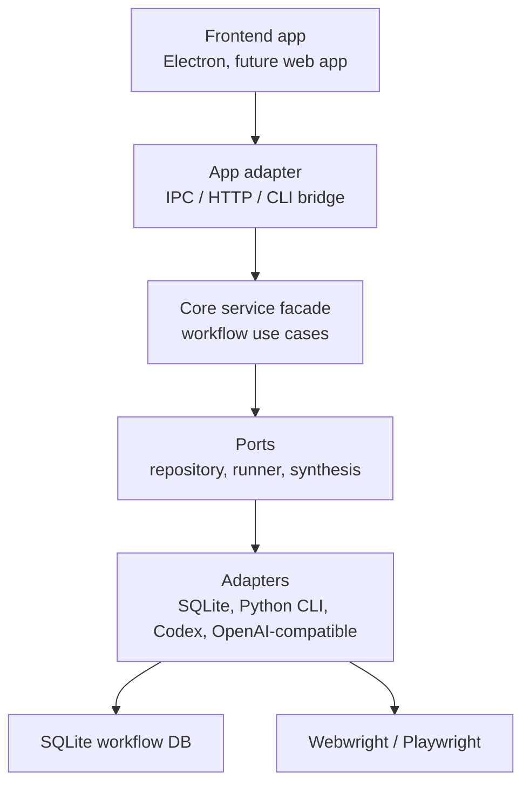
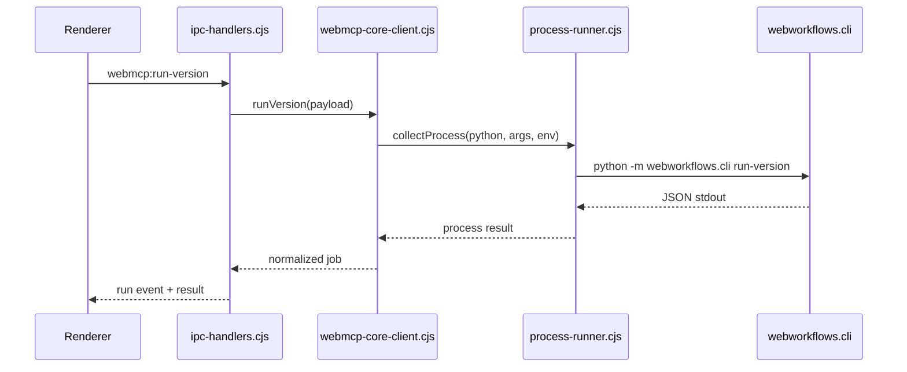

# WebMCP Port/Adapter 리팩토링 설계

## 배경

WebMCP는 현재 Python core, Electron Desktop, Rust sidecar, Codex/Webwright plugin을
한 제품 단위로 묶고 있습니다. 기능 경계는 `webmcp/`로 정리되었지만, 일부 실행
경계는 아직 기술 스택에 직접 묶여 있습니다.

특히 Desktop의 Electron main process는 Python CLI 인자 생성, process spawn,
경로 계산, IPC event payload 생성을 한 파일에서 함께 처리합니다. Core도 CLI가
storage, seed, loader, executor, update proposal을 직접 조립합니다. 이 구조에서는
Claude Code, OpenAI-compatible API, 다른 frontend app으로 옮길 때 동일한 기능을
재사용하기보다 기존 파일의 구현 세부사항을 다시 알아야 합니다.

## 목표

이 리팩토링은 기능을 새로 추가하지 않고, 기존 기능을 더 이식하기 쉬운 함수와
모듈 경계로 재배치합니다.



## 설계 원칙

- Core는 Desktop을 알지 않습니다.
- Desktop은 Core의 내부 SQL이나 Python module 배치를 알지 않습니다.
- CLI는 사람과 app이 쓰는 안정 contract이고, 내부 구현은 service 함수로 이동합니다.
- 모델 provider는 이름, model, endpoint, credential source를 바꿀 수 있는 adapter로
  둡니다.
- 저장소는 지금 SQLite를 유지하되, service layer가 SQL 상세에 직접 의존하지 않게
  얇은 repository 함수를 둡니다.

## Core 구조

```text
webmcp/core/webworkflows/
  cli.py
  services/
    __init__.py
    workflow_runtime.py
    update_runtime.py
  repositories/
    __init__.py
    workflow_repository.py
  providers/
    __init__.py
    synthesis_provider.py
  storage.py
  loader.py
  executor.py
```

`services`는 use case 단위 entry point입니다. 예를 들어 workflow 실행은
`WorkflowRuntime.run_latest()`와 `WorkflowRuntime.run_version()`으로 호출합니다.
CLI와 future API server는 같은 service를 호출합니다.

`providers`는 Codex, agent-json, fake-copy, 향후 OpenAI-compatible 또는 Claude Code
연동을 숨기는 경계입니다. 지금은 기존 `backend_from_name()`과
`AgentJsonSynthesisBackend`를 감싸되, 외부에서 provider 선택 규칙을 한 곳에서 볼 수
있게 합니다.

`repositories`는 workflow 조회와 handler source 조회처럼 frontend 또는 sidecar가
필요로 하는 읽기 기능을 함수화합니다. SQLite schema는 유지합니다.

## Desktop 구조

```text
webmcp/apps/desktop/electron/
  main.cjs
  ipc-handlers.cjs
  process-runner.cjs
  webmcp-core-client.cjs
  update-command.cjs
  project-paths.cjs
```

`main.cjs`는 app lifecycle과 window 생성만 담당합니다. IPC handler 등록은
`ipc-handlers.cjs`로 이동합니다. Python CLI 실행은 `webmcp-core-client.cjs`가
담당하고, 실제 child process 수집은 `process-runner.cjs`가 담당합니다.



## 테스트 전략

리팩토링은 behavior-preserving이어야 합니다. 먼저 현재 contract를 테스트로
고정합니다.

- Core service가 CLI와 같은 JSON payload를 반환하는지 확인합니다.
- provider factory가 `codex`, `agent-json`, `fake-copy`를 같은 이름으로 유지하는지
  확인합니다.
- Desktop core client가 Python command, cwd, `PYTHONPATH`, headless/headed env를
  안정적으로 조립하는지 확인합니다.
- IPC handler source가 새 모듈에 등록되어도 기존 channel 이름을 유지하는지
  확인합니다.

## 완료 기준

- 기존 CLI 명령이 그대로 동작합니다.
- Desktop의 `webmcp:run-version`, `webmcp:propose-update`, `webmcp:apply-proposal`
  channel 이름이 유지됩니다.
- 다른 frontend가 Electron 없이도 `webmcp-core-client.cjs`에 해당하는 adapter를
  쉽게 다시 구현할 수 있도록 command contract가 문서화됩니다.
- 향후 OpenAI-compatible API와 Claude Code provider를 추가할 위치가 코드와 문서에서
  명확합니다.
