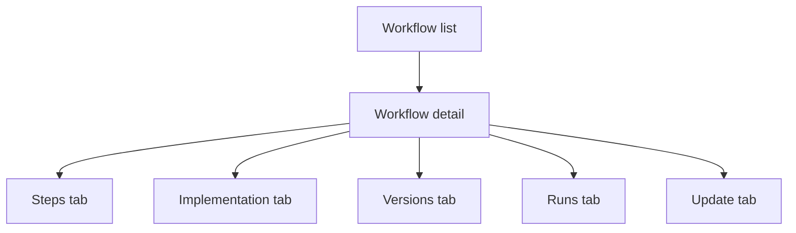

# WebMCP Desktop 설계

## 목표

WebMCP Desktop은 workflow cache와 version history를 눈으로 확인하고 관리하는
앱입니다. 사용자는 entry page에서 workflow 목록을 보고, detail page에서 step,
script preview, version 변화, run history, update proposal을 확인할 수 있어야
합니다.

## 앱 구조

## 기술 경계

Desktop 앱은 `webmcp/apps/desktop` 안에 있습니다. React renderer는 화면을
담당하고, Electron main은 IPC와 process spawning을 담당합니다. Rust sidecar는
SQLite read query를 담당합니다. Python core는 workflow 실행과 update proposal
생성을 담당합니다.

## 실행 UX

처음에는 모든 version을 headless로 순차 실행하는 방식을 고려했습니다. 그러나
실제로는 사용자가 동시에 모든 브라우저를 관찰할 수 없고, UI도 선택된 version
하나를 중심으로 보여줍니다. 따라서 최종 설계는 선택된 version 하나를 headless
또는 headed로 실행하는 방식입니다.

## Implementation preview

Workflow step은 JavaScript가 아니라 DB action과 Python handler reference로
구성됩니다. 사용자가 이를 오해하지 않도록 Implementation 탭에서는 Python +
Playwright preview를 보여주고, handler source를 import 뒤에 숨기지 않고 inline
표시합니다.

## Update Studio

Update 탭은 사용자가 자연어로 수정 방향을 입력하고 Codex 기반 proposal을 만들
수 있게 합니다. 사용자는 `코드만 보고 수정` 또는 `브라우저를 조작하며 수정` 중
하나를 고릅니다. Proposal은 적용 전 diff와 evidence를 확인할 수 있어야 합니다.
