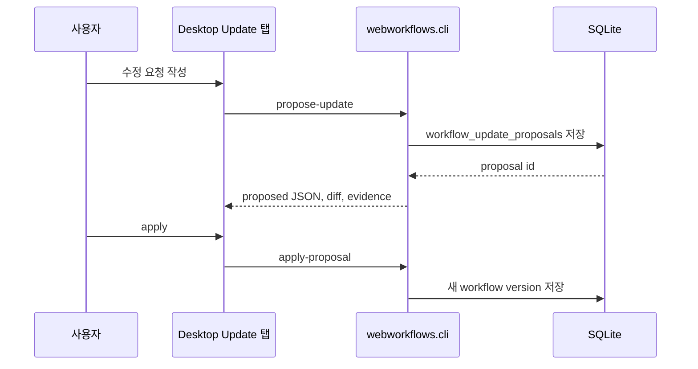

# WebMCP Update Studio 계획

## 목표

기존 Desktop은 workflow를 확인하는 앱에 가까웠습니다. Update Studio는 사용자가
수정 방향을 말하고, Codex와 Webwright evidence를 사용해 다음 workflow version을
생성할 수 있게 하는 편집 표면입니다.

## 데이터 흐름

## Python core 작업

`webworkflows/storage.py`에는 proposal table과 update event table을 추가합니다.
`webworkflows/update_proposal.py`는 base workflow를 읽고, 사용자 instruction과
discovery evidence를 반영해 proposed workflow JSON을 생성합니다.

## CLI 작업

`webworkflows/cli.py`에 `propose-update`와 `apply-proposal` 명령을 추가합니다.
`propose-update`는 proposal row를 만들고 stdout으로 JSON을 반환합니다.
`apply-proposal`은 승인된 proposal을 다음 workflow version으로 materialize합니다.

## Desktop 작업

Electron main은 `webmcp:propose-update`와 `webmcp:apply-proposal` IPC handler를
등록합니다. React UI는 Update 탭에서 instruction, mode, model, proposal 결과,
apply action을 보여줍니다.

## 사용자 표현

내부 용어인 discovery provider와 synthesizer를 그대로 노출하면 사용자가 의미를
이해하기 어렵습니다. 그래서 UI에서는 다음 두 표현을 사용합니다.

- `코드만 보고 수정`
- `브라우저를 조작하며 수정`

Codex 기반 생성이 기본이며 Desktop에서 `fake-copy`는 노출하지 않습니다.
