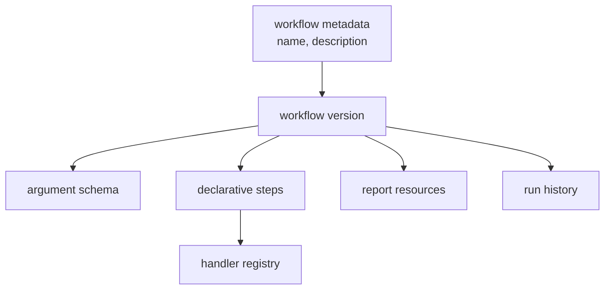

# WebMCP Workflow MVP 계획

## 목표

반복되는 Webwright 작업을 매번 LLM으로 새로 계획하지 않고, 성공한 실행을
workflow로 저장해 빠르게 재사용하는 구조를 만든다. 이 workflow는 Codex agent
skill이 아니라 SQLite-backed WebMCP workflow입니다.

## MVP 구조

## 저장소

`webworkflows/storage.py`는 SQLite schema와 CRUD helper를 담당합니다. Workflow는
metadata와 version을 분리해 저장합니다. 실행 이력은 workflow version과 연결해
나중에 성능 변화와 update 효과를 비교할 수 있게 합니다.

## 로더와 실행기

`webworkflows/loader.py`는 DB row를 실행 가능한 workflow 객체로 로드합니다.
`webworkflows/executor.py`는 step을 순서대로 실행하고, handler 호출 결과와 report
렌더링 결과를 run history에 저장합니다.

## Naver stock handler

`webworkflows/handlers/naver_stock.py`는 Naver 검색 결과 텍스트에서 현재가,
등락, 티커, 시장 상태를 추출합니다. 이 handler는 DB에 code blob으로 저장하지
않고 source file로 유지합니다. DB에는 module/function reference만 저장합니다.

## Cold init

Cold init은 DB가 비어 있거나 workflow가 없을 때 새 workflow를 만드는 과정입니다.
초기 MVP는 browser discovery 결과를 deterministic materializer로 변환했습니다.
이후에는 Codex가 `workflow.json`을 작성하고 materializer가 DB에 반영하는
`agent-json` 경로를 추가했습니다.
